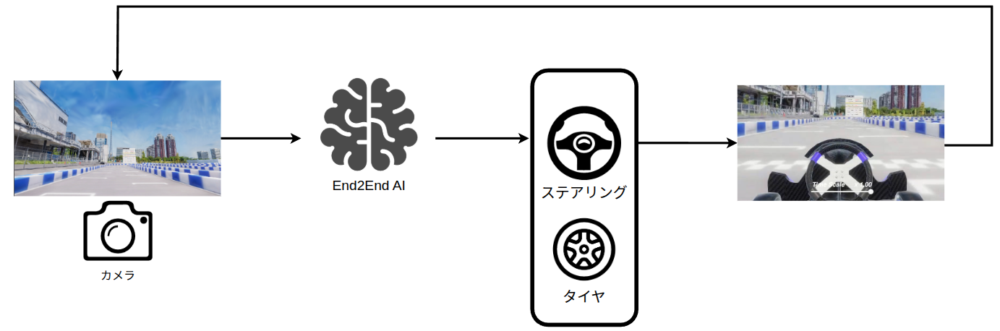

# AI Course

## Overview

This competition has an End to End AI Division. In this division, you are required to achieve autonomous driving by taking camera images and LiDAR data as input and outputting control signals (or a trajectory).

To help participants acquire basic knowledge and development tips, this page introduces the main AI algorithms and explains how to use the provided packages. Modify these samples, or use them as a reference to implement new nodes.

## AI Packages

The AI packages provided for this competition are listed below. Packages already integrated with Autoware can be run by switching the `control_method` setting. Training scripts for the models are also provided, so you can improve the models yourself. For concrete usage, see the usage page of each model. Details of each algorithm are summarized in [Algorithms](./ml_sample/algorithms.md).

| Model | Input sensors | Output | Package | Description |
|---|---|---|---|---|
| TinyLidarNet | LiDAR | Control signal | tiny_lidar_net_controller | [Usage](./ml_sample/tiny_lidar_net.md) |
| PilotNet | Camera | Control signal | pilot_net_controller | [Usage](./ml_sample/pilot_net.md) |
| Soft Actor-Critic (reinforcement learning) | Camera, vehicle speed | Control signal | rl_train_controller | [Usage](./ml_sample/soft_actor_critic.md) |
| VLM Planner | Camera | Trajectory | --- | [Usage](./ml_sample/vlm_setup.md) |
| VAD Planner | Camera | Trajectory | --- | [Usage](./ml_sample/vad_setup.md) |

### Notes

- VLM Planner and VAD Planner are not integrated with the Autoware used in the 2026 competition. To use them, you need to bring them into the 2026 competition environment yourself. For design and implementation details, see [Sample ROS Node (VLM Planner)](./ml_sample/ai_sample_node_vlm.md).
