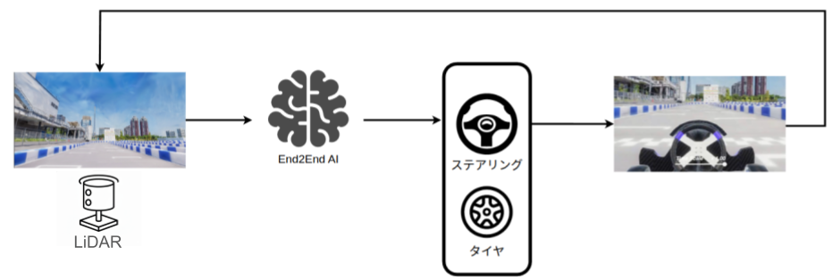

# AI講座

## 概要

更新中

## 目的

!!! tip "実践的なスキル獲得の機会"

    自動運転業界では、従来の制御アルゴリズムに加えて、機械学習を活用したアプローチが急速に発展しています。本教材は以下の実践的なスキルを身につける機会を提供します：

    - **実装スキル**: 機械学習モデルをROSシステムに統合する実践的な経験

    - **システム理解**: カメラ画像から軌道生成までのEnd-to-Endシステムの理解

    - **デバッグ能力**: シミュレータ環境での機械学習システムのデバッグ経験

    - **業界標準の習得**: 自動運転業界で使用される標準的なツールチェーンの理解

    - **複数台走行競技の来年度以降開催に向けた準備**: より複雑な走行環境に対応するための準備

!!! success "この教材の位置づけ"

    - **任意参加**: 興味がある方のみが利用する完全オプション教材

    - **学習の深化**: Autowareの理解を深める補完的な学習機会

    - **キャリア形成**: 将来的に自動運転業界で求められるスキルの先取り

## 提供教材

本年度はEmbodied AI（実世界とインタラクションする機械学習システム）をシミュレータと結合して動作させ、推論を実行できるコードをサンプルとして提供します。

- 自動運転AIチャレンジの教材と結合可能な、機械学習モデルを使用して軌道生成可能なSample ROS Nodeを提供します。

### LiDAR based End-to-End Sample ROS Node

- LiDARから出力された点群データを用いて、機械学習モデルによる推論を実行し、軌道データ（waypoint）を出力します。

- 機能概要
    - アルゴリズムについては、[Algorithms](./ml_sample/algorithms.md#tinylidarnet)を参照ください。
    - 実行方法については、[Develop: TinyLiDARNet](./ml_sample/develop_tiny_lidar_net.md)を参照ください。

### Camera based End-to-End Sample ROS Node

- このSample ROS Nodeを参考に、以下のような発展的学習を進められることを期待しています。
    - 自分の使用したい機械学習モデルとシミュレータを結合し、走らせてみる
    - Sample ROS Nodeを使って走行を行い、tuningしてみる
    - 機械学習モデルを組み込んだシステムの実装方法について知識を得て、記事を書いてみる
- 機能概要
    - カメラから出力された画像を用いて、機械学習モデルによる推論を実行し、軌道データ（waypoint）を出力します。
    - 実装の詳細については [Design: Sample ROS Node](./ml_sample/design.md)を参照。

Sample ROS Nodeと教材は以下のlinkより参照ください。

- [AutomotiveAIChallenge/e2e-utils-beta](https://github.com/AutomotiveAIChallenge/e2e-utils-beta)
    - Sample nodeとtoolをまとめた実装が含まれています
- 実行方法、instructionを以下に提供しております
    - [Getting started](./ml_sample/getting_started_vlm_setup.md)
    - [Design: Sample ROS Node](./ml_sample/design.md)
    - [Algorithms](./ml_sample/algorithms.md)

## 本教材の想定読者

!!! tip "想定読者"

    本教材は以下のような方におすすめです。

    - 自分自身で新しく機械学習モデルを作り、データを集め、学習し、AIチャレンジで使用するシミュレータと繋いで走らせてみたい方

    - 新しいことにトライし、その経験や知識を記事やプレゼンテーションとして発表したい方

この教材では、自分自身の興味関心を基に、Embodied AIの領域を学習したい方向けに、その補助輪となるSampleを提供します。

- 自作した機械学習モデルを使ってみたいがどう繋いだらいいかわからない
- 機械学習モデルを使って実験してみたいという興味はあるが何から始めたらいいかわからない
- 新しいことにトライし、その経験や知識を記事やプレゼンテーションとして発表したいが、どういう内容を発表すればいいかアイデアが浮かんでいない

という方はぜひ使ってみてください。

### 自作した機械学習モデルを繋いでみたい方

以下の資料がおすすめです。Sample ROS Nodeの構成を学び、参考にし、ぜひ自作した機械学習モデルを使ってみてください。

- [Getting started](./ml_sample/getting_started_vlm_setup.md)
- [Design: Sample ROS Node](./ml_sample/design.md)

### 機械学習モデルを使って実験してみたい方

以下の資料がおすすめです。Sample ROS Nodeで使用されているアルゴリズムについて勉強し、動かしてみて、簡単な実験をしてみましょう。

- [Getting started](./ml_sample/getting_started_vlm_setup.md)
- [Algorithms](./ml_sample/algorithms.md)

### 獲得した知識・経験をOutputしたい方

- 大きく分けて、以下の２つのOutput方法を期待しております。

#### 1. インターネット上での共有

- GitHubでのコード公開
- 技術ブログでの実装レポート
- SNSでの成果発表

#### 2. プレゼンテーション

- 実装成果の報告
- 技術的知見の共有
- 参加者間での情報交換

## まとめ

この追加的取り組みにより、参加者は実際の機械学習システムを自動運転環境で動作させる貴重な経験を積むことができます。Embodied AIとシミュレータの組み合わせにより、より実践的なスキルの習得が期待されます。
興味のある方は、ぜひお試しください。また、実装した成果については積極的な共有をお願いいたします。
