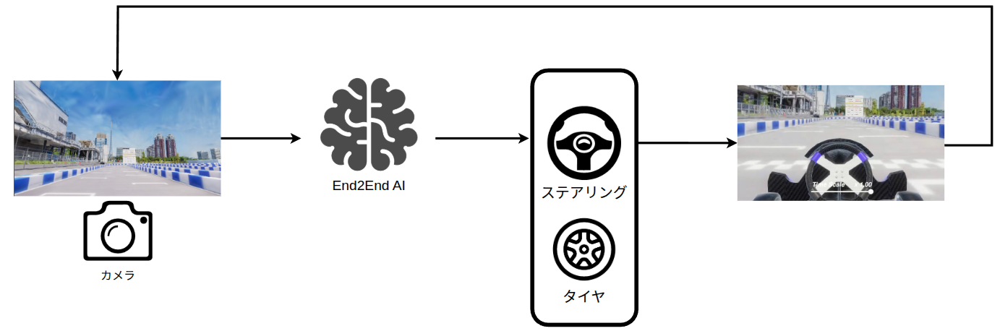

# AI講座

## 概要

本大会ではEnd to End AI部門を用意しています。本部門ではカメラ画像とLiDARデータを入力として、制御信号（あるいは軌道）を出力して自動運転を実現することが求められています。

本ページでは参加者の皆様に基礎知識、及び開発のヒントを身につけていただくために主要なAIアルゴリズムの紹介と提供パッケージの使用方法を説明します。これらのサンプルを改造したり、サンプルを参考にして新規ノードを実装してください。

## AIパッケージ

本年度はEmbodied AI（実世界とインタラクションする機械学習システム）をシミュレータと結合して動作させ、推論を実行できるコードをサンプルとして提供します。

各アルゴリズムの詳細は、[Algorithms](./ml_sample/algorithms.md)を参照ください。

|モデル名|入力センサー|出力|説明|
|---|---|---|---|
|TinyLidarNet|LiDAR|制御信号|[使用方法](./ml_sample/develop_tiny_lidar_net.md)|
|PilotNet|カメラ|制御信号|[使用方法](./ml_sample/develop_pilot_net.md)|
|Reinforcement Learning|カメラ、車速|制御信号|[使用方法](./ml_sample/develop_soft_actor_critic.md)|
|VLM Planner|カメラ|軌道|[使用方法](./ml_sample/vlm_setup.md)|
|VAD Planner|カメラ|軌道|[使用方法](./ml_sample/vad_setup.md)|

### 注意

- VLD PlannerとVAD Plannerは2026年大会のAutowareとは未結合です。使用するためにはご自身で2026年度環境に取り込む必要があります。設計・実装の詳細については [Sample ROS Node (VLM Planner) ](./ml_sample/ai_sample_node_vlm.md)を参照してください。

