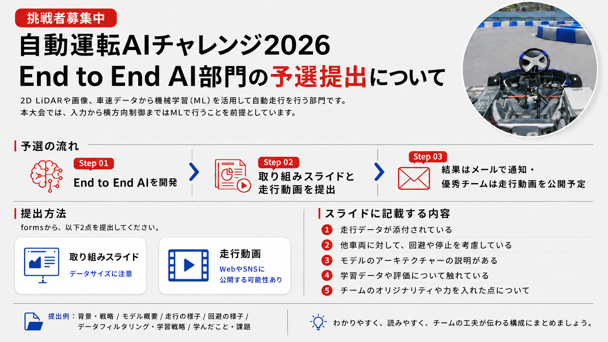
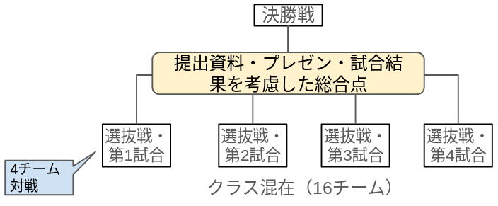
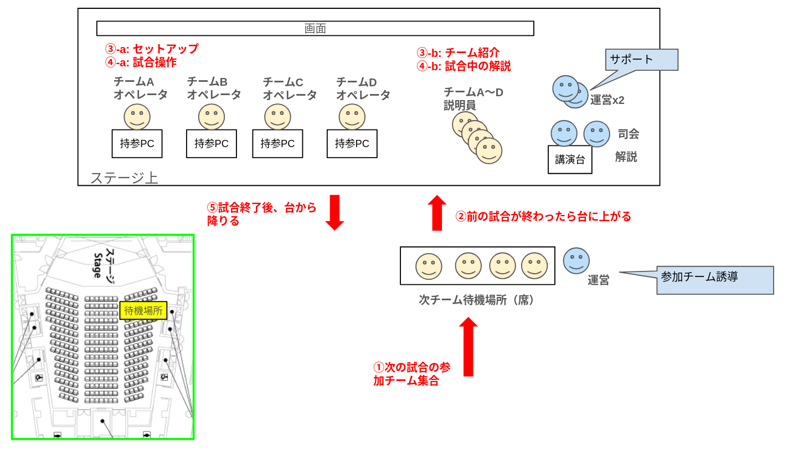

# End to End部門 ルール

## End to End部門概要

End to End AI部門では予選から決勝まで以下のように進みます。

| 項目 | 日程 | 内容 | 参加チーム |
| --- | --- | --- | --- |
| End to End部門 予選 | 7月1日〜9月1日 | プレゼン書類と走行動画を提出。（[提出フォーム](https://forms.office.com/pages/responsepage.aspx?id=NVLCok7DvEuOMQxVDG-yrJTP427xWZBKkcBQTu6n-vxUMTU5SkpIRFQ3UDRWUk9WNTBLVjUwR0lUNy4u&route=shorturl)） | 参加希望者 |
| SIM決勝準備 | 9月18日 | SIM決勝当日と同じ環境で動作確認・練習走行を行います | 決勝進出チームのうち、参加を希望するチーム |
| End to End部門 SIM決勝 | 9月19日 | 決勝会場のシミュレーション環境で走行 | E2E AI予選の上位16チーム |

!!! warning
    - End to End部門参加チームは、Sim to Real部門への参加も必須となります。
    - End to End部門では、実車両での走行はありません。

## End to End部門の共通ルール

### 走行方式

- AWSIM上でシティサーキット東京ベイ（CCTB）コースを模した環境を走行します。

### 速度とペナルティ

[Sim to Real部門](./sw-class.ja.md)と同様です。

### 使用可能なセンサー

- Camera
- LiDAR
- Steer Angle
- Wheel Odometry
- Gear Status

!!! warning "使用可能なセンサーについて"
    End to End AIの取り組みが重視されるため、GNSS など Sim to Real部門で使えていたセンサーは使用できません。

### 安全ゲート

[Sim to Real部門](./sw-class.ja.md)と同様です。

### 禁止事項

[Sim to Real部門](./sw-class.ja.md)と同様です。

## End to End部門 SIM予選

- End to End部門の予選では、参加チームの取り組みを審査します。
- プレゼン書類と走行動画を提出していただき、審査員による採点を行います。
- [提出フォーム](https://forms.office.com/pages/responsepage.aspx?id=NVLCok7DvEuOMQxVDG-yrJTP427xWZBKkcBQTu6n-vxUMTU5SkpIRFQ3UDRWUk9WNTBLVjUwR0lUNy4u&route=shorturl)

## End to End部門 SIM決勝

### 順位決定方式

- 走行は4台同時のレース方式で行われます。周回数は6周です。
- 選抜戦
    - 一般・学生混在で4試合行います。
    - 走行開始位置は、予選での審査結果によって決まります。
    - 書類審査・プレゼン・試合結果の総合点で決勝戦に進出する4チームが選ばれます。
- 決勝戦
    - 選抜戦から進出した4チームで試合を行います。
    - 走行開始位置は、選抜戦での順位によって決まります。
    - 試合走行の完走順によって、最終的な順位が決まります。

### 試合の流れ

| 時間（開始時刻基準） | 内容 |
| --- | --- |
| ①20〜5分前 | 待機場所に移動 |
| ②開始時刻 | 台上に移動 |
| ③0〜25分 | セットアップ & プレゼン |
| ④25〜35分 | 試合走行 |
| ⑤35〜40分 | 後片付け（PCの移動など） |

- 1回の試合は上記タイムテーブルに沿って行われます。
- 開始時刻の5分前までに、メイン会場前方の待機場所にお集まりください。
- 開始時刻になったらステージ上に上がり、セットアップを始めます。
- セットアップでは、持参したPCの起動、ネットワーク設定、Autowareの起動を行います。
- セットアップ時間は25分です。25分経過したら、仮にセットアップが間に合っていないチームがいても走行を始めます。
    - 運営として最低限のサポートは行いますが、基本的には自己責任でセットアップしていただきます。
    - 前日の準備日、練習走行、リハーサルテーブルをご活用ください。
- セットアップと並行して、各チーム5分でプレゼンを行っていただきます。
    - セットアップ作業を行うオペレータとは別に、プレゼン用の説明員をご用意ください。
    - プレゼンはご自身のPCからHDMIで出力するか、事前に発表用pdfの送付をお願いいたします。
    - 説明員の方には試合中に、解説員から質問をすることがあります。
        - 質問例：「いまのコーナーで失速していましたが、原因は何だったのでしょうか？」

### PCの構成

- 試合は以下の5台で行われます。
    - AWSIM用PC
    - 持ち込みPC（チームA）
    - 持ち込みPC（チームB）
    - 持ち込みPC（チームC）
    - 持ち込みPC（チームD）
- 各チームの席にモニター、キーボード、マウス、LANケーブルが配置されています。
- LANケーブルはスイッチングハブを通してAWSIM PCに接続されます。
- 持参したPCをLANケーブルに接続して、ネットワーク設定を行ってください。
    - セットアップ手順書は別途用意しますが、運営スタッフは基本的なサポートしか行いません。

### ルール

- 基本的なルールは上述の共通ルールに従います。
- 試合開始時刻になったら強制的に走行を開始します。セットアップが未完了のチームは、途中からの参加を目指して作業を続けるか、リタイアとなります。
- クラッシュ等で車両がスタックしたり、車両が予期せぬ挙動をした場合、運営側のサポートによる復帰は行いません。
- 参加者は自身のターミナル・RVizから任意の操作が可能です（ただしAWSIM画面は操作できません）。想定される操作は以下のとおりです。
    - Autowareの再起動
    - 自己位置の再設定
    - スタック時に、手動運転による車両の移動
    - `ros2 topic` コマンドによるギア切り替え・ターボコマンド発行
- ただし、操作前には運営に申告する必要があります。また、手動運転を多用することは禁止です。自身のROS_DOMAIN_ID以外に影響を及ぼす操作も禁止です。
