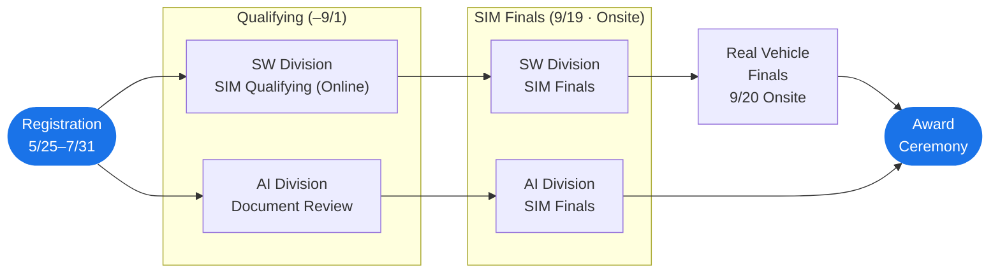

# Competition Overview

!!! info
    Please check the official website and announcements from the organizers for details and the latest information.

## Schedule

※ All dates are in 2026

| Period | Content |
| --- | --- |
| May 25 – July 31 | Registration period |
| July 1 – September 1 | Qualifying period (SW Division: online SIM / AI Division: document submission review) |
| September 19 | Simulation Finals (onsite · Tokyo International Exchange Center) |
| September 20 | Real Vehicle Finals (onsite · City Circuit Tokyo Bay (CCTB)) |
| Late autumn | Award ceremony |

!!! info "Changes from 2025"
    - The single competition division has been reorganized into two divisions: **Sim to Real SW Division** and **End to End AI Division**.
    - Previously, participants advanced directly from online qualifying to the Real Vehicle Finals. This year, a new **SIM Finals (onsite)** stage has been added.

!!! warning "No Real Vehicle Finals for AI Division"
    The final stage for the AI Division is the SIM Finals. The Real Vehicle Finals is held for the SW Division only.

## Divisions

This competition has two divisions. SW Division participation is mandatory for all participants; AI Division participation is optional and open to SW Division participants.

| Item | Sim to Real SW Division | End to End AI Division |
| --- | --- | --- |
| Approach | Rule-based | Machine learning |
| Primary Input Data | Vehicle state sensors + V2X data | External sensors |
| Class | Professional / Student (2 classes) | Unified class |
| Final stage | Real Vehicle Finals | SIM Finals |
| Competition environment | Online · organizer-provided PC | Participant's own PC |
| GPU | Not available | Available |
| Participation | Mandatory | Optional |

### Sim to Real SW Division

- Improve software using V2X data and rule-based algorithms. This division follows the format of previous Autonomous Driving AI Challenge competitions.
- Compete across **3 stages: SIM Qualifying → SIM Finals → Real Vehicle Finals**, starting from sample code built on Autoware / ROS 2.
    - :material-account-group: **Professional class** and **Student class** (2 classes)
    - :material-check-circle: Team registration is required at sign-up
    - :material-monitor: Competition runs on organizer-provided PCs, so participants do not need their own PC or GPU. Note that a GPU is required to run AWSIM locally during development.

### End to End AI Division

- Improve software using sensor data and machine learning algorithms. Participants are expected to implement a single AI model that takes camera and 2D LiDAR inputs.
- The final stage is the **SIM Finals**; there is no Real Vehicle Finals.
    - :material-account: No class divisions (unified class)
    - :material-check-circle: Open to SW Division participants on an opt-in basis
    - :material-laptop: Competition runs on participants' own PCs. GPU use is permitted.
