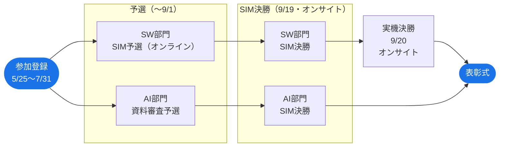

# 大会説明

!!! info
    詳細・最新情報は公式サイト・運営からのアナウンスをご確認ください。

## 部門説明

本大会には 2 つの競技部門があります。Sim to Real SW 部門への参加は全員必須で、End to End AI 部門には希望者が追加参加できます。

| 項目 | Sim to Real SW 部門 | End to End AI 部門 |
| --- | --- | --- |
| アプローチ | ルールベース | 機械学習 |
| 主な入力データ | 車両状態系センサ + V2X データ | 外界センサ |
| クラス | 社会人・学生（2 クラス） | 統一クラス |
| 最終ステージ | 実機決勝 | SIM 決勝 |
| 競技走行環境 | オンライン・運営が用意した PC | 参加チーム自身の PC |
| GPU | 使用不可 | 使用可 |
| 参加 | 全員必須 | 希望者のみ |

## 開催スケジュール

※日程はすべて 2026 年

※SIM = AWSIMシミュレータ上での走行

| 期間 | 内容 |
| --- | --- |
| 5月25日 〜 7月31日 | 参加登録期間 |
| 7月1日 〜 9月1日 | 予選期間（SW部門：オンライン SIM ／ AI部門：提出資料審査） |
| 9月19日 | SIM 決勝（オンサイト・東京国際交流館） |
| 9月20日 | 実車両決勝（オンサイト・シティサーキット東京ベイ（CCTB）） |
| 晩秋 | 表彰式 |

!!! info "2025年度までとの違い"
    - 昨年度まで単一だった競技部門を **Sim to Real SW 部門** と **End to End AI 部門** の 2 部門に再編しました。
    - 昨年度までは予選（オンライン）から直接実車両決勝へ進んでいましたが、今年度は新たに **SIM 決勝（オンサイト）** を設けました。

!!! warning "AI部門は実車両決勝なし"
    AI部門の最終ステージは SIM 決勝です。実車両決勝は SW 部門のみ実施します。

## Sim to Real SW 部門概要

- ルールベースのアルゴリズムによってソフトウェアを改善する部門です。昨年度までの自動運転 AI チャレンジの競技を踏襲しています。
- 車両状態系センサとV2X データが使用可能です。
- **SIM 予選 → SIM 決勝 → 実機決勝** の 3 ステップで腕を競います。
    - :material-account-group: **社会人クラス** と **学生クラス** の 2 クラス制
    - :material-check-circle: 参加登録時にチーム登録が必須
    - :material-monitor: 競技走行は運営が用意した PC で実行するため、参加チームの PC・GPU は不要です。ただし、ローカルでの開発時に AWSIM を動かすには GPU が必要です。

## End to End AI 部門概要

- 機械学習アルゴリズムによってソフトウェアを改善する部門です。
- カメラ・2D LiDARといった外界センサデータを入力とした単一AIモデルを実装することが期待されます。
- 最終ステージは **SIM 決勝** で、実機決勝はありません。
    - :material-account: クラス分けなし（統一クラス）
    - :material-check-circle: SW 部門参加チームが希望制で追加参加可能
    - :material-laptop: 競技走行は参加チーム自身の PC で実行します。GPU の使用も可能です。
