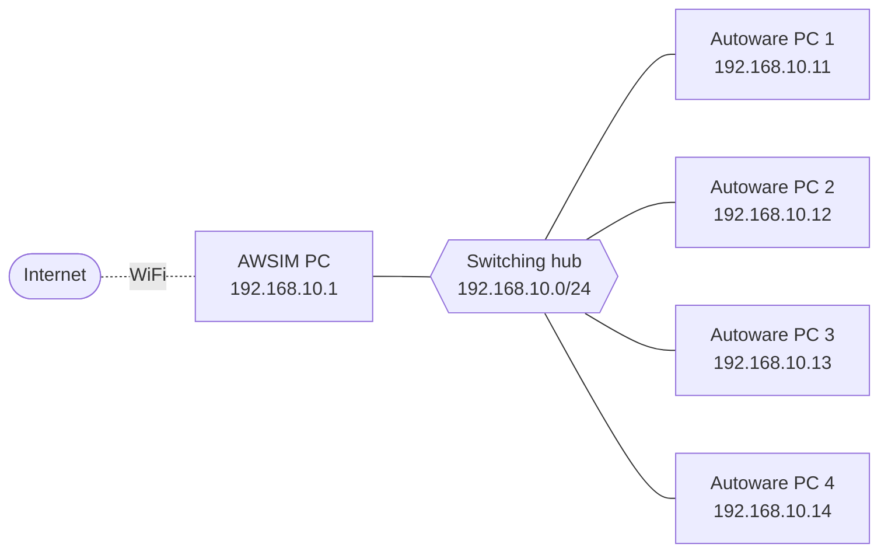
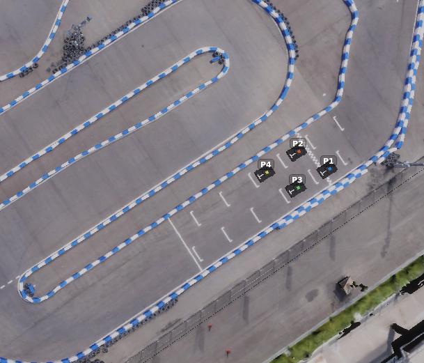

# SIM Finals PC Environment Guide

This page describes the PC environment for the SIM Finals held on September 19. It explains the setup procedure and how to operate the PCs.

!!! warning "WIP"
    Some steps are not yet finalized and may be updated.

## How to read this page { #how-to-read }

Which sections you need to read depends on your team's division and the PC you use. Use the quick-reference table below to find your sections.

| Your team | Sections to read |
| --- | --- |
| Sim to Real division, using the PC provided by the organizers | [Using the Autoware PC provided by the organizers](#operator-pc) → [Running Autoware](#run-autoware) |
| Sim to Real division, using your own PC | [Setting up your own PC](#byod) → [Running Autoware](#run-autoware) |
| End to End division (all teams bring their own PC) | [Setting up your own PC](#byod) → [Running Autoware](#run-autoware) |

## Overview

### Equipment provided at the venue

- SIM Finals, Sim to Real division
    - Each team's seat has an AC power strip, a monitor, a keyboard, a mouse, a LAN cable, and a PC for Autoware
    - Autoware is run on the PC provided by the organizers. Teams that wish to use their own PC may also do so
- SIM Finals, End to End division
    - Each team's seat has an AC power strip, a monitor, a keyboard, a mouse, and a LAN cable
    - Autoware is run on a PC brought by the participating team

### Role of each PC

- The SIM Finals are run with a total of five PCs of the following two types connected together
    - AWSIM PC: the PC that runs the AWSIM simulator. Provided by the organizers.
    - Autoware PC: a PC that runs Autoware only. Participating teams operate this PC.
- One AWSIM PC and four Autoware PCs are connected over a local network.
- Unlike `make dev` used during development, AWSIM does not run on the Autoware PC.

### Network configuration { #network }

- The AWSIM PC and the four Autoware PCs are connected by wired LAN around a **switching hub**. The wired LAN side is the `192.168.10.0/24` network.
- The **Internet** is reached via the AWSIM PC's WiFi.



The mapping between each Autoware PC's IP address, `ROS_DOMAIN_ID`, and grid (starting) position is as follows. **The team in grid position N uses Autoware PC N.**

| Grid position | PC | IP address | `ROS_DOMAIN_ID` |
| --- | --- | --- | --- |
| - | AWSIM PC | `192.168.10.1` | - |
| 1 | Autoware PC 1 | `192.168.10.11` | 1 |
| 2 | Autoware PC 2 | `192.168.10.12` | 2 |
| 3 | Autoware PC 3 | `192.168.10.13` | 3 |
| 4 | Autoware PC 4 | `192.168.10.14` | 4 |

## AWSIM settings

- The simulator (AWSIM) runs on the AWSIM PC provided by the organizers. Participants cannot operate the AWSIM screen.
- The starting positions are shown below. The organizers launch and operate AWSIM with processing equivalent to the following commands.
    - Sim to Real division: `make simulator-s2r-final`
    - End to End division: `make simulator-e2e-final`



## Using the Autoware PC provided by the organizers { #operator-pc }

!!! info "Who this procedure is for"

    - **For**: Sim to Real division teams using the Autoware PC provided by the organizers
    - **Not for**: Sim to Real division teams using their own PC, and all End to End division teams (skip this procedure)

The Autoware PC provided by the organizers is handed over as **an ordinary Ubuntu 22.04 PC that is already logged in**. Please note the following.

- **PC specifications**: see [Specifications / Hardware](../specifications/hardware.en.md).
- **Operations that require sudo**: if you need to do something that requires sudo privileges, such as installing with apt, please ask the organizing staff.
- **Source code location**: the AI Challenge repository at the latest main branch is placed in `~/aichallenge-racingkart`.
    - **As a rule, modifying the source code on site is prohibited.** For how to obtain your source code, see the procedure below.
- **Creating working files**: if you need working files such as scripts, create a folder under `~/temp/` whose name identifies your team (e.g. `~/temp/team_ooo`) and work inside it.

??? note "Connecting over SSH from your own PC"

    Autoware runs on the Autoware PC provided by the organizers, but if you prefer to type commands on a PC you are used to, you can SSH into the provided PC. **You configure this at your own responsibility. Please also bring the required equipment (a LAN port and a LAN cable) yourself.**

    1. **Connect your PC to the organizers' Autoware PC with a LAN cable**
        - Connect to the port on the PC labelled **⑨**.

    2. **Configure your PC's network settings (IPv4) as follows**
        - After configuring, unplug and re-plug the cable once.

        | Item | Value |
        | --- | --- |
        | Method | Manual |
        | IP address | `192.168.50.2` |
        | Netmask | `255.255.255.0` |
        | Others | Leave blank (or Automatic) |

    3. **Connect over SSH from a terminal on your PC.** Ask the organizing staff for the user name and password.

        ```bash
        ssh <username>@192.168.50.1
        ```

    4. **To run GUI applications**, run the following first.

        ```bash
        export DISPLAY=:1
        ```

## Setting up your own PC { #byod }

Teams bringing their own PC need to make the following settings at the venue on the day. The setup has two main stages: **"network settings"** and **"ROS 2 settings"** (the ROS 2 settings are further split into CycloneDDS and `ROS_DOMAIN_ID`).

!!! info "Who this procedure is for"

    - **For**: Sim to Real division teams using their own PC, and all End to End division teams
    - **Not for**: Sim to Real division teams using the Autoware PC provided by the organizers (skip this procedure)

!!! warning "Please update the AI Challenge repository"

    Please bring `~/aichallenge-racingkart` up to date with the main branch as of September 18. Please also rebuild the Docker image.

### Equipment participants must bring

- **A PC to run Autoware**
    - Either a laptop or a desktop PC is fine
    - **Ubuntu 22.04 recommended** (this document describes the network settings assuming Ubuntu 22.04. For other environments, use this document as a reference and work out and apply the settings yourself)
- Everything needed to start up the PC (except the equipment provided at the venue)
- A way to connect to wired LAN (a LAN port, a USB-LAN adapter, etc.)

### Network settings

Assign a static IP so that the PC can reach the Internet over the wired LAN.

!!! note "IP address to set"

    Depending on your team seat (grid position), set one of `192.168.10.11`–`192.168.10.14`. For the mapping between grid position and IP address, see the table in [Network configuration](#network) above.

    | Item | Value |
    | --- | --- |
    | Address | `192.168.10.11`–`192.168.10.14` (according to grid position) |
    | Netmask | `255.255.255.0` |
    | Gateway | `192.168.10.1` |

Procedure

1. **Check the interface name of your LAN port**
    - You can check it with the `ip a` command, for example.
    - From here on, commands refer to this name as `IF_LOCAL`.
2. **Set it to DHCP once**
    - Open `Settings -> Network -> IPv4`
    - Select `Automatic (DHCP)` as the IPv4 Method
    - Click `Apply`
3. **Connect the LAN cable**
    - Plug the LAN cable provided at your team seat into your PC's LAN port.
4. **Set a static IP**
    - Open `Settings -> Network -> IPv4`
    - Select `Manual` as the IPv4 Method
    - Enter the values from "IP address to set" above (Address / Netmask / Gateway)
    - Click `Apply`
5. **Unplug and re-plug the LAN cable once**
6. **Check the connection**
    - Open a terminal and confirm that all three of the following succeed.

    ```bash
    ping 192.168.10.1
    ping 8.8.8.8
    ping google.com
    ```

!!! warning "Troubleshooting"

    **If `ping google.com` fails** (for example, while `ping 8.8.8.8` succeeds)

    If you do not need Internet access, it is fine for `ping google.com` to fail.

    Run the following commands in a terminal. Set `IF_LOCAL` to your own network device name.

    ```bash
    IF_LOCAL=enx3c18a059f0d4    # change this
    NAME_LOCAL=$(nmcli -g GENERAL.CONNECTION dev show "$IF_LOCAL")
    echo $NAME_LOCAL

    sudo nmcli connection modify "$NAME_LOCAL" ipv4.dns 192.168.10.1 ipv4.dns-search "~."
    sudo nmcli connection up "$NAME_LOCAL"
    ```

    **If you are already connected to the Internet through another network**

    If you are already connected to the Internet through another network device, such as the venue WiFi, the connections may conflict. In that case, disable the network device that is connected to the Internet and try again.

### ROS 2 (CycloneDDS) settings

Add the LAN port you use for the LAN cable (`IF_LOCAL`) to the network interfaces used by CycloneDDS. The command below appends the interface to `~/aichallenge-racingkart/vehicle/cyclonedds.xml`.

```bash
IF_LOCAL=enx3c18a059f0d4    # change this
cd ~/aichallenge-racingkart/
./setup.bash network if $IF_LOCAL
```

!!! warning "Note if ROS 2 is installed in your host environment"

    - The configuration file defined by `$CYCLONEDDS_URI` is also overwritten. **Please restore the settings after the competition.**
    - If ROS 2 is installed in your host environment, connection problems may occur. If any of the following environment variables are set in `~/.bashrc` or similar, remove them and reopen the terminal.
        - `ROS_DOMAIN_ID`
        - `ROS_LOCALHOST_ONLY`
        - `RMW_IMPLEMENTATION`
        - `CYCLONEDDS_URI`

### ROS 2 (ROS_DOMAIN_ID) settings

Open the configuration file (`.env`) with the command below and set `ROS_DOMAIN_ID` to one of `1`–`4` according to your team seat (grid position). For the mapping between grid position and `ROS_DOMAIN_ID`, see the table in [Network configuration](#network) above.

```bash
code ~/aichallenge-racingkart/.env
```

```bash
# set according to your grid position
ROS_DOMAIN_ID=1
#ROS_DOMAIN_ID=2
#ROS_DOMAIN_ID=3
#ROS_DOMAIN_ID=4
```

!!! warning "Settings may be checked"

    The organizing staff may check the settings of each PC. If so, please follow the staff's instructions, for example by displaying your settings.

??? note "Checking ROS 2 connectivity"

    AWSIM PC

    ```bash
    ROS_DOMAIN_ID=1 ros2 topic pub -r 1 /chatter std_msgs/msg/String "data: 'Hello World'"
    ROS_DOMAIN_ID=2 ros2 topic pub -r 1 /chatter std_msgs/msg/String "data: 'Hello World'"
    ROS_DOMAIN_ID=3 ros2 topic pub -r 1 /chatter std_msgs/msg/String "data: 'Hello World'"
    ROS_DOMAIN_ID=4 ros2 topic pub -r 1 /chatter std_msgs/msg/String "data: 'Hello World'"
    ```

    Autoware PC

    ```bash
    cd ~/aichallenge-racingkart
    make autoware-bash
    echo $ROS_DOMAIN_ID
    ros2 topic list
    ```

## Running Autoware { #run-autoware }

!!! info "Who this procedure is for"

    - **For**: all participating teams in the Sim to Real and End to End divisions

### Downloading and building the source code

Download and build the source code you will use in the match. Run the steps in the following order.
(If you use your own PC and have already built, you can skip this procedure.)

1. **Download the source code** (`make download`)
    - You will be asked for a user name and password. **Make sure you remember these login credentials.**
    - Next, select the source code to download. To use the latest code, type `1` and press Enter.
    - Note: this step is planned to change to "extracting source code that has been downloaded in advance"
2. **Check the source code** (`code .`)
    - VSCode opens; confirm that the source code is **your own team's**.
    - After checking, we recommend closing VSCode to reduce load.
3. **Build** (`make autoware-build`)

```bash
cd ~/aichallenge-racingkart
make download
code .
make autoware-build
```

### Commands to run Autoware

Run **Autoware only** with the commands below. AWSIM runs on the networked AWSIM PC, so it is not needed on the Autoware PC.

- The Autoware PC's display shows **RViz only**.
- For the AWSIM view, watch **the venue display connected to the AWSIM PC**.

```bash
cd ~/aichallenge-racingkart
make autoware-simulator

# to stop
make down
```

!!! warning "Resetting localization"

    When the race is started or reset from the AWSIM side, the vehicle is forcibly moved to the starting position. Localization may drift when this happens.
    Therefore, restart Autoware, or click `Initial Pose Set` in RViz to reset localization.

### Actions permitted during a match

- **Resetting localization**: you can trigger it by clicking `Initial Pose Set` in RViz.
- **Running ros2 commands**: inside the `make autoware-bash` terminal, you may run ros2 commands against your own `ROS_DOMAIN_ID`.
    - **Always declare it to the organizing staff before running a command.**
    - For example, you may issue the following commands.

        ```bash
        make autoware-bash
        # from here on, inside the Docker container

        # boost
        ros2 topic pub --once /awsim/cmd std_msgs/msg/Float32MultiArray "{data: [1.0]}"
        ros2 topic pub --once /awsim/cmd std_msgs/msg/Float32MultiArray "{data: [0.0]}"

        # gear change
        ros2 topic pub --once /control/command/gear_cmd autoware_auto_vehicle_msgs/msg/GearCommand "{command: 20}"
        ros2 topic pub --once /control/command/gear_cmd autoware_auto_vehicle_msgs/msg/GearCommand "{command: 2}"
        ```
