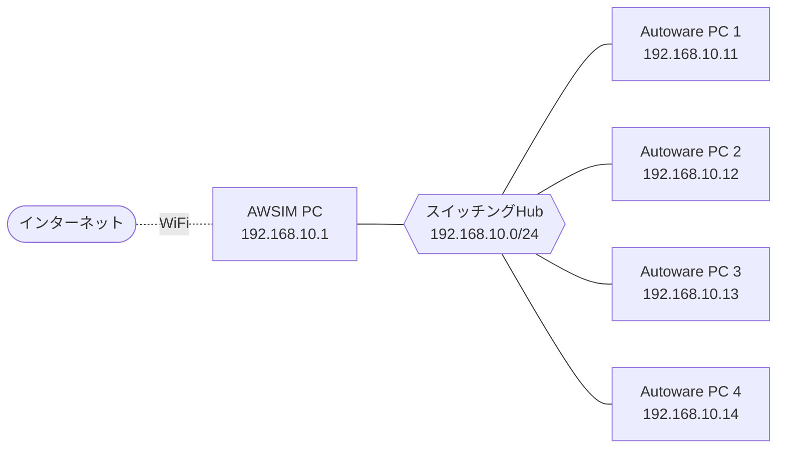

# SIM 決勝 PC 環境説明

このページでは、9月19日に開催する SIM 決勝の PC 環境についてまとめています。セットアップ手順・操作方法を説明します。

## このページの読み方 { #how-to-read }

チームの部門・使用する PC によって、読むべき節が異なります。以下の早見表で自分が読む節を確認してください。

| あなたのチーム | 読む節 |
| --- | --- |
| Sim to Real 部門・運営が用意した PC を使う | [運営が用意する Autoware PC の使い方](#operator-pc) → [Autoware の実行方法](#run-autoware) |
| Sim to Real 部門・持ち込み PC を使う | [持参 PC の設定](#byod) → [Autoware の実行方法](#run-autoware) |
| End to End 部門（全チーム持ち込み） | [持参 PC の設定](#byod) → [Autoware の実行方法](#run-autoware) |

## 概要

### 会場に用意されている機材

- Sim to Real 部門の SIM 決勝
    - 各チームの席に AC 電源タップ、モニター、キーボード、マウス、LAN ケーブル、Autoware 用 PC が配置されています
    - Autoware の実行には運営が用意する PC を使用します。持参 PC の使用を希望するチームは、持参 PC も使用できます
- End to End 部門の SIM 決勝
    - 各チームの席に AC 電源タップ、モニター、キーボード、マウス、LAN ケーブルが配置されています
    - Autoware の実行には参加チーム持参 PC を使用します

### 各 PC の役割

- SIM 決勝は以下の2種類の PC を合計5台接続して行われます
    - AWSIM PC：AWSIM シミュレータを実行する PC です。運営が用意します。
    - Autoware PC：Autoware のみを単体実行する PC です。参加チームは本 PC を操作します。
- AWSIM PC x 1台と Autoware PC x 4台をローカルネットワークで接続します。
- 開発時に使用された `make dev` とは異なり、Autoware PC 上で AWSIM は実行されません。


### ネットワーク構成 { #network }

- **スイッチング Hub** を中心に、AWSIM PC と 4 台の Autoware PC を有線 LAN で接続します。有線 LAN 側は `192.168.10.0/24` のネットワークです。
- **インターネット** へは AWSIM PC の WiFi 経由で接続します。



各 Autoware PC の IP アドレス・`ROS_DOMAIN_ID`・出走位置の対応は以下の通りです。**出走位置 N のチームは Autoware PC N を使用します。**

| 出走位置 | PC | IP アドレス | `ROS_DOMAIN_ID` |
| --- | --- | --- | --- |
| - | AWSIM PC | `192.168.10.1` | - |
| 1 | Autoware PC 1 | `192.168.10.11` | 1 |
| 2 | Autoware PC 2 | `192.168.10.12` | 2 |
| 3 | Autoware PC 3 | `192.168.10.13` | 3 |
| 4 | Autoware PC 4 | `192.168.10.14` | 4 |


## 運営が用意する Autoware PC の使い方 { #operator-pc }

!!! info "本手順の対象"

    - **対象**：Sim to Real 部門で運営が用意した Autoware PC を使うチーム
    - **対象外**：Sim to Real 部門で持ち込み PC を使うチーム、および End to End 部門の全参加チーム（本手順はスキップしてください）

運営が用意する Autoware PC は、**ログイン済みの通常の Ubuntu 22.04 PC** としてお渡しします。以下の点にご留意ください。

- **PC のスペック**：[仕様/ハードウェア](../specifications/hardware.ja.md) をご確認ください。
- **sudo 権限が必要な操作**：apt コマンドによるインストールなど sudo 権限が必要な操作を行う場合は、運営スタッフにお声がけください。
- **ソースコードの配置**：`~/aichallenge-racingkart` に、最新の main ブランチの AI チャレンジリポジトリが配置されています。
    - **この場でのソースコード変更は原則禁止**です。ソースコードの取得方法は後述の手順を参照してください。
- **作業用ファイルの作成**：スクリプトなど作業用ファイルが必要な場合は、`~/temp/` 配下にチーム名がわかるフォルダ（例：`~/temp/team_ooo`）を各自作成し、その中で作業してください。


??? note "持参 PC から SSH 接続する方法"

    Autoware の実行は運営が用意する Autoware PC で行いますが、コマンド操作などを使い慣れた持参 PC で行いたい場合は、運営が用意する PC へ SSH 接続できます。**設定は自己責任で行ってください。また、必要な機材（LAN ポートと LAN ケーブル）は各自でご用意ください。**

    1. **持参 PC と運営 Autoware PC を LAN ケーブルで接続する**
        - PC の **⑨** と書いてあるポートに接続します。

    2. **持参 PC のネットワーク設定（IPv4）を以下のようにする**
        - 設定後、一度ケーブルを抜き差しします。

        | 項目 | 設定値 |
        | --- | --- |
        | Method | Manual（手動） |
        | IP アドレス | `192.168.50.2` |
        | Netmask | `255.255.255.0` |
        | その他 | 空欄（または Automatic） |

    3. **持参 PC のターミナルから SSH 接続する**。ユーザー名とパスワードは運営スタッフにご確認ください。

        ```bash
        ssh ユーザー名@192.168.50.1
        ```

    4. **GUI アプリを実行する場合**は、事前に以下を実行してください。

        ```bash
        export DISPLAY=:1
        ```


## 持参 PC の設定 { #byod }

PC を持参するチームは、当日会場で以下の設定を行う必要があります。設定は大きく **「ネットワーク設定」** と **「ROS 2 の設定」** の 2 段階です（ROS 2 の設定は、CycloneDDS と `ROS_DOMAIN_ID` の 2 つに分かれます）。

!!! info "本手順の対象"

    - **対象**：Sim to Real 部門で持ち込み PC を使うチーム、および End to End 部門の全参加チーム
    - **対象外**：Sim to Real 部門で運営が用意した Autoware PC を使うチーム（本手順はスキップしてください）

!!! warning "AI チャレンジリポジトリの更新のお願い"

    `~/aichallenge-racingkart` を、main ブランチの9月18日時点での最新状態にしておいてください。また、Docker イメージの再ビルドを行っておいてください。


### 参加者が用意する機材

- **Autoware 実行用 PC**
    - ノート PC / デスクトップ PC いずれも可
    - **Ubuntu 22.04 推奨**（本ドキュメントは Ubuntu 22.04 を前提にネットワーク設定を記載します。それ以外の環境では、本ドキュメントを参考に各自で設定方法を確認・実施してください）
- PC を起動するために必要な機材一式（会場で用意されている機材は除く）
- 有線 LAN に接続する手段（LAN ポート、USB-LAN 変換アダプタなど）

### ネットワーク設定

固定 IP を割り当てて、有線 LAN 経由でインターネットへ接続できる状態にします。

!!! note "設定する IP アドレス"

    チーム席（出走位置）に応じて、`192.168.10.11`〜`192.168.10.14` のいずれかを設定します。出走位置と IP アドレスの対応は、上記 [ネットワーク構成](#network) の表を参照してください。

    | 項目 | 設定値 |
    | --- | --- |
    | Address | `192.168.10.11`〜`192.168.10.14`（出走位置に応じて） |
    | Netmask | `255.255.255.0` |
    | Gateway | `192.168.10.1` |

**手順**

1. **LAN ポートのインターフェイス名を確認する**
    - `ip a` コマンドなどで確認できます。
    - 以後、コマンド内ではこの名前を `IF_LOCAL` と表記します。
2. **一度 DHCP に設定する**
    - `設定 -> Network -> IPv4` を開く
    - IPv4 Method で `Automatic (DHCP)` を選ぶ
    - `Apply` をクリック
3. **LAN ケーブルを接続する**
    - チーム席に用意されている LAN ケーブルを、持参 PC の LAN ポートに挿します。
4. **固定 IP に設定する**
    - `設定 -> Network -> IPv4` を開く
    - IPv4 Method で `Manual` を選ぶ
    - 上記「設定する IP アドレス」の値（Address / Netmask / Gateway）を入力する
    - `Apply` をクリック
5. **LAN ケーブルを一度抜き差しする**
6. **接続確認を行う**
    - ターミナルを開き、以下の3つが成功することを確認します。

    ```bash
    ping 192.168.10.1
    ping 8.8.8.8
    ping google.com
    ```

!!! warning "トラブルシューティング"

    **`ping google.com` が失敗する場合**（`ping 8.8.8.8` は成功する場合など）

    インターネット接続が不要な場合は、`ping google.com` には失敗しても問題ありません。

    ターミナルで以下のコマンドを実行してください。`IF_LOCAL` にはご自身のネットワークデバイス名を設定してください。

    ```bash
    IF_LOCAL=enx3c18a059f0d4    # 要変更
    NAME_LOCAL=$(nmcli -g GENERAL.CONNECTION dev show "$IF_LOCAL")
    echo $NAME_LOCAL

    sudo nmcli connection modify "$NAME_LOCAL" ipv4.dns 192.168.10.1 ipv4.dns-search "~."
    sudo nmcli connection up "$NAME_LOCAL"
    ```

    **別のネットワークで既にインターネット接続している場合**

    会場内 WiFi など別のネットワークデバイスで既にインターネットに接続していると、接続に不整合が出ることがあります。その場合は、インターネットに接続しているネットワークデバイスを無効にしてから再度お試しください。

### ROS 2 (CycloneDDS) の設定

CycloneDDS が使用するネットワークインターフェイスに、LAN ケーブル接続に使用している LAN ポート（`IF_LOCAL`）を追加します。下記コマンドによって `~/aichallenge-racingkart/vehicle/cyclonedds.xml` に設定したインターフェイスが追記されます。

```bash
cd ~/aichallenge-racingkart/
./setup.bash network if $IF_LOCAL
```

!!! warning "ホスト環境に ROS 2 がインストールされている場合の注意"

    - `$CYCLONEDDS_URI` で定義される設定ファイルも上書きされます。**本大会終了後、設定を元に戻してください。**
    - ホスト環境に ROS 2 がインストールされている場合、接続に問題が発生する可能性があります。`~/.bashrc` などで以下の環境変数が設定されていたら、削除してターミナルを立ち上げ直してください。
        - `ROS_DOMAIN_ID`
        - `ROS_LOCALHOST_ONLY`
        - `RMW_IMPLEMENTATION`
        - `CYCLONEDDS_URI`

### ROS 2 (ROS_DOMAIN_ID) の設定

チーム席（出走位置）に応じて、`ROS_DOMAIN_ID` を `1`〜`4` のいずれかに設定します。出走位置と `ROS_DOMAIN_ID` の対応は、上記 [ネットワーク構成](#network) の表を参照してください。

以下のコマンドで設定ファイル（`.env`）を開き、使用する `ROS_DOMAIN_ID` の行だけを有効化（先頭の `#` を外す）してください。

```bash
code ~/aichallenge-racingkart/.env
```

```bash
# 出走位置に応じて1行だけを有効にする（例：出走位置1）
ROS_DOMAIN_ID=1
#ROS_DOMAIN_ID=2
#ROS_DOMAIN_ID=3
#ROS_DOMAIN_ID=4
```

??? note "ROS 2 の疎通確認"

    AWSIM PC

    ```bash
    ROS_DOMAIN_ID=1 ros2 topic pub -r 1 /chatter std_msgs/msg/String "data: 'Hello World'"
    ROS_DOMAIN_ID=2 ros2 topic pub -r 1 /chatter std_msgs/msg/String "data: 'Hello World'"
    ROS_DOMAIN_ID=3 ros2 topic pub -r 1 /chatter std_msgs/msg/String "data: 'Hello World'"
    ROS_DOMAIN_ID=4 ros2 topic pub -r 1 /chatter std_msgs/msg/String "data: 'Hello World'"
    ```

    Autoware PC

    ```bash
    cd ~/aichallenge-racingkart
    make autoware-bash
    echo $ROS_DOMAIN_ID
    ros2 topic list
    ```

## Autoware の実行方法 { #run-autoware }

!!! info "本手順の対象"

    - **対象**：Sim to Real 部門・End to End 部門の全参加チーム

### ソースコードのダウンロードとビルド

試合に使用するソースコードをダウンロードし、ビルドします。以下の順に実行してください。
（持参 PC を使用し、既にビルド済みの場合は本手順はスキップ可能です）

1. **ソースコードをダウンロードする**（`make download`）
    - 実行するとユーザー名とパスワードを聞かれます。**このログイン情報は必ず覚えておいてください。**
    - 続いてダウンロードするソースコードを選択します。最新のコードを使用する場合は `1` を入力してエンターを押します。
2. **ソースコードを確認する**（`code .`）
    - VSCode が開くので、ソースコードが **自チームのもの** であることを確認してください。
    - 確認後は、負荷低減のため VSCode を閉じることを推奨します。
3. **ビルドする**（`make autoware-build`）

```bash
cd ~/aichallenge-racingkart
make download
code .
make autoware-build
```

### Autoware の実行コマンド

下記コマンドで **Autoware のみ** を実行します。AWSIM はネットワーク接続された AWSIM PC で実行されるため、Autoware PC 側では不要です。

- Autoware PC のディスプレイには **RViz のみ** が表示されます。
- AWSIM の映像は、**AWSIM PC に接続された会場ディスプレイ** をご確認ください。

```bash
cd ~/aichallenge-racingkart
make autoware-simulator

# 終了する場合
make down
```

!!! warning "自己位置のリセットについて"

    AWSIM 側の操作によってレースが開始・リセットされると、車両位置は強制的にスタート位置に移動します。この際、自己位置がずれる可能性があります。
    そのため、Autoware を再起動するか、RViz 上で `Initial Pose Set` をクリックして自己位置をリセットしてください。

### 試合中に許可されている行為

- **自己位置のリセット**：RViz 上で `Initial Pose Set` をクリックすることで指示できます。
- **ros2 コマンドの実行**：`make autoware-bash` のターミナル内で、自身の `ROS_DOMAIN_ID` に対して ros2 コマンドを実行できます。
    - **実行前に、必ず運営スタッフへ宣言してください。**
    - 例えば以下のコマンドを発行できます。

        ```bash
        # ブースト
        ros2 topic pub --once /awsim/cmd std_msgs/msg/Float32MultiArray "{data: [1.0]}"
        ros2 topic pub --once /awsim/cmd std_msgs/msg/Float32MultiArray "{data: [0.0]}"

        # ギア切り替え
        ros2 topic pub --once /control/command/gear_cmd autoware_auto_vehicle_msgs/msg/GearCommand "{command: 20}"
        ros2 topic pub --once /control/command/gear_cmd autoware_auto_vehicle_msgs/msg/GearCommand "{command: 2}"
        ```
