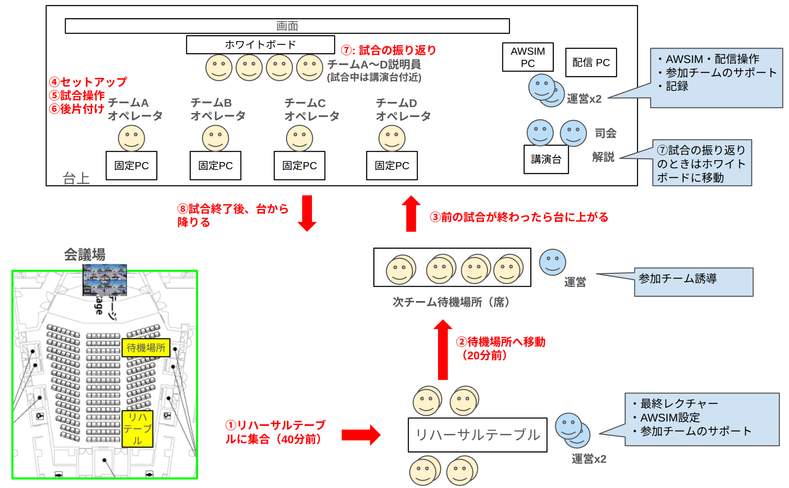

# SIM決勝特設ページ（2026/9/19）

このページでは、9月19日に開催する SIM 決勝の会場・スケジュール・当日の進行をまとめています。SIM 決勝は Sim to Real 部門・End to End 部門の 2 部門で行います。

## 対象

SIM 決勝進出チーム及び補欠チーム

## 会場

- 東京国際交流館 プラザ平成3階 [国際交流会議場](https://www.jasso.go.jp/ryugaku/kyoten/tiec/plazaheisei/facility/hall.html)
- [アクセス](https://www.jasso.go.jp/ryugaku/kyoten/tiec/access.html)

## スケジュール

### 全体日程

| 日付 | 会場 | 内容 |
| --- | --- | --- |
| 9/18（金） | 国際交流館 | 事前練習 |
| **9/19（土）** | **国際交流館** | **SIM 決勝** |
| 9/20（日） | CCTB | Sim to Real部門 実機決勝 |

### 9/18 事前練習

- 9月18日 に、本番同様の環境で試走ができる 事前練習会 への参加が可能です。参加は任意ですが、参加することを強く推奨します。
- 今回の大会では、PCのセットアップは自己責任で行っていただきます。そして、走行開始時間になったら強制的に試合が始まります。そのため、操作に慣れておくことが非常に重要です。特に、PCを持ち込むチームは接続・動作確認を事前に行うことでSIM 決勝当日でのトラブルを防げます。
- E2E部門参加チームはプレゼン資料の投影確認も行えます。
- 詳細・出欠は後日告知します。

| 時間 | 内容 |
| --- | --- |
| 13:00〜17:00 | 練習走行（Sim to Real部門） |
| 15:00〜17:00 | 練習走行（End to End部門） |

### 9/19 SIM決勝の全体スケジュール

| 時間 | 内容 |
| --- | --- |
| 9:30〜10:30 | 練習走行（Sim to Real部門） |
| 10:30〜10:40 | 開会・対戦表発表 |
| 10:40〜12:00 | Sim to Real部門 一般クラス SIM決勝 |
| 12:00〜13:00 | 昼休み。練習走行（End to End部門） |
| 13:00〜14:20 | Sim to Real部門 学生クラス SIM決勝 |
| 14:30〜17:10 | End to End部門 SIM選抜戦 |
| 17:10〜17:40 | End to End部門 SIM決勝戦 |
| 18:00〜 | 交流会 |

当日は試合の他に、ポスター展示、スポンサーブース、フリー対戦テーブル、交流会を用意しています。フリー対戦テーブルでは自由に対戦走行を楽しむことが出来ます！

### 9/19 試合スケジュール（Sim to Real部門）

| 開始 | 終了 | 内容 |
| ----- | ----- | ------------------------------------- |
| 10:40 | 11:00 | Sim to Real部門 一般クラス 第1試合 |
| 11:00 | 11:20 | Sim to Real部門 一般クラス 第2試合 |
| 11:20 | 11:40 | Sim to Real部門 一般クラス 第3試合 |
| 11:40 | 12:00 | Sim to Real部門 一般クラス 第4試合 |
| 13:00 | 13:20 | Sim to Real部門 学生クラス 第1試合 |
| 13:20 | 13:40 | Sim to Real部門 学生クラス 第2試合 |
| 13:40 | 14:00 | Sim to Real部門 学生クラス 第3試合 |
| 14:00 | 14:20 | Sim to Real部門 学生クラス 第4試合 |

- ※試合開始40分前に、会場に用意したリハーサルテーブルにお集まりください。その後、試合開始20分前に運営案内によって待機場所に移動していただきます。遅れた場合は棄権・不戦敗扱いとなる可能性があります。
- ※遅くとも10時までに受付を済ませてください

### 9/19 試合スケジュール（End to End部門）

| 開始 | 終了 | 内容 |
| ----- | ----- | ------------------------------- |
| 14:30 | 15:10 | End to End部門 選抜戦 第1試合 |
| 15:10 | 15:50 | End to End部門 選抜戦 第2試合 |
| 15:50 | 16:30 | End to End部門 選抜戦 第3試合 |
| 16:30 | 17:10 | End to End部門 選抜戦 第4試合 |
| 17:10 | 17:40 | End to End部門 決勝戦 |

- ※試合開始20分前に、会場に用意した待機場所にお集まりください。遅れた場合は棄権・不戦敗扱いとなる可能性があります。
- ※遅くとも10時までに受付を済ませてください
- ※PCの搬入には事前練習日、練習走行時間をご活用ください

## Sim to Real部門の進行

ルールは[こちら](./sw-class.ja.md#semifinal)をご確認ください。

!!! info "オーバーテイクレーンについて"

    SIM決勝は `s2r-final` モード（オーバーテイクレーン on）で実施します。ルールは[オーバーテイクレーン](./sw-class.ja.md#overtake-lane)を参照してください。

### 役割 { #s2r-role }

- オペレーター：Autoware PCのセットアップ・操作を行う
    - ソースコードダウンロードのために、ログインIDとパスワードを必ず覚えておいてください
- 説明員：試合後の振り返りを行う（オペレータと兼務可）

!!! info "ステータス可視化のお願い"

    観覧者に向けて、各チームがいま何を行っているか（走行中、バグ対応中 など）を可視化するアプリを用意します。現在の状態をタップするだけで更新できる予定です。観覧者にできる限りリアルタイムで反映したいので、状態が変わったら更新をお願いいたします。

### 試合の流れ { #s2r-flow }

| 時間（開始時刻基準） | 内容 |
| --- | --- |
| ①40分前 | リハーサルテーブルに集合。接続確認・動作確認を行う |
| ②20分前 | 待機場所に移動 |
| ③開始時刻 | ステージ上に移動 |
| ④0〜10分 | セットアップ |
| ⑤10〜18分 | 本番走行 |
| ⑥18〜20分 | 後片付け（ソースコードの削除など） |
| ⑦20〜30分 | 走行の振り返り |

- 1回の試合は上記タイムテーブルに沿って行われます。
- 開始時刻の40分前までに、メイン会場後方に用意したリハーサルテーブルにお集まりください。
    - リハーサルテーブルでは、試合と同じ構成のPCを用意しています。
    - リハーサルテーブルで、操作の最終確認を行えます。
- 開始時刻の20分前に、メイン会場前方の待機場所に移動します。
    - このタイミングのソースコードの変更は原則禁止とさせていただきます
- 開始時刻になったらステージに上がり、セットアップを始めます。
- セットアップでは、ソースコードのダウンロード、ビルド、Autowareの起動を行います。持参したPCを使用する場合にはネットワークの設定も必要になります。
- セットアップ時間は10分です。10分経過したら、仮にセットアップが間に合っていないチームがいても走行を始めます。
    - 運営として最低限のサポートは行いますが、基本的には自己責任でセットアップしていただきます。
    - 前日の準備日、練習走行、リハーサルテーブルをご活用ください。
- ダウンロードしたソースコードは、走行後に削除できます（そのままでも問題ありません）。
- 試合後10分間で、走行の振り返りを行います。解説員からの質問にご回答をお願いします。
    - 質問例：「最初のコーナーで失速していましたが、原因は何だったのでしょうか？」
    - 振り返りを行う説明員と操作を行うオペレータは、別メンバーでも1人が兼任でも構いません。

### PCの構成 { #s2r-pc }

- 試合は以下の5台で行われます。
    - AWSIM用PC
    - Autoware用PC（チームA用）
    - Autoware用PC（チームB用）
    - Autoware用PC（チームC用）
    - Autoware用PC（チームD用）
- 各チームの席にAutoware用PCとモニター、キーボード、マウス、LANケーブルが配置されています。
- 各PCはスイッチングハブを通してAWSIM PCに接続されます。インターネットへのアクセスも提供されます。
- 参加チームが持参したPCを使うことも可能ですが、運営スタッフは基本的なサポートしか行いません。
    - セットアップ手順書は別途用意します。

## End to End部門の進行

ルールは[こちら](./ai-class.ja.md#semifinal)をご確認ください。

### 役割 { #e2e-role }

- オペレーター：Autoware PCのセットアップ・操作を行う
- 説明員：試合前に5分間のプレゼンテーション発表を行う

### 試合の流れ { #e2e-flow }

| 時間（開始時刻基準） | 内容 |
| --- | --- |
| ①20分前 | 待機場所に移動 |
| ②開始時刻 | ステージ上に移動 |
| ③0〜25分 | ・セットアップ ・プレゼン（5分x4チーム） |
| ④25〜35分 | 本番走行 |
| ⑤35〜40分 | 後片付け（PCの移動など） |

- 1回の試合は上記タイムテーブルに沿って行われます。
- 開始時刻の20分前までに、メイン会場前方の待機場所にお集まりください。
- 開始時刻になったらステージ上に上がり、セットアップを始めます。
- セットアップでは、持参したPCの起動、ネットワーク設定、Autowareの起動を行います。
- セットアップ時間は25分です。25分経過したら、仮にセットアップが間に合っていないチームがいても走行を始めます。
    - 運営として最低限のサポートは行いますが、基本的には自己責任でセットアップしていただきます。
    - 前日の準備日、練習走行、リハーサルテーブルをご活用ください。
- セットアップと並行して、各チーム5分でプレゼンを行っていただきます。
    - セットアップ作業を行うオペレータとは別に、プレゼン用の説明員をご用意ください。
    - プレゼンはご自身のPC（Autoware用PCとは別のPCを推奨）からHDMIで出力するか、事前に発表用pdfの送付をお願いいたします。

### PCの構成 { #e2e-pc }

- 試合は以下の5台で行われます。
    - AWSIM用PC
    - 参加チーム持参PC（チームA）
    - 参加チーム持参PC（チームB）
    - 参加チーム持参PC（チームC）
    - 参加チーム持参PC（チームD）
- 各チームの席にAC電源タップ、モニター、キーボード、マウス、LANケーブルが配置されています。それ以外に必要な機材は全て参加者側でご用意ください。有線LANに接続する手段（LANポートまたはUSB-LAN変換アダプタ）もご用意ください
- LANケーブルはスイッチングハブを通してAWSIM PCに接続されます。インターネットへのアクセスも同じケーブルで提供されます。
- 持参したPCをLANケーブルに接続して、ネットワーク設定を行ってください。
    - セットアップ手順書は別途用意しますが、運営スタッフは基本的なサポートしか行いません。
