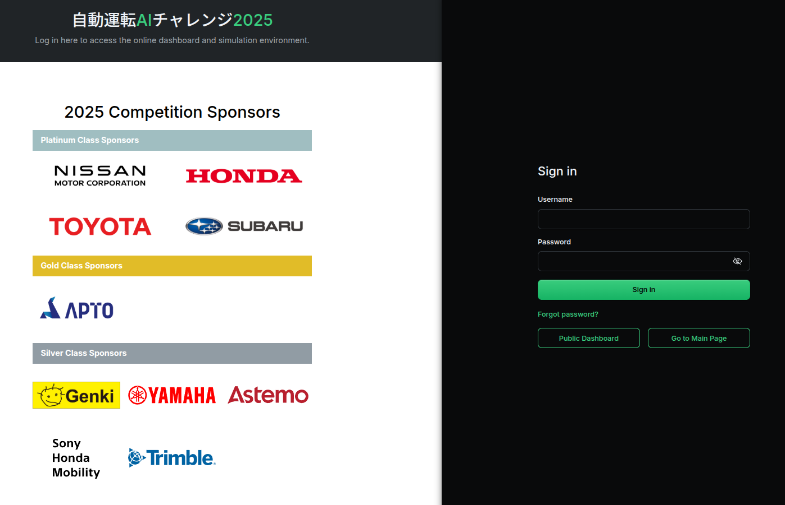
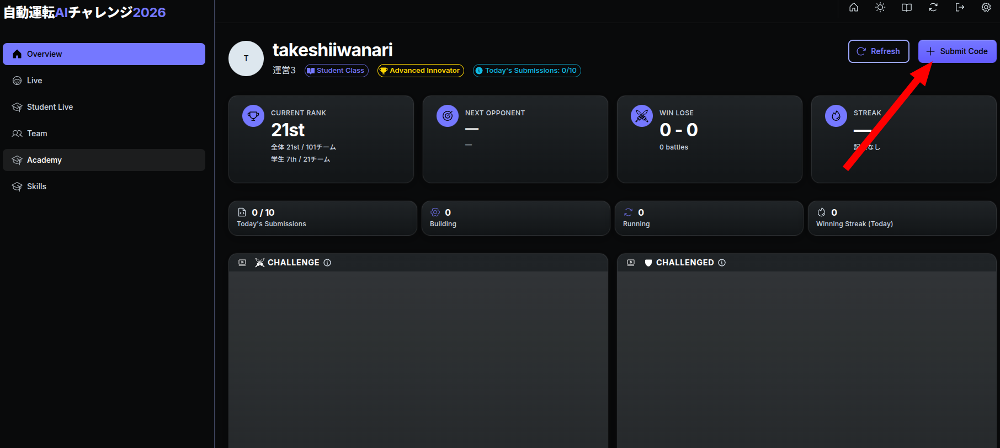
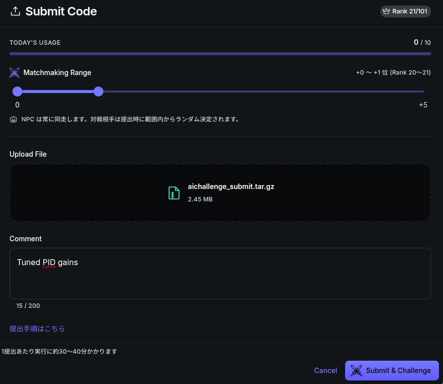
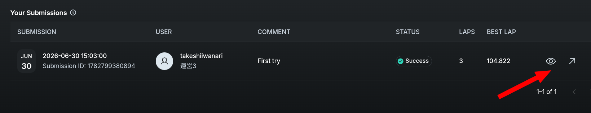
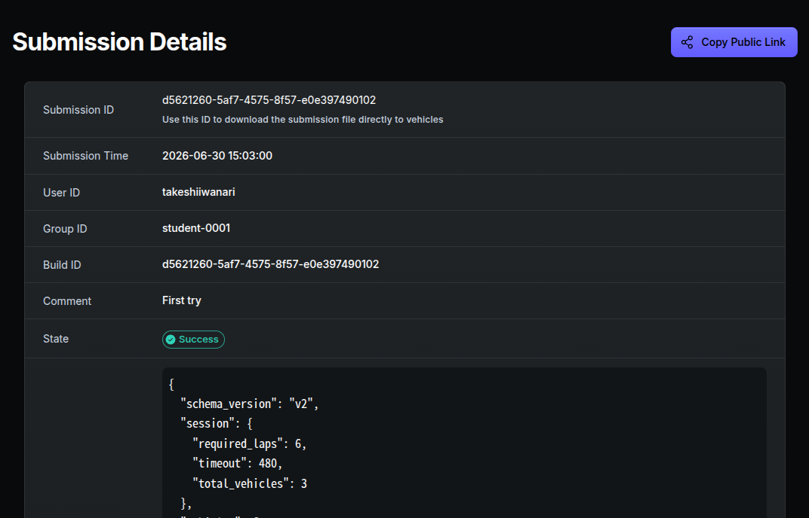

# SW Division Submission Guide

## Online Environment

In the SW Division SIM Qualifying, scoring is conducted using an online environment equipped with a simulator and automatic scoring function. Follow the steps below to upload your packages to the online environment. After uploading, the simulation will automatically start and results will be displayed.

> Note: Screenshots on this page are from 2025.

## How Scoring and Ranking Work

Online scoring is not a simple lap-time ladder — it is a **head-to-head battle format**. Understanding the mechanism helps you plan your submission strategy.

- **Battle format**: Your submitted code (the CHALLENGER) races in the same session against the submitted code of a higher-ranked team (the defender), and the **finishing order** decides the winner.
- **Rating**: Your team's rating (Rate) goes up when you win and down when you lose, and the leaderboard is ordered by rating. A tie counts as a successful defense for the defender, and no rating changes.
- **Opponent selection (matchmaking)**: When submitting, you can choose how far above your own rank to challenge. Challenging a higher-ranked team yields a larger rating gain when you win.
    - A submission by the 1st-ranked team becomes a defense battle against an NPC.
    - Unranked teams enter the leaderboard after their first submission.

!!! note
    The exact rating formula, coefficients, and selectable opponent range may be adjusted by the organizers. Treat the online environment's own display as the source of truth for current behavior.

## Submission Lifecycle

Processing after upload has two stages: **build** (a Docker image is created from your code) and **execution** (the simulation battle runs). The STATUS shown for your submission follows these stages:

```text
Queued → Building → Running → Success
              └─ build failure ─┴─ run failure → Failed
```

Build failures and run failures have different causes and different places to look — see [If Failed](#if-failed) below.

## Submission Steps

Submit to the online environment using the following steps:

1. Compress source code

    - Run `./create_submit_file.bash` to compress the `aichallenge_submit` directory.
    - The compressed file is saved at `aichallenge-racingkart/submit/aichallenge_submit.tar.gz`.
    - See the [Submission Contract](../specifications/submission-contract.en.md) for the structure and interfaces your submission must satisfy.

2. Verify operation in local evaluation environment

    See [Development Guide — Local Evaluation](../development/development-guide.en.md#local-evaluation) for details.

3. Submit to the online scoring environment

    Access the [online environment](https://aichallenge-board.jsae.or.jp).
    

    Log in from the "Login" button in the top right.
    

    Once logged in, upload `aichallenge_submit.tar.gz` using the "Submit Code" button. After uploading, the source code will be built and simulation will be run in sequence.
    

    On the upload screen, select the `aichallenge_submit.tar.gz` to upload. You can optionally add a comment. You can also change the rank range of the opponent to challenge — by default you battle the team one rank above you. Widening the range lets you challenge higher-ranked teams, with a larger rating gain if you win. Choose strategically.

    If successful, "Success" will be displayed.
    If the build fails, the launch fails, or the score is not output, "Failed" will be displayed. In this case, please re-upload as there may be an internal server error. Contact us via Slack if the problem persists.

    

## Checking Results

- After the race finishes in the online environment, you can check the latest rankings.
- Detailed race data including lap times and logs can be checked by clicking the button at the right end of the submission history.
    - You can check `result-summary.json`, rosbag, and `autoware.log`.

    

    

## If Failed

First determine whether it was a **build failure** or a **run failure**.

- **Failed during Building**: caused by dependency or build errors. Note that during the online build, dependencies that `rosdep` cannot resolve are **skipped without an error**, so a missing dependency may only surface at runtime rather than at build time. Always confirm your code builds and launches cleanly with a local `make eval` first.
- **Failed after reaching Running**: caused by launch failures or nodes crashing. Check `autoware.log` and the rosbag downloadable from the submission details.

- Check for package dependency issues

    - Verify that there are no missing dependencies in `package.xml`, `setup.py`, or `CMakeLists.txt`, depending on the language used.

- Check Docker

    - Use the following command to check inside Docker and verify that everything is correctly installed and built in the required directories.

    - `docker run -it aichallenge-racingkart-eval:latest /bin/bash`

- Directories to check:

    - `/aichallenge/workspace/*`
    - `/autoware/install/*`
