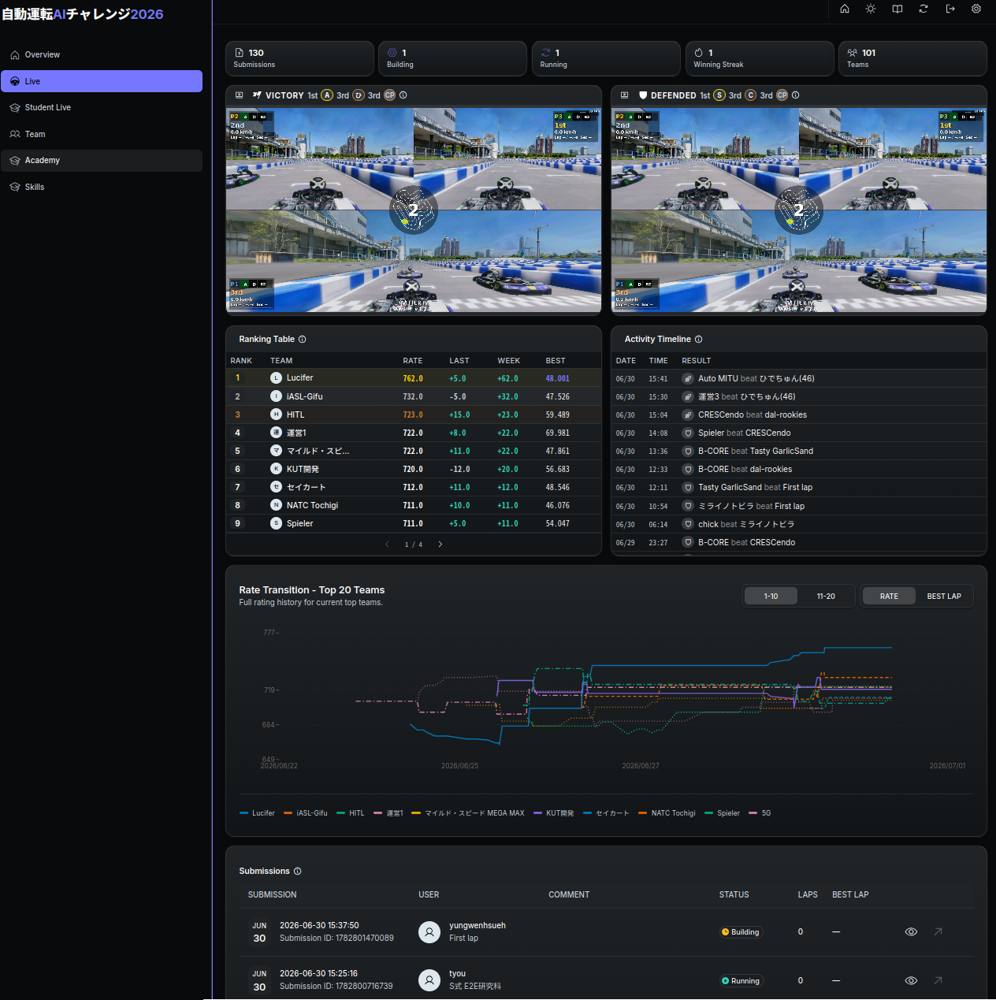

# SW部門 提出手順

## オンライン環境

Sim to Real SW部門 SIM予選では、シミュレーターと自動採点機能を備えたオンライン環境を使用して採点が行われます。以下の手順に従って、作成したパッケージ群をオンライン環境にアップロードしてください。アップロード後、シミュレーションが自動で開始され、結果が表示されます。

## 提出手順

オンライン環境への提出は以下の手順で行います。

1. ソースコードの圧縮

    - `./create_submit_file.bash`を実行してaichallenge_submitディレクトリを圧縮します。
    - 圧縮したファイルはaichallenge-racingkart/submit/aichallenge_submit.tar.gzに保存されています。

2. ローカル評価環境での動作確認

    詳細は[開発の進め方 — ローカル評価の手順](../development/development-guide.ja.md#ローカル評価の手順)を参照してください。

3. オンライン採点環境への提出

    [オンライン環境](https://aichallenge-board.jsae.or.jp)にアクセスします。
    

    右上の「Login」 ボタンからログインします。
    

    ログインが完了したら「Submit Code」ボタンでアップロードを行います。
    

    アップロード画面では、アップロードする`aichallenge_submit.tar.gz` を選択します。任意でコメントを記載出来ます。また、対戦相手のレートの範囲を変更することが出来ます。デフォルトはランクが1つ上のチームと対戦します。範囲を広げることで、より上位ランクのチームと対戦する可能性がありますが、勝利したときのレートの上がり幅が大きくなります。戦略を練って設定しましょう。
    

## 結果の確認手順

- アップロード後、ソースコードのビルドとシミュレーションが順に実施されます。画面下部の「Your Submissions」で、今回提出したソースコードのSTATUSを確認できます。正常に処理が進むと、Queued → Building → Running → Successとなります。全ての処理が完了するまで、30分程度かかります。万が一ビルドに失敗したり、launchに失敗した場合は「Failed」と表示されます。ログや提出物をご確認ください。
- オンライン環境での走行が終わると、Activity Timelineや動画で結果を確認出来ます。試合結果によって、レートが増減します。
- ページ下部の「Your Submissions」の右側のアイコンクリックによって、ラップタイムやログなどの走行時の詳細データを確認・取得できます。
    - `result-summary.json`、rosbag、`autoware.log`を確認することができます
    - 画面右上の「Copy Public Link」によってSNSでの共有用リンクを取得できます

    

    

## Failedの場合

- packageの依存関係に問題がないか確認

    - 使用言語に応じて、`package.xml`、`setup.py`、または`CMakeLists.txt`に依存関係の漏れがないか確認してください。

- dockerの確認

    - `make eval` 実行中に、 `make autoware-attach` でコンテナに入れます

- 確認するディレクトリ:

    - `/aichallenge/workspace/*`
    - `/autoware/install/*`

## オンライン環境のページ概要

- 「Overview」ページ（ログイン後のみ）
    - 自チームのランク情報や提出履歴を確認できます
- 「Live」ページ
    - 全チーム混在のランク情報などを確認できます
- 「Student Live」ページ
    - 学生クラス内のチームのランク情報などを確認できます

- 各コンテンツの説明
    - 左側の動画
        - コード提出者（CHALLENGER、P1）が上位ランカー（P2）に勝利した試合のリプレイです
    - 右側の動画
        - 上位ランカー（防衛チーム、P2）がコード提出者（P1）に勝利した試合のリプレイです
    - Ranking Table
        - 全チームのランクが表示されます
    - Activity Timeline
        - 勝敗履歴が表示されます
        - 剣のアイコンはコード提出者（CHALLENGER）が勝利した試合、盾のアイコンは上位ランカー（防衛チーム）が勝利した試合です
    - Rate Transition
        - レート変動が表示されます
    - Submissions
        - コードの提出履歴が表示されます。ログの確認やROSBAGダウンロードはここで行えます

