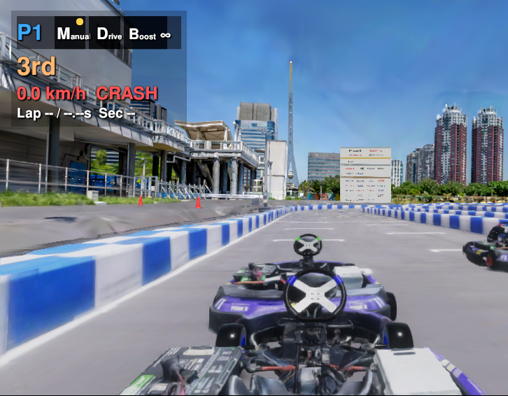
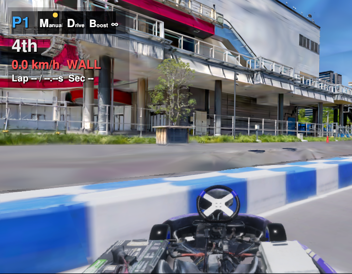
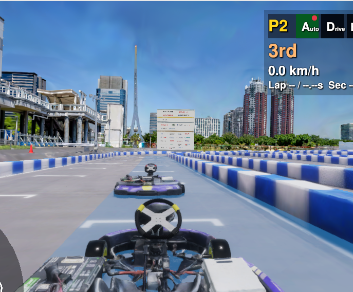
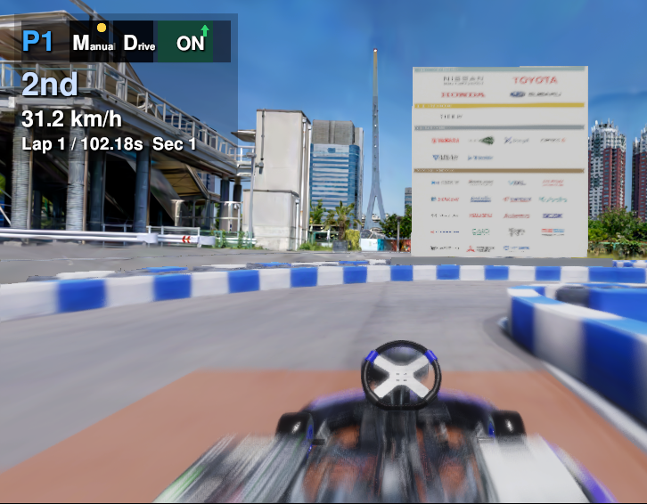
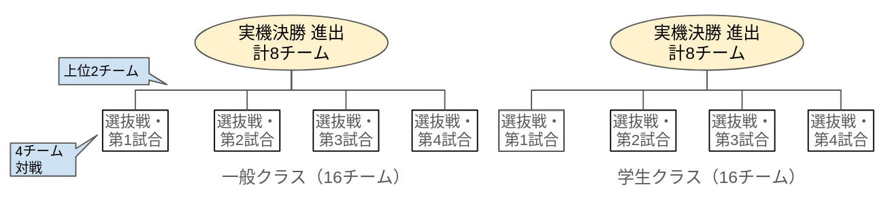
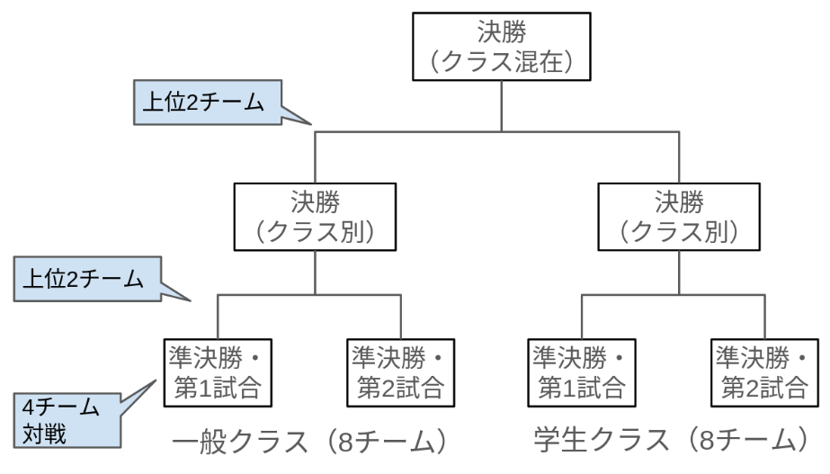

# Sim to Real部門 説明

!!! warning "WIP"
    一部ルールはまだ未定であり、今後更新される可能性があります。

## Sim to Real部門概要

Sim to Real SW部門では予選から決勝まで以下のように進みます。

| 項目 | 日程 | 内容 | 参加チーム |
| --- | --- | --- | --- |
| Sim to Real部門 SIM予選 | 7月1日〜9月1日 | オンラインのシミュレーション環境で走行 | 全参加チーム |
| SIM決勝準備 | 9月18日 | SIM決勝当日と同じ環境で動作確認・練習走行を行います | SIM予選の上位32チームのうち、参加を希望するチーム |
| Sim to Real部門 SIM決勝 | 9月19日 | 決勝会場のシミュレーション環境で走行 | SIM予選の上位32チーム |
| Sim to Real部門 実機決勝 | 9月20日 | シティサーキット東京ベイ（CCTB）での実車両走行 | SIM決勝の上位16チーム |

## Sim to Real部門の共通ルール

### 走行方式

- SIM予選・SIM決勝ではAWSIM上でシティサーキット東京ベイ（CCTB）コースを模した環境を走行します。実機決勝ではCCTB現地をカート実機で走行します。
- 走行は3〜4台同時のレース方式で行われます。
- 走行開始位置は過去の戦績によって決まります。

!!! info "従来との変更点"
    従来はタイムアタック形式でしたが、今回から複数車両の同時走行による競争形式に変わりました。単に速く走るだけでなく、他の車両を追い抜く技術が求められます。加えて、実機決勝では速さだけではなく、衝突の少なさも評価対象になります。

### 速度とペナルティ

- 加速度上限は約1.0m/s²に制限されています。（内訳：加速度上限が1.37、転がり抵抗が0.37）
- 速度上限はシミュレータが使用している物理モデルに従います。実車両の場合は25km/h程度に制限されています。
- レース内順位によって加速度・速度に対してハンディキャップがつく場合があります。（SIM環境のみ）
- 以下のペナルティを受けた場合、一定時間 **5 km/h** に速度が制限されます。種別は HUD と走行結果に表示される名前です。（SIM環境のみ）
    - ペナルティは[禁止事項](#prohibited)に当たる走行を防ぐために設けています。
    - 速度制限の長さは危険度に比例します。他車を妨害する走行がもっとも長く、自車だけに影響する過加速がもっとも短くなります。

| 種別 | 条件 | 速度制限 |
| --- | --- | --- |
| `CRASH` | 自車の前バンパーが他車の後バンパーに接触したとき。後退中は自車の後バンパーと他車の前バンパーの接触でも発火します | 10秒 |
| `WALL` | 壁に接触したとき。車両同士の接触は `CRASH` として扱い、`WALL` では数えません | 5秒 |
| `OVER` | 過加速。クランプ前の加速度入力が **3 m/s²** を超えたとき、または入力周期が **250 Hz** 以上のとき | 2秒 |
| `BLOCK` | オーバーテイクレーンの違反（後述） | 20秒 |

追突は追突した側が罰せられ、追突された側は免除されません。接触が続いている間、`CRASH` の制限時間は更新され続けます。

ペナルティが発動すると、HUD の速度表示の横に種別が赤字で表示され、速度が 5 km/h に落ちます。

前方の車両に追突して `CRASH` が発動した状態です。

壁に接触して `WALL` が発動した状態です。

- 一時的に加速度を上昇させるブーストアイテムが用意されています。（SIM環境のみ）

#### オーバーテイクレーン { #overtake-lane }

SIM決勝では、後方車両の進路を塞ぐ走行を抑えるため、コース上の指定区間を**オーバーテイクレーン**とします。判定は AWSIM が自動で行います。（SIM決勝のみ。End to End部門には適用しません）

- オーバーテイクレーンは**水色の長方形**として路面に描画されます。
- 車体全体がオーバーテイクレーン内に入り、**27 km/h 以上**で走行する車両を**アタッカー**とします。アタッカーがいる間、オーバーテイクレーンはオレンジ色に脈動します。
- アタッカーがいる間、オーバーテイクレーンに触れている他の車両は、**27 km/h 以下**なら**3秒以内**に完全に退出しなければ違反です。加速しても退出の義務は消えません。
- アタッカーがいる間、オーバーテイクレーン外の車両が **27 km/h 未満**でオーバーテイクレーンに触れた場合も違反です。
- 違反した車両には `BLOCK` ペナルティ（**20秒間・5 km/h の速度制限**）が科されます。HUD に `BLOCK` と残り秒数が表示されます。

通常時の状態です。路面が水色になっている範囲がオーバーテイクレーンです。

オーバーテイクレーン内に 27 km/h 以上の車両がいる間は、オレンジ色に変わります。

オーバーテイクレーンに進入しなければ制約はありません。練習方法は[シミュレータ仕様](../specifications/simulator.ja.md#launch-modes)を参照してください。よくある質問は [FAQ](../faq.ja.md#overtake-lane) にまとめています。

### 使用可能なセンサー

- IMU
- GNSS
- Steer Angle
- Wheel Odometry
- Gear Status
- V2X 情報（他車両の位置情報）

### 安全ゲート

決勝以降は、以下の安全ゲートをすべてクリアする必要があります。実行方法は[こちら](../development/development-guide.ja.md#safety-gate)をご確認ください。

- 障害物停止
- NPC 追い越し
- 車線維持

### 禁止事項 { #prohibited }

以下のような行為・コードは禁止です。
決勝以降はコードチェックが行われます。

- 意図的に危険な走行を行うこと。
- 意図的に蛇行走行・他車を邪魔するような走行を行うこと。
- V2X（`/v2x/vehicle_positions`）で得た後方車両の情報を使って、後方車両の進路を妨害すること。幅寄せ・蛇行・不要な減速を含みます。リバースでのコース復帰時など、安全確認のために後方情報を参照することは禁止しません。
- 環境そのものをハックすること。（例えば、他の車両の通信を盗み見たり、偽データを流すこと）

## Sim to Real部門 SIM予選

### 概要 { #preliminaries-abst }

- 運営が用意したオンライン上のシミュレーション環境で、マッチメイキング対戦を行います。
- 参加チームが行うことはコードの提出のみです。提出後は自動的にビルド・走行・順位付けが行われます。
- 詳細は[提出手順](./submission.ja.md)をご確認ください。

### 順位決定方式 { #preliminaries-race }

- 走行は3台同時のレース方式で行われます。周回数は6周で、各レースでの順位は完走順で決まります。
- コードが提出されると、オンライン上で自動的に以下の3台の車両で同時走行が行われます。レース結果によってレートが増減します。レートが高いほど上位ランクとなります。

| 車両 | 説明 |
| --- | --- |
| 車両1 | コードを提出したチーム（チャレンジャー） |
| 車両2 | チャレンジャーのランク帯と近い他のチーム（対戦相手） |
| 車両3 | 運営が用意した NPC |

### ルール { #preliminaries-rule }

- 基本的なルールは上述の共通ルールに従います。
- 1日に提出できるコードの回数には上限があります。

## Sim to Real部門 SIM決勝 { #semifinal }

### 概要 { #semifinal-abst }

- SIM決勝会場で運営が用意した PC 上のシミュレーション環境で、リアルタイム同時対戦を行います。
- 詳細については、後日アナウンス予定です。

### 順位決定方式 { #semifinal-race }

- 走行は4台同時のレース方式で行われます。周回数は6周で、各レースでの順位は完走順で決まります。
- 走行開始位置は、SIM予選での順位によって決まります。
- 各クラス4試合行い、各試合の上位2チームが9月20日の実機決勝に進出となります。
- SIM決勝では時間の都合上、上位チーム同士による順位を決めるための試合は行いません。
- SIM決勝としての順位は、実機決勝に進出する上位チームの中で以下の順で決定します。
    1. ペナルティ回数が少ないほど上位（ペナルティはAWSIMによって自動検出される、追突・壁衝突・入力異常です）
    2. ペナルティ回数が同数の場合は、SIM予選のランク順位

    ※これは9月20日に行われる実機決勝と同様に安全を考慮した走行を優先する考え方です。 
    ※本順位は実機決勝の走行位置を決めるために使われます。SIM決勝順位による表彰はありません。そのため、決勝戦というよりは選抜戦という位置付けになります。

### ルール { #semifinal-rule }

- 基本的なルールは上述の共通ルールに従います。
- 走行開始時刻になったら強制的に走行を開始します。セットアップが未完了のチームは、途中からの参加を目指して作業を続けるか、リタイアとなります。
- クラッシュ等で車両がスタックしたり、車両が予期せぬ挙動をした場合、運営側のサポートによる復帰は行いません。
- 参加者は自身のターミナル・RVizから任意の操作が可能です（ただしAWSIM画面は操作できません）。想定される操作は以下のとおりです。
    - Autowareの再起動
    - 自己位置の再設定
    - スタック時に、手動運転による車両の移動
    - `ros2 topic` コマンドによるギア切り替え・ターボコマンド発行
- ただし、操作前には運営に申告する必要があります。また、手動運転を多用することは禁止です。自身のROS_DOMAIN_ID以外に影響を及ぼす操作も禁止です。

## Sim to Real部門 実機決勝

### 概要 { #final-abst }

- シティサーキット東京ベイ（CCTB）で実車両を用いて、リアルタイム同時対戦を行います。
- カートに搭載されたPC 上で参加チームのコードを動かします。作業に必要なPC は運営が用意します。
- 実機による走行のため、安全面を考慮した試合構成・ルールとしています。
- 詳細については、後日アナウンス予定です。

### 順位決定方式 { #final-race }

- 走行は4台同時の時間内自由走行型となります。
- 規定時間（例：8分）の間、車両は走り続けます。順位は以下の順で決定します。
    1. 反則回数が少ないほど上位
    2. 反則回数が同数の場合は、周回数が多いほど上位
    3. それでも同順位の場合は、SIM決勝での順位
- 走行開始位置はSIM決勝の順位によって決まります。ただし、安全を考慮して走行間隔はSIMよりも長くなります。
- クラス別のトーナメント戦の後、各クラスの上位チームによるクラス混合戦を行います。

### 反則の定義 { #final-foul }

以下のような走行は反則となります（意図的か偶発的か、または不具合によるものかを問わず）。

- 著しく低速で走行したり、途中で理由なく停止する
    - 反則を避けるための消極的走行を防ぐためです
- 他車両の進路を妨害しながら走行する
- コース復帰時に他の車両を妨害する
- コース端以外で停車する（停車が必要な場合はコース端に寄せてください）
- 以下のケース**以外**の衝突
    - 追い抜きしようとするときにかすってしまう（進路妨害ではない場合）
    - 前方車両が急減速時の後方からの衝突
    - 前方車両が復帰時の後方からの衝突
    - 前方車両が危険運転している時の後方からの衝突
- ルールに記載されている禁止行為

### ルール { #final-rule }

- 基本的なルールは上述の共通ルールに従います。
- クラッシュ等で車両がスタックしたり、車両が予期せぬ挙動をした場合、運営側のサポートによる復帰は行いません（遠隔操作、物理的介入どちらも行いません）。
    - ただし、運営が危険と判断した場合に緊急停止・車両移動を行う可能性はあります。
- 参加者は自身のターミナル・RVizから任意の操作が可能です。
- ただし、操作前には運営に申告する必要があります。また、手動運転を多用することは禁止です。自身のROS_DOMAIN_ID以外に影響を及ぼす操作も禁止です。

### 注意事項

- 参加チームは実車両へのインテグレーション作業を行い、走行に立ち会う必要があります。（作業は運営がサポートします）
- 参加チームは、オペレータの指示により車両を停止したり、必要に応じて遠隔操作を行う必要があります。
- 以下の条件に該当する場合、走行を中止します。
    - コースの壁が大きく動いてしまった場合。
    - コースから大きく逸脱した場合。
    - その他、安全上の問題等でスタッフが指示した場合。
