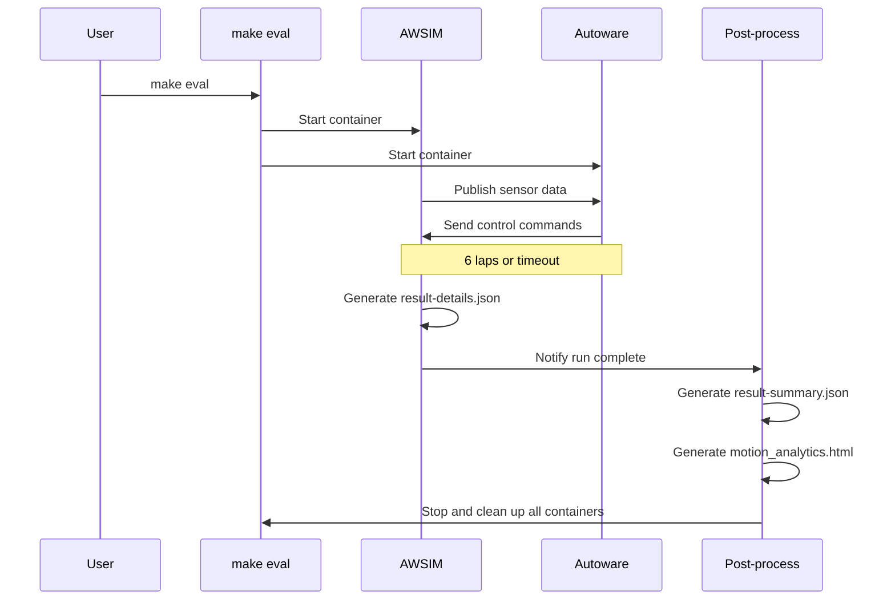

# Development Guide

This page covers procedures only. For details on individual commands and the environment structure, see [Environment Overview](environment.en.md) and [Command Reference](commands.en.md). Once you understand the development workflow, head to [Development Ideas](development-ideas.en.md) and start building your own solution.

## Development Cycle

Development follows this cycle:

1. **Edit code** — Modify files under `aichallenge/workspace/src/aichallenge_submit/`
2. **Build** — Build the ROS workspace with `make autoware-build`
3. **Test** — Start the simulator with `make dev` and check behavior
4. **Evaluate** — Run `make eval` for quantitative evaluation and check results under `output/latest/`
5. **Submit** — Upload following the [submission instructions](../preliminaries/submission.en.md)

## Development and Debugging

- The development Docker image is built when you run `setup.bash`. Re-run it as needed when updating the environment.
- The basic loop is: edit code → build → verify behavior, repeated as needed.

```bash
# Build the development Docker image (first time, or when updating the environment)
./docker_build.sh dev

# Edit files under aichallenge/workspace/src/aichallenge_submit/

# Build the workspace
make autoware-build

# Start AWSIM + Autoware
make dev

# Verify behavior

# Stop AWSIM + Autoware
make down
```

!!! info
    Use `make ps` to list running containers. If a container cannot be stopped, use `make down_all` to force-remove all containers.

## Local Evaluation

- After development, run a local evaluation.
- The evaluation Docker image must be rebuilt each time. The workspace build is done automatically as part of the image build.
- Execution stops automatically once the run completes.

```bash
# Compress aichallenge_submit/ and create the submission archive
./create_submit_file.bash

# Build the evaluation Docker image
./docker_build.sh eval

# Start AWSIM + Autoware and run the evaluation
make eval
```

## Local Evaluation (Multiple Vehicles)

- Use `run_parallel_submissions.bash` to evaluate multiple vehicles at the same time.
- Accepts 1–4 submission archives, each running on a separate Domain ID (`d1`–`d4`).
- A separate evaluation Docker image is built for each archive.

```bash
# Prepare the submission archives (example: 2 vehicles)
./create_submit_file.bash  # your code → submit/aichallenge_submit.tar.gz

# Prepare a rival vehicle archive (here we copy our own)
cp submit/aichallenge_submit.tar.gz submit/other_submit.tar.gz

# Run parallel evaluation with multiple archives
./run_parallel_submissions.bash --submit submit/aichallenge_submit.tar.gz submit/other_submit.tar.gz
```

## Output

### Workspace Build Artifacts

- `make autoware-build` outputs build artifacts to `aichallenge/workspace/build/`, which is mounted when running `make dev`.
- For `make eval`, the workspace is built inside the Docker image during `./docker_build.sh eval` and the artifacts are stored in the image.
- Check terminal output for build logs.

### Execution Output

Results are saved under `output/<timestamp>/d<domain_id>/`. The latest evaluation results (`make eval`) are also accessible via symlinks from `output/latest/d<domain_id>/`.

```text
output/
├── <timestamp>/
│   └── d1/
│       ├── autoware.log                          # Autoware execution log
│       ├── awsim.log                             # AWSIM execution log (make dev only)
│       ├── ros/log/                              # Per-node logs
│       ├── capture/                              # Drive video and images
│       ├── rosbag2_autoware/                     # ROS bag files
│       ├── d1-result-details.json                # Detailed drive data (make eval only)
│       ├── result-summary.json                   # Lap time summary (make eval only)
│       └── motion_analytics-<timestamp>.html     # Speed/acceleration visualization (make eval only)
├── latest/                                       # Symlink to the latest evaluation result (make eval only)
└── docker/
    └── <timestamp>-docker_build-<pid>.log        # docker_build.sh build log
```

### Submission Archive Output

The archive created by `./create_submit_file.bash` is saved at `aichallenge-racingkart/submit/aichallenge_submit.tar.gz`.

## Tips

### Differences between `make dev` and `make eval`

| | `make dev` | `make eval` |
| --- | --- | --- |
| **Autoware image** | `aichallenge-2025-dev` | `aichallenge-2025-eval` |
| **Workspace** | `./aichallenge` mounted | Baked into the image |
| **Build** | `make autoware-build` reflects changes immediately | `./docker_build.sh eval` must be re-run |
| **Laps** | 600 (effectively unlimited) | 6 |
| **Timeout** | Effectively unlimited | 600 seconds |
| **Termination** | Manual with `make down` | Stops automatically when the run completes |
| **Output** | Logs only | Scores and drive data included |

The typical workflow is to use `make dev` for rapid iteration during development, then run `make eval` before submission to evaluate in an environment close to the actual scoring environment.

**`make eval` evaluation flow:**



### Entering the Docker Container for Debugging

While `make dev` is running, you can enter the Autoware container with the following command:

```bash
cd ~/aichallenge-racingkart
docker compose exec autoware bash
```

Inside the container you can inspect ROS topics and run debug commands:

```bash
# Set domain for vehicle 1
export ROS_DOMAIN_ID=1

# List topics
ros2 topic list

# Monitor a specific topic
ros2 topic echo /localization/kinematic_state
```
