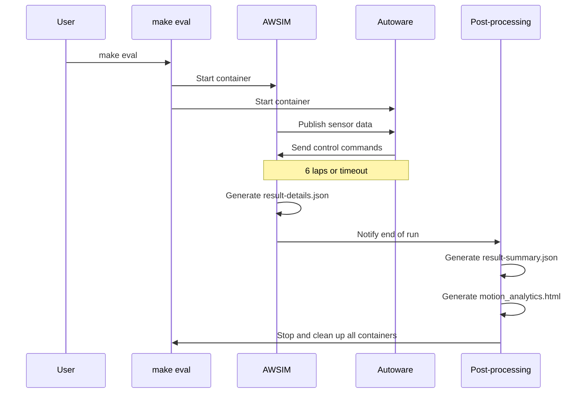
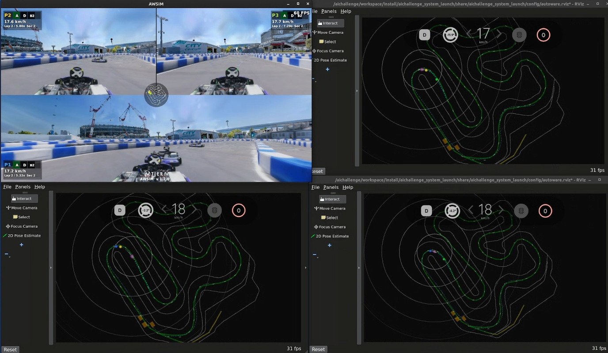
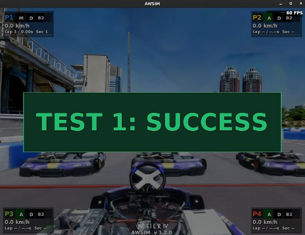

# Development Guide

This page explains how to proceed with development in the AI Challenge and the main commands. For details on each command and on the environment, see [Environment Overview](environment.en.md) and [Command Reference](commands.en.md).

Once you understand how development works here, use [Development Ideas](development-ideas.en.md) as a reference and move on to your own development.

## Development Cycle

Development follows this cycle:

1. **Edit code** — Modify files under `aichallenge/workspace/src/aichallenge_submit/`
2. **Build** — Build the ROS workspace with `make autoware-build`
3. **Check behavior**: Start the simulator with `make dev` and check how the vehicle behaves
4. **Local evaluation**: Run a quantitative evaluation with `make eval` and check the results in `output/latest/`
5. **Submit** — Upload following the [submission instructions](../competition/submission.en.md)

### Development and Debugging Steps

- Basically, you develop by repeating code changes, builds, and behavior checks with the commands below.
- The development Docker image is already created when you run `setup.bash`. Re-run it as needed, for example when the environment is updated.

```bash
# Build the development Docker image (first time only, or when the environment is updated)
./docker_build.sh dev

# Edit the code under aichallenge/workspace/src/aichallenge_submit/

# Build the workspace
make autoware-build

# Start AWSIM + Autoware
make dev

# Check the behavior

# Stop AWSIM + Autoware
make down
```

!!! tip "How to stop"
    Closing the RViz or AWSIM window does not stop them. Always stop with `make down` or `make down_all`.

!!! tip "Checking and force-stopping containers"
    `make ps` lists the running containers. If a container cannot be stopped, force-stop it with `make down_all`.

### Local Evaluation Steps { #local-evaluation }

- Once you have developed something, run an evaluation in your local environment.
- The evaluation Docker image must be built every time. The workspace is built automatically while the Docker image is being built.
- The purpose of these steps is to confirm that your code runs without errors in an environment close to the actual evaluation environment. These steps run a single-vehicle time attack, whereas the competition itself is a multi-vehicle race.

```bash
# Compress the aichallenge_submit directory to create the submission file
./create_submit_file.bash

# Build the evaluation Docker image
./docker_build.sh eval

# Start AWSIM + Autoware and run the evaluation
make eval
```

!!! warning "If `make eval` stays at `Waiting for at least 1 matching subscription(s)...`"
    After starting the evaluation container, `make eval` runs `make awsim-request-start` (`ros2 topic pub -1 /admin/awsim/start ...` on domain 0). That command keeps waiting until AWSIM subscribes to `/admin/awsim/start`. The evaluation launch (`evaluation.launch.xml`) starts AWSIM and Autoware in the same launch, so if the launch of your submission fails (for example because a package in `aichallenge_submit` was not built or installed, or a dependency cannot be found), AWSIM is shut down with it and the terminal stays at this message.

    Exit with `Ctrl+C`, run `make down`, and then check the following.

    ```bash
    # Latest run log (launch errors appear here)
    less "$(ls -td output/2*/d1 | head -n 1)/autoware.log"

    # Check that your package is installed in the evaluation image (<package> is your package name)
    docker run --rm aichallenge-2025-eval ls /aichallenge/workspace/install | grep <package>
    ```

## Output

### Workspace Build Artifacts

- Artifacts of `make autoware-build` are written to `aichallenge/workspace/build` and are mounted and used when you run `make dev`.
- For `make eval`, the workspace is also built when `./docker_build.sh eval` creates the Docker image, and the build artifacts are stored inside the image.
- Check the terminal output for the build log.

### Execution Output

Execution results are saved under `output/<timestamp>/d<domain_id>/`. The latest evaluation results (from `make eval`) can also be accessed through symbolic links in `output/latest/d<domain_id>/`.

```text
output/
├── <timestamp>/
│   ├── awsim.log                                 # AWSIM log (make dev)
│   └── d1/
│       ├── autoware.log                          # Autoware log
│       ├── ros/log/                              # Per-node logs
│       ├── capture/                              # Capture videos (cap-*.mp4)
│       ├── rosbag2_autoware/                     # ROS bag files
│       ├── d1-result-details.json                # Detailed driving data (make eval only)
│       ├── result-summary.json                   # Lap time summary (make eval only)
│       └── motion_analytics-<timestamp>.html     # Speed/acceleration visualization (make eval only)
├── latest/                                       # A real directory whose entries are symlinks to the latest artifacts (make eval only)
│   ├── docker_build.log                          # Latest docker_build.sh log
│   └── d1/
│       ├── autoware.log                          # Autoware log
│       ├── capture.mp4                           # Capture video
│       ├── rosbag2_autoware.mcap                 # ROS bag (MCAP format)
│       ├── result-details.json                   # Detailed driving data (link to d1-result-details.json)
│       ├── result-summary.json                   # Lap time summary
│       └── motion_analytics.html                 # Interactive speed/acceleration visualization
└── docker/
    └── <timestamp>-docker_build-<pid>.log        # docker_build.sh build log
```

### Submission File Output

The file compressed by `./create_submit_file.bash` is saved at `aichallenge-racingkart/submit/aichallenge_submit.tar.gz`.

## Tips

### Differences Between `make dev` and `make eval`

| | `make dev` | `make eval` |
| --- | --- | --- |
| **Autoware image** | `aichallenge-2025-dev` | `aichallenge-2025-eval` |
| **Workspace** | `./aichallenge` is mounted | Baked into the image |
| **Build** | `make autoware-build` takes effect immediately | The image must be rebuilt with `./docker_build.sh eval` |
| **Laps** | Unlimited | 6 |
| **Timeout** | Unlimited | 600 seconds |
| **Termination** | Stop manually with `make down` | Stops automatically when the run is complete |
| **Output** | Logs only | Scores and driving data are also output |

During development, the basic flow is to check behavior quickly with `make dev` and, before submitting, run a local evaluation close to the submission environment with `make eval`.

Actual races are run with multiple vehicles, so even `make eval` is not exactly the same as the real run. By running in the same evaluation environment as the real one, however, you can detect before submitting the situations in which your code would not work in the real run, for example because it refers to source code outside the submission or depends on libraries that do not exist in the real environment.

**Local evaluation flow with `make eval`:**


```mermaid
sequenceDiagram
    participant User as User
    participant Make as make eval
    participant AWSIM as AWSIM
    participant AW as Autoware
    participant Post as Post-processing

    User->>Make: make eval
    Make->>AWSIM: Start container
    Make->>AW: Start container
    AWSIM->>AW: Publish sensor data
    AW->>AWSIM: Send control commands
    Note over AWSIM,AW: 6 laps or timeout
    AWSIM->>AWSIM: Generate result-details.json
    AWSIM->>Post: Notify end of run
    Post->>Post: Generate result-summary.json
    Post->>Post: Generate motion_analytics.html
    Post->>Make: Stop and clean up all containers
```

### Entering a Docker Container for Debugging

- To debug, you need an environment in which ROS and Autoware are ready to run, which means entering a Docker container. There are two ways to do this.
- Method 1) Attach to an existing Autoware container
    - The `make autoware-attach` command lets you enter a running Autoware container.
        - After running the command, enter the number of the container you want to enter. Normally, choose the container named `autoware`
        - This is equivalent to `docker compose exec autoware bash`
    - Note: an Autoware container must already be running, for example with `make dev`
- Method 2) Create a new container
    - The `make autoware-bash` command creates a new container with the runtime environment ready.
    - This works even when Autoware is not running, so it is useful when you only want the environment itself, for example for machine learning

```bash
cd ~/aichallenge-racingkart

# Method 1) Attach to an existing Autoware container
make autoware-attach
# or
# Method 2) Create a new container
make autoware-bash
```

Inside the container you can check ROS topics and run debugging commands.

```bash
# Use the domain of vehicle ID 1
export ROS_DOMAIN_ID=1

# List topics
ros2 topic list

# Monitor a specific topic
ros2 topic hz /control/command/control_cmd -w 10
```

### Running Multiple Vehicles at the Same Time

- This competition uses a race format in which multiple vehicles run at the same time.
- The following commands run 1 to 4 vehicles at the same time. One AWSIM window shows the vehicles in a split screen, and one Autoware is started per vehicle.

```bash
# 1 vehicle (default)
make dev

# 2 vehicles
make dev2

# 3 vehicles (number of vehicles in SIM qualifying)
make dev3

# 4 vehicles (number of vehicles in SIM finals)
make dev4
```



### Running the Safety Gate Scenarios { #safety-gate }

- In this competition, you are expected to clear the defined safety gate scenarios.
- The following commands run scenarios that reproduce each safety gate.

```bash
# Obstacle stop
make gate1

# Overtaking
make gate2

# Lane keeping
make gate3
```


