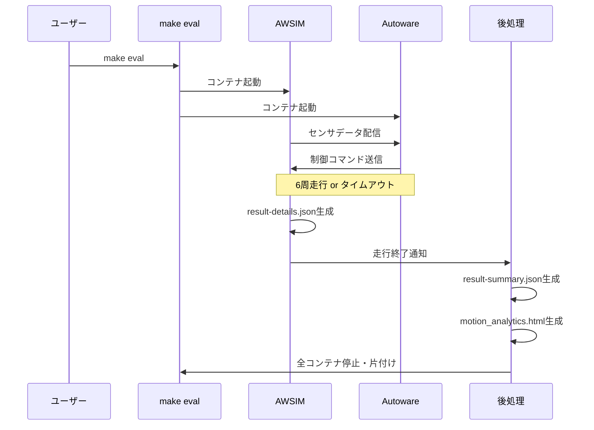
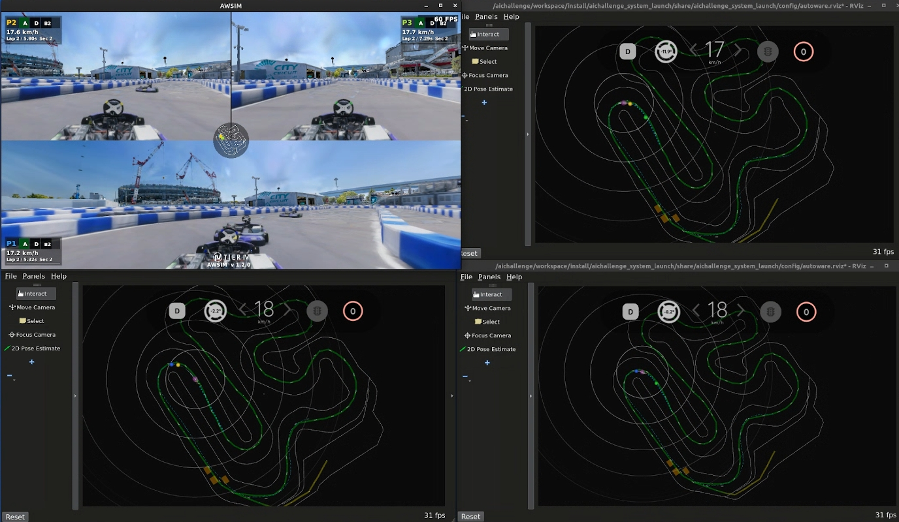
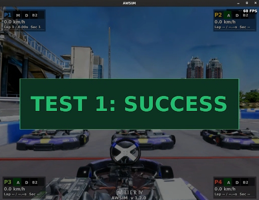

# 開発の進め方

本ページでは、AIチャレンジの開発の進め方と主要コマンドを説明します。各コマンドや環境の詳細については、[環境の説明](environment.ja.md)および[コマンド一覧](commands.ja.md)を参照してください。

ここで開発の進め方を理解した後は、[開発のアイデア](development-ideas.ja.md)を参考に各自の開発を進めていきましょう。

## 開発サイクル

開発は以下のサイクルで進めます。

1. **コードを編集** — `aichallenge/workspace/src/aichallenge_submit/` 配下を変更します
2. **ビルド** — `make autoware-build` でROSワークスペースをビルドします
3. **動作確認** — `make dev` でシミュレータを起動し、挙動を確認します
4. **ローカル評価** — `make eval` で定量評価し、`output/latest/` の結果を確認します
5. **提出** — [提出手順](../competition/submission.ja.md)に従ってアップロードします

### 開発・デバッグの手順

- 基本的には下記コマンドの通り、コード変更・ビルド・動作確認を繰り返して開発を進めます。
- 開発用Dockerイメージは `setup.bash` 実行時に作成済みです。環境の更新時など、必要に応じて再実行してください。

```bash
# 開発用Dockerイメージを作る（初回、または環境更新時のみ）
./docker_build.sh dev

# aichallenge/workspace/src/aichallenge_submit/ 配下のコードを変更

# ワークスペースをビルド
make autoware-build

# AWSIM + Autoware を起動
make dev

# 動作確認する

# AWSIM + Autoware を終了
make down
```

!!! tip "終了方法"
    RvizやAWSIMの画面を閉じても終了しません。必ず、 `make down` または `make down_all` コマンドで終了してください。

!!! tip "コンテナの確認と強制終了"
    起動中のコンテナ一覧は `make ps` で確認できます。コンテナが終了できない場合は `make down_all` で強制終了してください。

### ローカル評価の手順 { #local-evaluation }

- 開発ができたら、ローカル環境での評価を行います。
- 評価用Dockerイメージは毎回作成が必要です。ワークスペースのビルドはDockerイメージビルド時に自動で行われます。
- 本手順の目的は、実際の評価環境に近い環境でエラーなく実行できることを確認することです。本手順では単独走行のタイムアタックが実行されますが、本大会は複数台走行のレース形式になります。

```bash
# aichallenge_submit ディレクトリを圧縮し、提出用ファイルを作成
./create_submit_file.bash

# 評価用Dockerイメージを作る
./docker_build.sh eval

# AWSIM + Autoware を起動して評価を実行
make eval
```

## 結果の出力

### ワークスペースのビルド生成物

- `make autoware-build` の生成物は `aichallenge/workspace/build` に出力され、 `make dev` 実行時にマウントされ使用されます。
- `make eval` の場合は、`./docker_build.sh eval` でDockerイメージ作成時にワークスペースもビルドされ、ビルド生成物はDockerイメージ内に保存されます。
- ビルドログはターミナル出力を確認してください。

### 実行結果の出力

実行結果は `output/<timestamp>/d<domain_id>/` 配下に保存されます。最新の評価結果（`make eval` 実行結果）については `output/latest/d<domain_id>/` からシンボリックリンクでもアクセス可能です。

```text
output/
├── <実行日時>/
│   └── d1/
│       ├── autoware.log                          # Autoware の実行ログ
│       ├── awsim.log                             # AWSIM の実行ログ（make devのみ）
│       ├── ros/log/                              # 各ノードの個別ログ
│       ├── capture/                              # キャプチャ動画
│       ├── rosbag2_autoware/                     # ROSBagファイル
│       ├── d1-result-details.json                # 詳細な走行データ (make evalのみ)
│       ├── result-summary.json                   # ラップタイムの結果サマリー (make evalのみ)
│       └── motion_analytics-<timestamp>.html     # 速度・加速度の可視化 (make evalのみ)
├── latest/                                       # 最新の評価結果へのシンボリックリンク (make evalのみ)
│   └── d1/                                       # output/<実行日時>/d1/ へのシンボリックリンク
│       ├── autoware.log                          # Autoware の実行ログ
│       ├── capture/                              # キャプチャ動画
│       ├── rosbag2_autoware/                     # ROSBag記録（MCAP形式）
│       ├── d1-result-details.json                # 詳細な走行データ
│       ├── result-summary.json                   # ラップタイムの結果サマリー
│       └── motion_analytics-<timestamp>.html     # 速度・加速度のインタラクティブ可視化
└── docker/
    └── <実行日時>-docker_build-<pid>.log          # docker_build.sh のビルドログ
```

### 提出用ファイルの出力

`./create_submit_file.bash` によって圧縮されたファイルは、 `aichallenge-racingkart/submit/aichallenge_submit.tar.gz` に保存されています。

## Tips

### `make dev` と `make eval` の違い

| | `make dev` | `make eval` |
| --- | --- | --- |
| **Autowareイメージ** | `aichallenge-2025-dev` | `aichallenge-2025-eval` |
| **ワークスペース** | `./aichallenge` をマウント | イメージに焼き込み済み |
| **ビルド** | `make autoware-build` で即反映 | `./docker_build.sh eval` でイメージ再作成が必要 |
| **周回数** | 無制限 | 6周 |
| **タイムアウト** | 無制限 | 600秒 |
| **終了** | `make down` で手動終了 | 走行完了で自動終了 |
| **結果出力** | ログのみ | スコアや走行データも出力 |

開発中は `make dev` で素早く動作確認し、提出前に `make eval` で提出環境に近いローカル評価を行うのが基本的な流れです。

実際の走行は複数台で行われるため `make eval` でも本番と完全に同じ走行ではありませんが、本番と同じ評価環境で実行することで、外部のソースコードへの参照や本番環境に存在しないライブラリへの依存などにより本番で動かなくなる事態を、提出前に検出することを目的としています。

**`make eval` によるローカル評価フロー:**



### Dockerコンテナに入ってデバッグしたい場合

- デバッグするためにはROSとAutowareの実行環境が整った状態になる必要があります。そのためには、Dockerコンテナに入る必要があります。以下の2つの方法があります。
- 方法1) 既存のAutowareコンテナにアタッチする
    - `make autoware-attach` コマンドによって、起動中のAutowareコンテナに入れます。
        - コマンド実行後、入りたいコンテナの番号を入力してください。通常は `autoware` と名前のついたコンテナを選んでください
        - `docker compose exec autoware bash` と同等の操作になります
    - 注意：`make dev` などでAutowareコンテナが起動している必要があります
- 方法2) 新規コンテナを作成する
    - `make autoware-bash` コマンドによって、実行環境が整った新規コンテナを作成できます。
    - 本操作はAutowareが起動していない状態でも実行可能です。そのため、機械学習など、仮想環境だけを使いたい場合に活用できます

```bash
cd ~/aichallenge-racingkart

# 方法1) 既存のAutowareコンテナにアタッチする場合
make autoware-attach
# または
# 方法2) 新規コンテナを作成する場合
make autoware-bash
```

コンテナ内でROSトピックの確認やデバッグコマンドを実行できます。

```bash
# 車両ID1のドメインを確認する
export ROS_DOMAIN_ID=1

# トピック一覧の確認
ros2 topic list

# 特定トピックの監視
ros2 topic hz /control/command/control_cmd -w 10
```

### 複数車両の同時走行

- 本大会では、複数車両の同時走行によるレース形式を採用しています。
- 以下のコマンドによって1台〜4台までの同時走行を行います。実行すると、1つのAWSIM画面上に複数車両が画面分割されて表示されます。Autowareは複数車両分起動します。

```bash
# 1台走行（デフォルト）
make dev

# 2台走行
make dev2

# 3台走行（SIM予選の台数）
make dev3

# 4台走行（SIM決勝の台数）
make dev4
```



### 安全ゲートシナリオの実行

- 本大会では、定められた安全ゲートシナリオをクリアすることが期待されています。
- 以下のコマンドによって、各安全ゲートを再現したシナリオを実行することができます。

```bash
# 障害物停止
make gate1

# 追い越し
make gate2

# 車線維持
make gate3
```


