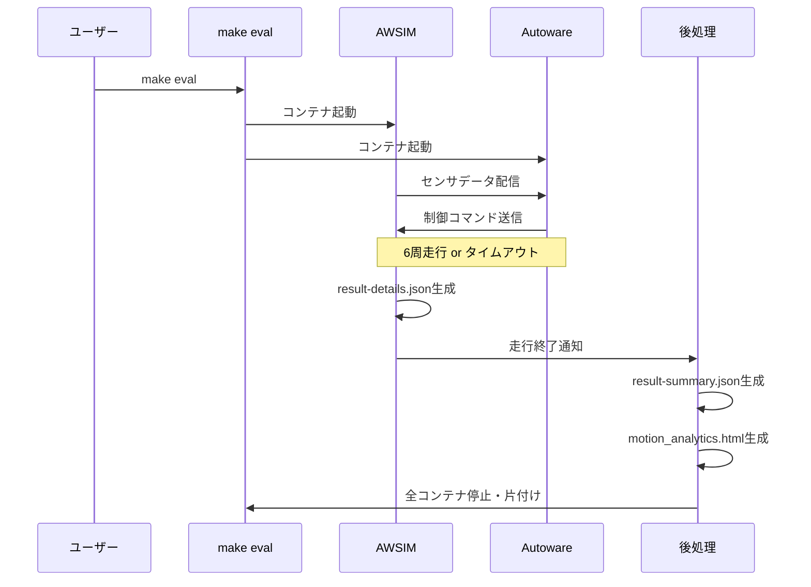

# 開発の進め方

本ページでは、AIチャレンジの開発の進め方と主要コマンドを説明します。各コマンドや環境の詳細については、[環境の説明](environment.ja.md)および[コマンド一覧](commands.ja.md)を参照してください。

ここで開発の進め方を理解した後は、[開発のアイデア](development-ideas.ja.md)を参考に各自の開発を進めていきましょう。

## 開発サイクル

開発は以下のサイクルで進めます。

1. **コードを編集** — `aichallenge/workspace/src/aichallenge_submit/` 配下を変更します
2. **ビルド** — `make autoware-build` でROSワークスペースをビルドします
3. **動作確認** — `make dev` でシミュレータを起動し、挙動を確認します
4. **評価** — `make eval` で定量評価し、`output/latest/` の結果を確認します
5. **提出** — [提出手順](../preliminaries/submission.ja.md)に従ってアップロードします

### 開発・デバッグの手順

- 基本的には下記コマンドの通り、コード変更・ビルド・動作確認を繰り返して開発を進めます。
- 開発用Dockerイメージは `setup.bash` 実行時に作成済みです。環境の更新時など、必要に応じて再実行してください。

```bash
# 開発用Dockerイメージを作る（初回、または環境更新時のみ）
./docker_build.sh dev

# aichallenge/workspace/src/aichallenge_submit/ 配下のコードを変更

# ワークスペースをビルド
make autoware-build

# AWSIM + Autoware を起動
make dev

# 動作確認する

# AWSIM + Autoware を終了
make down
```

!!! info
    起動中のコンテナ一覧は `make ps` で確認できます。コンテナが終了できない場合は `make down_all` で強制終了してください。

### ローカル評価の手順

- 開発ができたら、ローカル環境での評価を行います。
- 評価用Dockerイメージは毎回作成が必要です。ワークスペースのビルドはDockerイメージビルド時に自動で行われます
- 走行が完了すると実行は自動的に終了します。

```bash
# aichallenge_submit ディレクトリを圧縮し、提出用ファイルを作成
./create_submit_file.bash

# 評価用Dockerイメージを作る
./docker_build.sh eval

# AWSIM + Autoware を起動して評価を実行
make eval
```

### ローカル評価の手順（複数車両）

- 複数車両を同時に評価したい場合は、`run_parallel_submissions.bash` を使います。
- 1〜4 つの提出ファイルを指定でき、それぞれ別の Domain ID（`d1`〜`d4`）で並列走行します。
- 各提出ファイルに対して評価用Dockerイメージが個別にビルドされます。

```bash
# 評価したい提出ファイルを用意する（例: 2台）
./create_submit_file.bash  # 自分のコード → submit/aichallenge_submit.tar.gz

# ライバル車両コードを準備する（ここでは自分のコードをコピーする）
cp submit/aichallenge_submit.tar.gz submit/other_submit.tar.gz

# 複数の提出ファイルを指定して並列評価を実行
./run_parallel_submissions.bash --submit submit/aichallenge_submit.tar.gz submit/other_submit.tar.gz
```

## 結果の出力

### ワークスペースのビルド生成物

- `make autoware-build` の生成物は `aichallenge/workspace/build` に出力され、 `make dev` 実行時にマウントされ使用されます。
- `make eval` の場合は、`./docker_build.sh eval` でDockerイメージ作成時にワークスペースもビルドされ、ビルド生成物はDockerイメージ内に保存されます。
- ビルドログはターミナル出力を確認してください。

### 実行結果の出力

実行結果は `output/<timestamp>/d<domain_id>/` 配下に保存されます。最新の評価結果（`make eval` 実行結果）については `output/latest/d<domain_id>/` からシンボリックリンクでもアクセス可能です。

```text
output/
├── <実行日時>/
│   └── d1/
│       ├── autoware.log                          # Autoware の実行ログ
│       ├── awsim.log                             # AWSIM の実行ログ（make devのみ）
│       ├── ros/log/                              # 各ノードの個別ログ
│       ├── capture/                              # 走行動画、画像
│       ├── rosbag2_autoware/                     # ROSBagファイル
│       ├── d1-result-details.json                # 詳細な走行データ (make evalのみ)
│       ├── result-summary.json                   # ラップタイムの結果サマリー (make evalのみ)
│       └── motion_analytics-<timestamp>.html     # 速度・加速度の可視化 (make evalのみ)
├── latest/                                       # 最新の評価結果へのシンボリックリンク (make evalのみ)
└── docker/
    └── <実行日時>-docker_build-<pid>.log          # docker_build.sh のビルドログ
```

### 提出用ファイルの出力

`./create_submit_file.bash` によって圧縮されたファイルは、 `aichallenge-racingkart/submit/aichallenge_submit.tar.gz` に保存されています。

## Tips

### `make dev` と `make eval` の違い

| | `make dev` | `make eval` |
| --- | --- | --- |
| **Autowareイメージ** | `aichallenge-2025-dev` | `aichallenge-2025-eval` |
| **ワークスペース** | `./aichallenge` をマウント | イメージに焼き込み済み |
| **ビルド** | `make autoware-build` で即反映 | `./docker_build.sh eval` でイメージ再作成が必要 |
| **周回数** | 600周（実質無制限） | 6周 |
| **タイムアウト** | 実質無制限 | 600秒 |
| **終了** | `make down` で手動終了 | 走行完了で自動終了 |
| **結果出力** | ログのみ | スコアや走行データも出力 |

開発中は `make dev` で素早く動作確認し、提出前に `make eval` で提出環境に近い評価を行うのが基本的な流れです。

**`make eval` による評価フロー:**



### Dockerコンテナに入ってデバッグしたい場合

`make dev`で起動した状態で、以下のコマンドで起動中のAutowareコンテナに入れます。

```bash
cd ~/aichallenge-racingkart
docker compose exec autoware bash
```

コンテナ内でROSトピックの確認やデバッグコマンドを実行できます。

```bash
# 車両ID1のドメインを確認する
export ROS_DOMAIN_ID=1

# トピック一覧の確認
ros2 topic list

# 特定トピックの監視
ros2 topic echo /localization/kinematic_state
```
