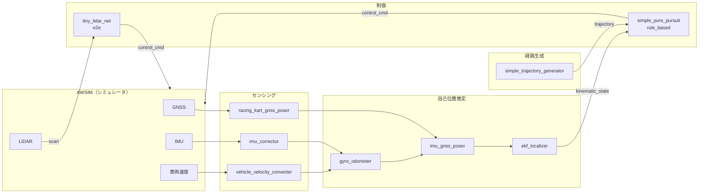

# メインモジュール

## Autowareのカスタマイズ

本大会では、自動運転ソフトウェアAutowareをベースとした実装を用意しております．
本ページでは、その背景と説明に加えて、どのように本実装を活用できるかの紹介を行います．

前回のシミュレーション大会では、デフォルトのAutowareから機能を絞り、ノード数を減らした縮小構成のAutowareを起動できるLaunchファイルを提供しました．その際の、背景や用意した意図については、[前大会のドキュメント](https://automotiveaichallenge.github.io/aichallenge2023-racing/customize/index.html)をご覧ください．

## 縮小構成のAutowareを用意した背景

### Autowareを利用する時の課題

デフォルトのAutowareでは様々な走行環境に対応するため、たくさんのノードから構成されています．

Autowareの公式ドキュメンテーションでは、[Autowareを構成するROSノードの構成図](https://autowarefoundation.github.io/autoware-documentation/main/design/autoware-architecture-v1/node-diagram/)を見ることもできます．以下に現時点の図を示します．

自動運転に関わる各コンポーネントで多種多様な機能を揃えており、難易度の高い走行環境にも対応できるように作られています．

一方、その複雑な構成を理解し、各パラメータの意味や調整の仕方、モジュールの切り替え・入れ替えなどを行うことが必ずしも容易ではなくなっています．

### 縮小構成のAutoware-Microの用意

そのため、前回のシミュレーション大会では、デフォルトのAutowareから機能を絞り、ノード数を減らしたAutowareを用意しました．

Autoware-Microのノード図を以下に示します．ノード数が格段と減り、基本的な自動走行を可能とする機能のみが揃っていることが分かります．

Autoware-Microの特徴としては、以下が挙げられます．

- ほぼ全てのノードの起動を直接1つのLaunchファイルから行っている．
- パラメータを直接ノード起動時に書き込んでいるため、どのパラメータがどのノードで必要なのかを簡単に追うことができる．
- 各ノードの入出力となるROSトピック名も直接ノード起動時に`remap`しているため、トピック名も簡単に変えられる．

このAutowareをベースに自動運転ソフトを書くことで、以下のようなことができます．

- シンプルな構成となっているため、Autowareの中身をより深く理解できる
- 自作のモジュールをAutowareのものと簡単に入れ替えることができ、機能の改善に取り組める
- パラメータを変更した場合のシステム全体の動作への影響が分かりやすい
- 今回のAutowareには含まれていない既存のAutowareのノードを追加することもできる

各コンポーネントの変更点・特徴としては、以下が挙げられます．

- Localization：GNSS、IMU及び車輪速による自己位置推定
- Planning：behavior_velocity_plannerやobstacle_stop_plannerなどを省略し、出力経路から走行trajectoryを直接出力するように変更．
- Control：制御の1つの実装例としてsimple_pure_pursuitを用意．

## Autoware-Microの活用方法

Autoware-Microを活用することにより、本大会での課題となる：

1. カーブなどの戦略的な経路計画
2. 高速での車両制御

に集中して取り組むことができるようになります．

また、Autoware-Microの実装例を参考にしながら、Autowareのアーキテクチャとは少し異なる実装方法を試したり、新しくカスタムのノードを作成・導入したりすることができます．

独自のノードの実装を取り入れることにより、走行性能を向上させ点数を伸ばすことができます．

例えば、以下のような構成を考え、「Planning」と「Control」をそれぞれ実装して取り組んだり、「Planning & Control」を両方担うノードを実装できます．

ルートの入力と車両インターフェイス出力のROSトピックさえ合っていれば自由にカスタマイズして頂けます．

## Autoware-Microのデータフロー

以下の図は、Autoware-Microの主要なデータフローを示しています。

## パッケージ一覧

本大会のワークスペースに含まれるパッケージの一覧です。

### 制御

| パッケージ名 | 説明 |
| ------------ | ---- |
| simple_pure_pursuit | ルールベース制御（Pure Pursuit） |
| tiny_lidar_net_controller | End-to-End制御（TinyLiDARNet: LiDARスキャン→加速度+操舵角） |

### 経路生成

| パッケージ名 | 説明 |
| ------------ | ---- |
| simple_trajectory_generator | CSVファイルからTrajectoryを生成 |
| path_to_trajectory | PathメッセージからTrajectoryに変換 |
| goal_pose_setter | 初期ゴール姿勢の設定 |

### 自己位置推定

| パッケージ名 | 説明 |
| ------------ | ---- |
| gyro_odometer | ジャイロオドメトリ |
| imu_corrector | IMUデータ補正 |
| imu_gnss_poser | IMU+GNSSによる姿勢推定 |
| racing_kart_gnss_poser | レーシングカート用GNSSポーザー（NavSatFix→Pose変換） |

### センサ・車両記述

| パッケージ名 | 説明 |
| ------------ | ---- |
| laserscan_generator | 仮想LaserScanの生成 |
| racing_kart_description | 車両URDF定義 |
| racing_kart_sensor_kit_description | センサキット定義 |

### Launch

| パッケージ名 | 説明 |
| ------------ | ---- |
| aichallenge_submit_launch | メインLaunchファイル |

## 制御モードの切り替え

`reference.launch.xml`の`control_mode`引数を変更することで、制御モードを切り替えられます。

| モード | 説明 |
| ------ | ---- |
| `rule_based`（デフォルト） | `simple_pure_pursuit`によるPure Pursuit制御 |
| `e2e` | `tiny_lidar_net_controller`によるEnd-to-End制御（LiDAR 1080点→加速度+操舵角） |
| `joycon` | 手動テレオペ操作 |

## ワークスペースの構成

参考までに本大会で使用しているワークスペースの構成は以下となります。

### 開発環境（docker-dev）

### 評価環境（docker-eval）

