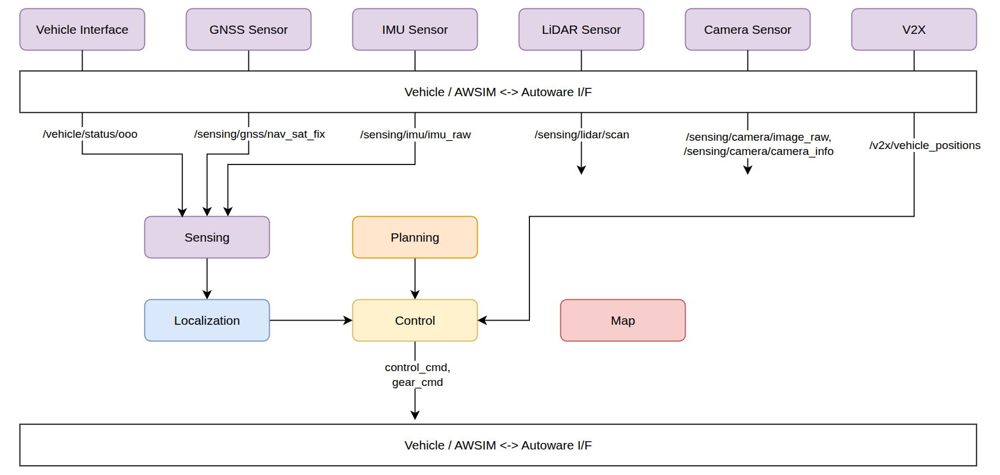
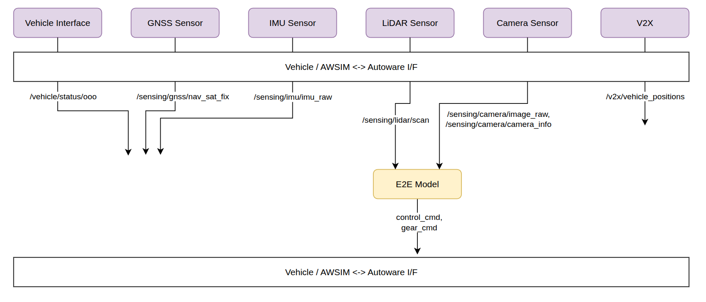
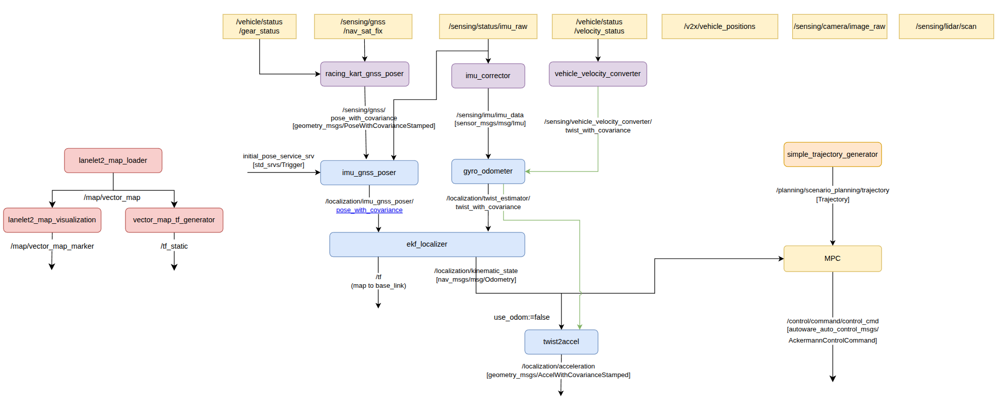

# Autowareの構成

## 本大会で使用するAutowareについて

本大会では、自動運転ソフトウェア[Autoware](https://github.com/autowarefoundation/autoware)をベースとした実装を用意しています。デフォルトのAutowareから機能を絞り、ノード数を減らした縮小構成となっています。これによって以下のようなことができます。

- シンプルな構成となっているため、Autowareの中身をより深く理解できる
- 自作のモジュールをAutowareのものと簡単に入れ替えることができ、機能の改善に取り組める
- パラメータを変更した場合のシステム全体の動作への影響が分かりやすい
- 今回のAutowareには含まれていない既存のAutowareのノードを追加することもできる

縮小構成のAutowareを用意した背景の詳細については、[過去大会のドキュメント](https://automotiveaichallenge.github.io/aichallenge2023-racing/customize/index.html)をご覧ください。

## 全体像

本大会は、シミュレータ環境（AWSIM）上で実装したコードをそのまま実機で動かすSim to Realを特徴としています。そのため、AWSIMと実機で共通のインターフェイスを用いています。Autoware側では決められたインターフェイスのトピックを受信・送信するような実装をすればよく、AWSIMと実機の差分を意識する必要はありません。

インターフェイスと主要なコンポーネントの図を以下に示します。Sim to Real SW部門では以下のように、車両インターフェイスから取得できる情報とGNSSセンサー、IMUセンサー、V2X情報を用いて、自己位置推定や経路計画などを行い、制御信号であるcontrol_cmdトピックを出力します。

End to End AI部門では以下のように、LiDARセンサーとCameraセンサーを用いて制御信号であるcontrol_cmdトピックを出力することが期待されています。なお、図では「E2E Model」と記載していますが、処理を分離したり、一部にロジックを入れたりすることは許容されます。また、本部門ではGNSSセンサー情報などを使うことは出来ませんが、RViz表示等のために関連するノード・トピックが残っています。

## ノード構成

本大会で運営からサンプルとして提供されるAutowareの構成図を以下に示します。デフォルト設定では制御にMPCを使うSim to Real SW部門用の構成となっています。Planningに相当するノードはsimple_trajectory_generatorという、あらかじめCSVファイルに用意された軌道情報を出力するだけのノードです。実際の自動運転では、地図情報から軌道情報を計算したり、V2X情報を用いて障害物や他車両を避けたり停止したりする処理が必要となります。

自己位置推定はGNSSセンサー、IMUセンサー、車両情報を用いて、EKFによって高精度で行われます。これらの実装は動く形で提供されていますが、自己位置推定の精度に課題があると感じた場合は変更可能です。ただし、vehicle_velocity_converterはAutoware標準の処理を使っているため変更出来ません。

## 制御モードの切り替え

`reference.launch.xml`の`control_method`引数を変更することで、制御モードを切り替えられます。

- `mpc`（デフォルト）：MPCベースの制御
- `pure_pursuit`: Pure Pursuitベースの制御
- `tiny_lidar_net`: TinyLiDARNetによるEnd-to-End制御
- `pilot_net`: PilotNetによるEnd-to-End制御
- `rl_train`: 強化学習の学習用モード
- `joycon`: 手動テレオペ操作

## パッケージ一覧

本大会のワークスペースに含まれるパッケージの一覧です。

### 制御

| パッケージ名 | 説明 |
| ------------ | ---- |
| multi_purpose_mpc_ros | ルールベース制御（MPC） |
| simple_pure_pursuit | ルールベース制御（Pure Pursuit） |
| tiny_lidar_net_controller | End-to-End制御（TinyLiDARNet: LiDARスキャン→加速度+操舵角） |
| pilot_net_controller | End-to-End制御（PilotNet: Camera画像→加速度+操舵角） |

### 経路生成

| パッケージ名 | 説明 |
| ------------ | ---- |
| simple_trajectory_generator | CSVファイルからTrajectoryを生成 |
| path_to_trajectory | PathメッセージからTrajectoryに変換 |

### 自己位置推定

| パッケージ名 | 説明 |
| ------------ | ---- |
| gyro_odometer | ジャイロオドメトリ |
| imu_corrector | IMUデータ補正 |
| imu_gnss_poser | IMU+GNSSによる姿勢推定 |
| racing_kart_gnss_poser | レーシングカート用GNSSポーザー（NavSatFix→Pose変換） |

### センサ・車両記述

| パッケージ名 | 説明 |
| ------------ | ---- |
| laserscan_generator | 仮想LaserScanの生成 |
| racing_kart_description | 車両URDF定義 |
| racing_kart_sensor_kit_description | センサキット定義 |

### Launch

| パッケージ名 | 説明 |
| ------------ | ---- |
| aichallenge_submit_launch | メインLaunchファイル |
