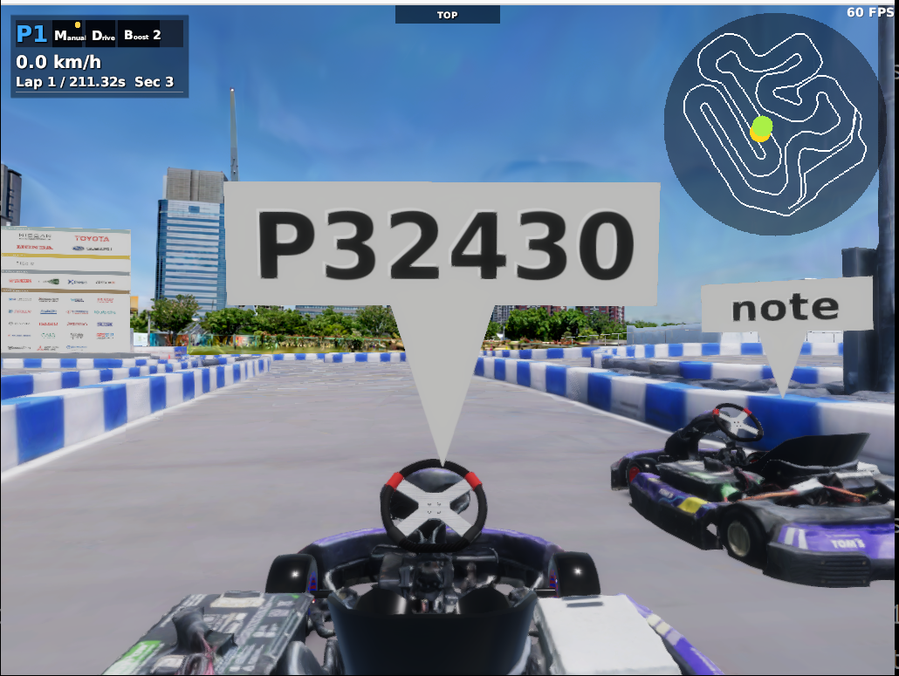
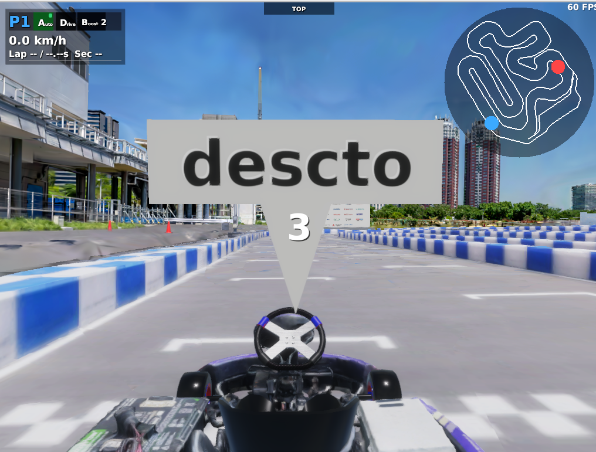

# Multiplay (Networked Racing)

AWSIM's Multiplay feature lets you race against other people by connecting multiple PCs to the same network. Each client shares its own kart (GoKart) pose over UDP, and everyone sees each other's vehicles on screen.

No internet-facing server is required. **Simply connect every PC to a smartphone tethering hotspot** and you can race on the spot (a shared home or venue Wi-Fi works too, of course).
For security, when racing with friends or acquaintances it is best to use a throwaway hotspot name and password just for the session, and change them afterwards.

## What you need

- Two or more PCs that can run AWSIM (e.g. a laptop and a desktop)
- A Wi-Fi network everyone can join (a smartphone hotspot is fine; traffic stays inside the network, so it consumes almost no mobile data)

## Roles

| Role | Description | Launch command |
| --- | --- | --- |
| **host** | Acts as the server and also plays (one person takes this role) | `make simulator-multiplay-host` |
| **client** | Connects to the host and plays (everyone else) | `make simulator-multiplay-client` |

These commands run `aichallenge/simulator_scripts/multiplay-host.sh` / `multiplay-client.sh` respectively. To change launch arguments such as the server IP, edit these scripts directly.

## Steps

### 1. Join the same Wi-Fi

Turn on tethering on a smartphone and connect every PC to that Wi-Fi.

### 2. Find the host's IP address

On the host PC, check its IP address:

```bash
ip addr show | grep "inet "
```

With tethering it is typically `172.20.10.x` on iPhone or `192.168.x.x` on Android. Share this value with every client player.

### 3. Launch the host

On the host PC, launch the script **without any changes**:

```bash
make simulator-multiplay-host
```

!!! note
    Leaving `--multiplay-address 127.0.0.1` on the host side is correct. It is the address the host's built-in client uses to connect to its own server; the server itself listens on all network interfaces.

### 4. Point the client at the host's IP and launch

On each client PC, edit `--multiplay-address` in `aichallenge/simulator_scripts/multiplay-client.sh` to the **host's IP address**:

```bash
    --multiplay-address 192.168.x.x \  # ← change to the host's IP
```

Then launch:

```bash
make simulator-multiplay-client
```

Once connected, each player's vehicle appears on the other screens.



!!! warning "Most important: `--multiplay-address` takes the server (host) IP"
    `--multiplay-address` is the **IP address of the server (host) you are connecting to**. **It is not your own PC's IP address.** Putting your own IP here is the most common mistake.

## Setting a player name (optional)

Add `--multiplay-name` to show a name of your choice (up to 6 characters) on the label above your kart. Without it, an auto-generated ID like `P32430` is shown instead (the front kart in the screenshot above).

Add the following to each host / client script. Including `--start-mode count` makes the countdown start automatically once every kart touches the ground:

```bash
    --multiplay-name descto \  # ← your name (up to 6 characters)
    --start-mode count \
```

Once every kart touches the ground, the countdown starts and the race begins.



## Troubleshooting

If you cannot connect, check the following in order.

### 1. Verify reachability with ping first

From the client PC, ping the host's IP:

```bash
ping <host IP>
```

If ping fails, **client-to-client traffic is blocked on that Wi-Fi** (AP isolation). This happens on office/school Wi-Fi and some Android tethering setups. The quickest fix is to tether from a different phone (iPhone hotspots generally allow it).

### 2. Allow UDP 7777 through the host's firewall

Make sure inbound UDP port 7777 is not blocked on the host:

```bash
sudo ufw allow 7777/udp   # if you use ufw
```

### 3. Read the banner at the top of the screen

- **`MULTIPLAY START FAILED: <reason>`** — the initial connection failed; check the displayed reason (the game keeps running offline afterwards)
- **`MULTIPLAY CONNECTION LOST`** — reception from the host stopped after a successful connection (host quit, Wi-Fi dropped, etc.)

### 4. Other common patterns

| Symptom | Cause and fix |
| --- | --- |
| A second player cannot join | Duplicate `--multiplay-network-id`. Keep the default `0` (auto-assign) |
| Launching two instances on one PC fails | UDP port collision. Change one side's `--multiplay-port` (e.g. 7778) |
| Others cannot see your kart | Make sure `--vehicles` is at least `--multiplay-vehicle-index` |
