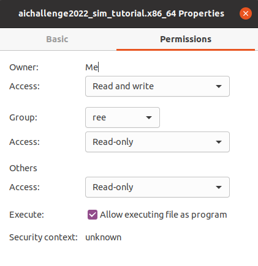

# 環境のアップデート

大会環境の重大なアップデートがあった際には適宜アナウンスがあります。都度必要な手順も併せてアナウンス予定ですが、参考までにこちらに記載します。

!!! warning "シミュレータのアップデート"
    使用するシミュレータ「AWSIM」は、大会期間中に複数回の更新を予定しています。

    アップデートの実施については告知いたしますが、アップデート内容については課題の難易度に関わるため告知いたしません。参加者の皆様には、ご自身でアップデート内容を調査していただくことを想定しています。

    なお、同じコードを提出した場合でも、アップデート前後でスコアに差が生じる可能性があります。いずれの段階においても提出いただいた結果の最高スコアによってランキングが決まります。

    アップデートに関するアナウンスは運営からの連絡をお待ちください。

## Dockerの更新

```bash
./setup.bash pull image
# または
docker pull ghcr.io/automotiveaichallenge/autoware-universe:humble-latest
```

## Autowareの更新

```bash
cd aichallenge-racingkart # path to aichallenge
git pull origin/main
```

## AWSIMの更新

```bash
./setup.bash download awsim
```

??? note "手動でダウンロードする場合"
    One DriveからSimPracticeFor2026内の `AWSIM.zip` をダウンロードし、`aichallenge-racingkart/aichallenge/simulator` に展開します。

    [:material-launch: AWSIMの練習ファイルのダウンロード](https://tier4inc-my.sharepoint.com/:f:/g/personal/taiki_tanaka_tier4_jp/IgAJY4bpq-zpRquKA3ghS1yLAXjc1xEl2O5u4PMQdmOJWXg){ .md-button .md-button--primary  target="_blank" }

    ※現在は大会期間外のため、練習用のファイルのみを提供しています。大会用のファイルは変更される可能性がありますのでご了承ください。

    実行ファイルが`aichallenge-racingkart/aichallenge/simulator/AWSIM/AWSIM.x86_64`に存在していることを確認してください。

    パーミッションを図のように変更します。

    
