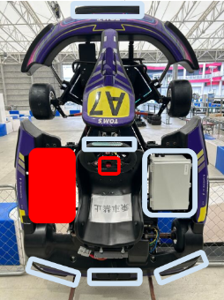

# 決勝大会の概要

## 場所

[シティサーキット東京ベイ](https://city-circuit.com/)
<iframe width="704" height="396" src="https://www.youtube.com/embed/GsuCUoNrMDM?si=zoh1mL_U0yRnB2fj" title="YouTube video player" frameborder="0" allow="accelerometer; autoplay; clipboard-write; encrypted-media; gyroscope; picture-in-picture; web-share" referrerpolicy="strict-origin-when-cross-origin" allowfullscreen></iframe>

## 使用車両と注意事項

# 車両の取り扱いにあたっての禁止事項						
☑	水色の枠以外の箇所には絶対に触れないでください。					
☑	赤色のボタンは運営が管理しますので、絶対に触らないようにお願いします。					
☑	赤色で塗りつぶされている部分は車両の電源となっています。感電のリスクがありますので、絶対に触らないでください。					
☑	白色のボックスの中には複雑な配線加工が施されていますので、無理やり手を入れないようにしてください。					
☑	原則として、車両の進行方向には待機しないでください。					
☑	センサの追加、アクチュエータの改造など含むHW自体の改造は禁止します。					

# 車両の取り扱いで許可されている事項						
☑	USBメモリ、USBの有線キーボード、有線ディスプレイを指すこと					
☑	バッテリーの充電					
☑	モバイルWifiの起動、再起動					
☑	走行中に落ちないと運営が判断した場合かつ、データ取得が目的の場合のみカメラやlidarなどのセンサの取り付けを許可する					
☑	sshやscp経由でのファイルの転送					

## [Next: 車両の動かし方](./operation.ja.md)
