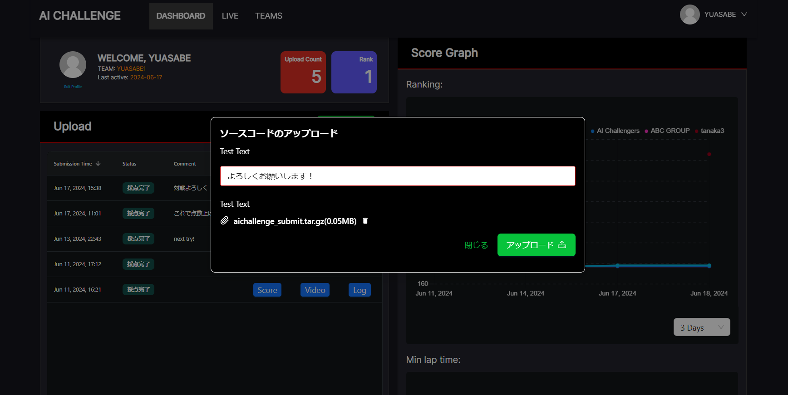

# Getting Started

This page describes the overall flow of the AI Challenge.

You can take part in this competition with a single PC running Ubuntu 22.04.

First use the online scoring environment, then move on to environment setup and development.

??? note  "1. Register for the Autonomous Driving AI Challenge"

    Register for this year's competition via the [:material-launch: registration form](https://questant.jp/q/QUHU0GNO){ .md-button .md-button--primary target="_blank" }

??? note  "2. Access the online scoring environment"

    In this competition, you upload a submission file (a compressed archive of your source code) to the online environment, where it is scored automatically and your ranking is determined.

    First, try the online scoring environment in the following two steps!
    !!! info

        It takes about 5 minutes from accessing the online scoring environment to submitting.

    1. After you register for the Autonomous Driving AI Challenge, login information is sent to your registered email address.

    2. Access the [:material-launch: online scoring environment](https://aichallenge-board.jsae.or.jp){ .md-button .md-button--primary target="_blank" } and log in with the credentials given in the email.

??? note  "3. Submit the sample code"

    1. Once you have access, try submitting source code once.
    Download the compressed sample code from the red button below.

    2. Upload it as-is with the "Submit Code" button in the online scoring environment to submit it.

    [:material-launch: Download the compressed sample code](https://github.com/AutomotiveAIChallenge/aichallenge-racingkart/releases){ .md-button .md-button--primary  target="_blank" }

    

    

??? note  "4. Set your team icon"
    Please set an icon for your team. Using generative AI such as ChatGPT is an effective way to create one.
    The icon you create is also shown in the list of participants' skills based on the SDV skill standard.

    [:material-launch: Participants' skills](https://aichallenge-board.jsae.or.jp/public/jobs){ .md-button .md-button--primary}

??? note  "5. Set up the AI Challenge environment"

    Once you have submitted the sample code, set up your development environment next.

    [:material-arrow-right-circle: Setting up the AI Challenge environment](./setup/requirements.en.md){ .md-button .md-button--primary}
    !!! note

        You can take part in this competition with a single PC running Ubuntu 22.04.

??? note  "6. How to develop in the AI Challenge"

    When the environment setup is complete, try improving the autonomous driving software.

    [:material-arrow-right-circle: How to develop in the AI Challenge](./development/workspace-usage.en.md){ .md-button .md-button--primary }

??? note  "7. Submit the code you developed"

    Submit your finished code from the [online scoring environment](https://aichallenge-board.jsae.or.jp/live).
    Try submitting again via the link below.

    [:material-launch: Submitting source code](./competition/submission.en.md){ .md-button .md-button--primary}

??? note  "8. When your submitted code does not work"

    If your submitted code does not work, look at `aichallenge-racingkart/output/$DATE-$TIME/d$DOMAIN_ID/autoware.log`.

    ```log
    [INFO] [launch]: All log files can be found below $USER/.ros/log/$DATE-$TIME-817891-XXX
    [INFO] [launch]: Default logging verbosity is set to INFO
    [INFO] [launch.user]: The arguments for aichallenge_system_launch.
    [INFO] [launch.user]:  - simulation: true
    [INFO] [launch.user]:  - use_sim_time: true
    [INFO] [launch.user]:  - sensor_model: racing_kart_sensor_kit
    [INFO] [launch.user]:  - launch_vehicle_interface: true
    [INFO] [launch.user]:  - rviz config: /aichallenge/workspace/install/aichallenge_system_launch/share/aichallenge_system_launch/config/autoware.rviz
    ↓↓↓↓↓↓↓↓
    [ERROR] [launch]: Caught exception in launch (see debug for traceback): "package 'aichallenge_submit_launch' not found, searching: ['/aichallenge/workspace/install/simple_trajectory_generator', '/aichallenge/workspace/install/simple_pure_pursuit', '/aichallenge/workspace/install/racing_kart_sensor_kit_description', '/aichallenge/workspace/install/racing_kart_gnss_poser', '/
    ↑↑↑↑↑↑↑↑
    ```
    If that does not solve it, check `aichallenge/workspace/build`, `aichallenge/workspace/install`, `aichallenge/workspace/log` and so on, delete them once, build again, and collect the logs.


    If you cannot reproduce the error locally by any method, ask in the questions channel with the following information.

    1. The ID, date/time, etc. from https://aichallenge-board.jsae.or.jp/public/submissions
    2. The steps you tried locally
    3. The diff from the original sample code and an explanation of the changes you made
    4. The log information and anything else you suspect may be relevant

??? note  "9. Try the AI-based practice materials (optional)"

    For those who want to broaden their skills after learning the basics of Autoware, we provide practice materials that use machine learning.

    **Recommended for:**

    - Those who want to try the latest AI techniques, not only conventional methods

    - Those who have time to spare and want to take on additional learning

    - Those interested in the field of autonomous driving × AI

    !!! warning "These materials are entirely optional"
        These materials have no effect whatsoever on competition scoring. They are purely for those interested in the technology.

    [:material-arrow-right-circle: AI-based practice materials](./ai.md){ .md-button .md-button--primary }
