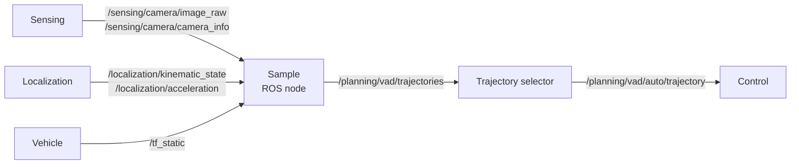
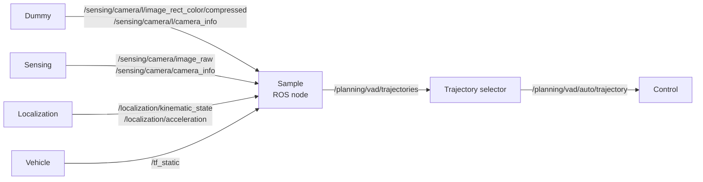

# Design: Sample ROS Node

!!! success "このページの想定読者"

    - sample nodeが使用する入出力形式を知って，自分自身でML plannerのnodeを作成したい方
    - sample nodeの入力画像データはどういうものか，出力する軌道データはどういうものか知って勉強したい方

## Input/Output概略

- 基本構成としては，画像を入力し，trajectoryを出力するという設計になっています．
- 画像の他にも，以下のような情報を含むtopicを入力として受け取っています．
  - Camera Info, tf_static: 座標変換に用いる情報
  - kinematic_state, acceleration: 車両の現在状態の情報
- 出力するtrajectoryはwaypointの形式で表現されています.
  - Sample Nodeは三本trajectoryを生成し，Selector Nodeがその中から適切な一本を選びます．

## Input/Output詳細

### 前提知識

- [QoS](https://docs.ros.org/en/humble/Concepts/Intermediate/About-Quality-of-Service-Settings.html)
- [tf2](https://docs.ros.org/en/humble/Tutorials/Intermediate/Tf2/Tf2-Main.html#tf2)
- [CameraInfo Message](https://docs.ros2.org/latest/api/sensor_msgs/msg/CameraInfo.html)

### Input詳細

入力データは以下のROS topicを通じて提供されます．

- **Image topic**: `/sensing/camera/image_raw`
  - 型: `sensor_msgs/msg/Image`
  - QoS: Reliability=BEST_EFFORT, Durability=VOLATILE
  - 解像度: 1920×1080
  - frame id: camera_optical_link

- **Camera Info topic**: `/sensing/camera/camera_info`
  - 型: `sensor_msgs/msg/CameraInfo`
  - QoS: Reliability=BEST_EFFORT, Durability=VOLATILE

- **Extrinsic Calibration topic**: `/tf_static`
  - 型: `tf2_msgs/msg/TFMessage`
  - QoS: Reliability=RELIABLE, Durability=TRANSIENT_LOCAL

- **Odmetry topic**: `/localization/kinematic_state`
  - 型: `nav_msgs/msg/Odometry`
  - QoS: Reliability=RELIABLE, Durability=VOLATILE

- **Acceleration topic**: `/localization/acceleration`
  - 型: `geometry_msgs/msg/AccelWithCovarianceStamped`
  - QoS: Reliability=BEST_EFFORT, Durability=VOLATILE 

### Output詳細: 軌道データ（waypoints）

- **Candidate trajectories topic**: `/planning/vad/trajectories`
  - 型: `autoware_internal_planning_msgs/msg/CandidateTrajectories`
  - QoS: Reliability=RELIABLE, Durability=VOLATILE

- **Selected trajectory topic**: `/planning/vad/auto/trajectory`
  - 型: `autoware_auto_planning_msgs/msg/Trajectory`
  - QoS: Reliability=BEST_EFFORT, Durability=VOLATILE

## Input/Output実装(詳細)

- 実装の都合上，上記の簡略版の図に加えて，Dummy imageをpublishするNodeが存在しています．
- 実際の実装でどのようになっているかを知りたい方は以下を参照ください．

実際の実装

- Sample Nodeに使用しているalgorithmであるVADは，6枚の画像を入力に取ります．
  - 詳細については，[algorithm](./algorithms.md#vad-tinyの詳細)を確認してください．
- しかし，AWSIMは1枚しか画像を出力しないので，5枚はdummy画像を生成し，VADにわたしています．

