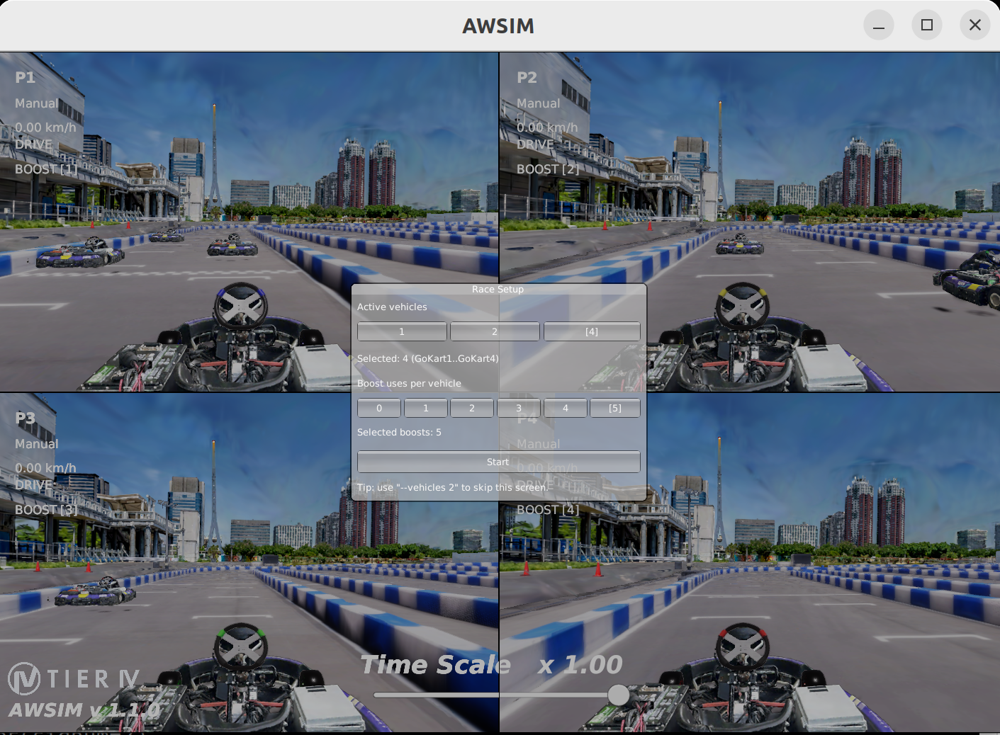
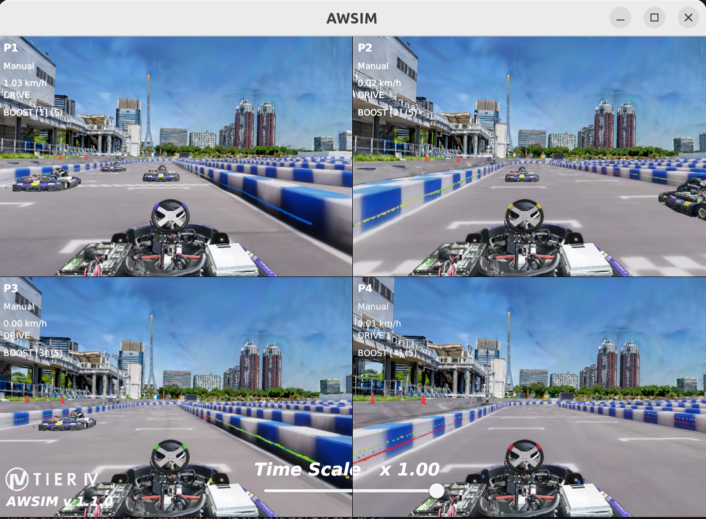
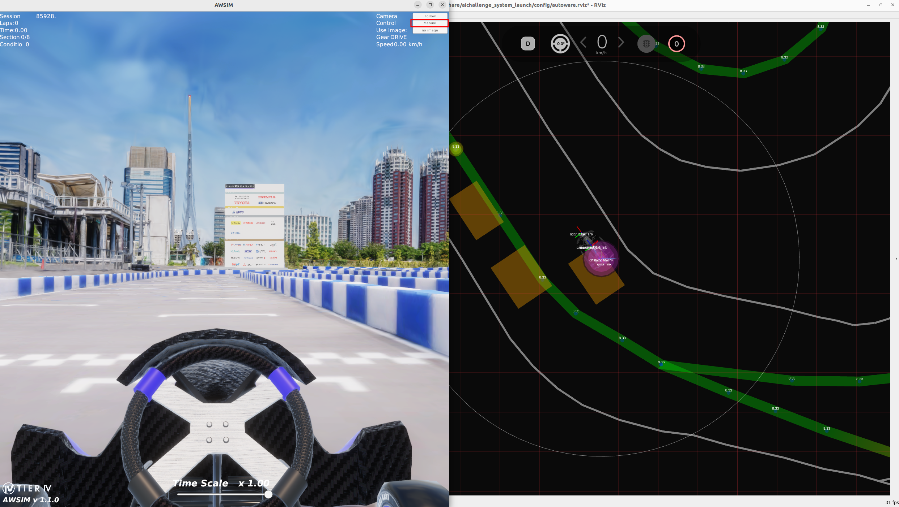

# Develop: Multiple Vehicle TinyLiDARNet

このドキュメントでは、2026年度のシミュレーション大会をFBを元に改善しながら提供している学習教材を使ったTinyLiDARNetの複数台走行のsetup方法・実行方法について説明します。

## Setup

AI Challengeのドキュメントに従って、

- [仮想環境のインストール](https://automotiveaichallenge.github.io/aichallenge-documentation-racingkart/setup/docker.html)
- [描画ありAWSIMの起動](https://automotiveaichallenge.github.io/aichallenge-documentation-racingkart/setup/requirements.html)
    - ただし、[こちら](https://tier4inc-my.sharepoint.com/:f:/g/personal/taiki_tanaka_tier4_jp/IgCivzVKr4HDSbS1BpXObYmGASNQ6uv7iVjKc6ysyBMernE)から、E2ESimSingleTest内のAWSIM.zipをダウンロードして使用してください。
    - AWSIMの配置については[こちらのページ](https://automotiveaichallenge.github.io/aichallenge-documentation-racingkart/setup/visible-simulation.html)を参考に、`aichallenge-racingkart/aichallenge/simulator`に配置してください。実行ファイルが`aichallenge-racingkart/aichallenge/simulator/AWSIM/AWSIM.x86_64`に存在していることを確認してください。
- [大会用リポジトリのビルド・実行](https://automotiveaichallenge.github.io/aichallenge-documentation-racingkart/setup/build-docker.html)

までを実施してください。

また、2025年度大会の参加者の方は再度dockerのpullとbuildが必要になりますので仮想環境のinstallのページを再度ご参考ください。

## TinyLiDARNetの学習手順

TinyLiDARNetの学習には、Autowareから取得したrosbagが必要です。このセクションでは、rosbagの取得方法から、TinyLiDARNetの学習・デプロイまでの手順を説明します。

### Step1. コンテナの操作

このStepでは、複数のTerminalを用います。

```sh
cd ~/aichallenge-racingkart;./docker_run.sh dev
```

をdocker環境の外で実行すれば、コンテナ内で複数のTerminalを開くことができます。3回繰り返して、合計4つのTerminalを開いてください。
また、ROS2をコンテナのシェルに認識させる必要があるので、以下のコマンドをコンテナ内で打つようにしてください。

```sh
source /opt/ros/humble/setup.bash
source /autoware/install/setup.bash
source /aichallenge/workspace/install/setup.bash
```

#### Terminal 1: AWSIMの起動

```sh
./docker_run.sh
./run_simulator.bash
```

下記のような画像がでてきます。何人対戦にするか選択しましょう。
ここでは4人プレイとしてすすめるので4を選択します。



スタートを押すと下記のようにAWSIMが起動します。



#### Terminal 2: Autoware1の起動

```sh
./docker_exec.sh
./run_autoware.bash awsim 1
```

Initial poseを設定してください。

Initial poseを指定する際は、Rvizのviewを`ThirdPersonFollower`から`TopdownOrtho`に切り替える必要があります。

設定できたら、AWSIMの画面右上にあるControlボタンを押し、ManualからAutonomousに切り替えます。



#### Terminal 3: ROS Topicの確認

下記のコマンドでAutoware1のいるドメインIDのros topicを購読することができます。

```sh
./docker_exec.sh
export ROS_DOMAIN_ID=1
ros2 topic list
```

下記のコマンドでシミュレーターがやり取りしているdomain id(=0) のros topicを購読することができます。

```sh
./docker_exec.sh
export ROS_DOMAIN_ID=0
ros2 topic list
```

domainIDごとに見ることができるtopicが異なるため、データ取得の際は注意してください。

#### Terminal 4: rosbagの記録開始

```sh
./docker_exec.sh
cd ml_workspace
./record_rosbag.bash
```

走行が終わったら、Ctrl+Cでrosbagの記録を停止します。記録されたrosbagは、`/aichallenge/ml_workspace/rawdata/$(date +%Y%m%d-%H%M%S)`に保存されます。rosbagはディレクトリ単位で管理されるものなので、この場合は`$(date +%Y%m%d-%H%M%S)`が一つの記録の単位となります（内部に.mcap形式のファイルが蓄積されていきます）。

例えば20251226-233714であれば2025年12月26日23時37分14秒に作られたデータという意味になります。
本当は訓練と検証データを別のものにする、データを選定するなどの工夫をすべきですが、一旦流れを掴むために訓練データと検証データに取得したデータを下記のコマンドでそのままいれてしまいます。

```sh
cp -r /aichallenge/ml_workspace/rawdata/* /aichallenge/ml_workspace/train
```

```sh
cp -r  /aichallenge/ml_workspace/rawdata/* /aichallenge/ml_workspace/val
```

<details>
<summary>※ちなみに、autowareの経路追従を使わず手動でデータを収集することもできます。</summary>

Terminal 2で

```sh
./run_autoware.bash awsim 1
```

の代わりに

```sh
ros2 launch teleop_manager teleop_manager.launch.xml
```

を打ってみてください。Joycon等のコントローラからの入力を使って走行できます。
</details>

## Step2. Dataset conversion

rosbagを学習用datasetに変換します。

```sh
cd /aichallenge/ml_workspace/tiny_lidar_net/
```

```sh
python3 /aichallenge/ml_workspace/tiny_lidar_net/extract_data_from_bag.py --bags-dir /aichallenge/ml_workspace/train/ --outdir /aichallenge/ml_workspace/tiny_lidar_net/dataset/train/
```

以下のような出力が得られたら成功です。

```sh
[INFO] [PID:99328] Found 1 bags. Starting processing with 1 workers.
[INFO] [PID:99356] Saved rosbag2_autoware: 413 samples (Total: 0.13s)
[INFO] [PID:99328] All processing finished in 0.34 seconds.
```

trainだけでなく、validation setも変換しておきましょう。

```sh
cd /aichallenge/ml_workspace/tiny_lidar_net/
python3 /aichallenge/ml_workspace/tiny_lidar_net/extract_data_from_bag.py --bags-dir /aichallenge/ml_workspace/train/ --outdir /aichallenge/ml_workspace/tiny_lidar_net/dataset/train/
```

## Step3. Model training

```sh
python3 /aichallenge/ml_workspace/tiny_lidar_net/train.py
```

CPUで学習を回したい場合や、RTX 50 seriesなどを用いていて、CUDAがこの環境に対応していない場合は、以下を実行してください。

```sh
CUDA_VISIBLE_DEVICES="" python3 /aichallenge/ml_workspace/tiny_lidar_net/train.py
```

## Step4. Model deployment

- `.pth`から`.npy`に変換します

```sh
python3 /aichallenge/ml_workspace/tiny_lidar_net/convert_weight.py --ckpt /aichallenge/ml_workspace/tiny_lidar_net/checkpoints/best_model.pth --output /aichallenge/ml_workspace/tiny_lidar_net/weights/converted_weights.npy
```

以下のような出力が得られれば成功です。

```sh
✅ Loaded checkpoint: /aichallenge/ml_workspace/tiny_lidar_net/checkpoints/best_model.pth
✅ Saved NumPy weights to: weights/converted_weights.npy
```

作成した`converted_weights.npy`を、ROS 2 package内のckptディレクトリに移動します。

```sh
cp /aichallenge/ml_workspace/tiny_lidar_net/weights/converted_weights.npy /aichallenge/workspace/src/aichallenge_submit/tiny_lidar_net_controller/ckpt/tinylidarnet_weights.npy
```

## Step5. Run TinyLiDARNet Sample ROS Node

[`reference.launch.xml`におけるcontrol mode](https://github.com/AutomotiveAIChallenge/aichallenge-racingkart/blob/6706f4cb1bd3b1e50dc56e092ebd51ca174a3530/aichallenge/workspace/src/aichallenge_submit/aichallenge_submit_launch/launch/reference.launch.xml#L20)を、`rule_based`から`e2e`に変更しましょう。

### Terminal 1: AWSIMの起動

```sh
./docker_exec.sh # すでにDockerを起動している場合はSkip
./run_simulator.bash
```

### Terminal 2: Autoware1の起動

```sh
./docker_exec.sh #すでにDockerを起動している場合はSkip
./run_autoware.bash awsim 1
```

[こちらのlink](https://autowarefoundation.github.io/autoware-documentation/main/demos/planning-sim/lane-driving/#2-set-an-initial-pose-for-the-ego-vehicle)を参考にし、initial poseを設定してください。

設定できたら、AWSIMの画面右上にあるControlボタンを押し、ManualからAutonomousに切り替えます。


### アクセル制御の追加

現在のdefault設定では、TinyLiDARNetはステアリング制御のみを行い、[アクセルは固定値](https://github.com/AutomotiveAIChallenge/aichallenge-racingkart/blob/6706f4cb1bd3b1e50dc56e092ebd51ca174a3530/aichallenge/workspace/src/aichallenge_submit/tiny_lidar_net_controller/config/tiny_lidar_net_node.param.yaml#L12-L13)で制御しています。`control_mode: "ai"`に変更し、アクセル制御もTinyLiDARNetに実施させてみましょう。

### TinyLiDARNetでのOvertake

単独走行であれば、ML Plannerを用いる必要性は低いですが、複数台走行の場合は、overtakeといった高度な意思決定が必要となり、機械学習の活躍場面が増えます。[複数台走行用のAWSIM](https://tier4inc-my.sharepoint.com/:f:/g/personal/taiki_tanaka_tier4_jp/IgAJY4bpq-zpRquKA3ghS1yLAYemytm9XUtONqpMeEBUAww?e=NU2sO0)を使用すれば、複数台走行データを収集・学習することができます。


### Rvizの設定

sensorモジュールはBestEffortでpublishしています。Rvizのtopicの設定をReliableからBestEffortにしてください。


