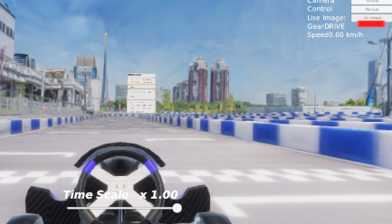

# Getting started

このドキュメントでは，Gemini APIとAWSIMを用いて，VLM Plannerを動かす方法について説明します．

## AWSIM側の準備

[環境構築](https://automotiveaichallenge.github.io/aichallenge-documentation-2025/setup/requirements.html)のドキュメントに従い，[描画ありAWSIMの起動](https://automotiveaichallenge.github.io/aichallenge-documentation-2025/setup/requirements.html)と[大会用リポジトリのビルド・実行](https://automotiveaichallenge.github.io/aichallenge-documentation-2025/setup/build-docker.html)までを実施してください．

```sh
cd ~/aichallenge-2025
./docker_run.sh dev gpu
```

```sh
cd /aichallenge
./build_autoware.bash
./run_evaluation.bash
```


AWSIMが表示されたら，AWSIMでuse imageのボタンを押してカメラ画像を有効にします．



## local環境側の準備

!!! info

    この手順書に従って環境構築を行うことで，local環境が変更されます．

### ROSのinstall

[こちらのドキュメント](https://autowarefoundation.github.io/autoware-documentation/main/installation/autoware/source-installation/#how-to-set-up-a-development-environment)に従って，ROS環境を構築してください．

```sh
git clone https://github.com/autowarefoundation/autoware.git
cd autoware
```

以下を実行する際，途中で選択肢への回答が必要です．

```sh
./setup-dev-env.sh
```

以下を参考に回答してください．
<details>
<summary>選択肢への回答</summary>

- 1. Are you sure you want to run setup?
  - `y`と回答してください

```sh
❯ ./setup-dev-env.sh
Setting up the build environment can take up to 1 hour.
>  Are you sure you want to run setup? [y/N] 
```

- 2. `BECOME password: `
  - local環境の変更が行われても問題なければ，passwordを入力してください．

```sh
autoware.dev_env:0.1.0 was installed successfully
ansible-playbook autoware.dev_env.universe --ask-become-pass --extra-vars install_devel=y --extra-vars data_dir=/home/autoware/autoware_data --extra-vars rosdistro=humble --extra-vars rmw_implementation=rmw_cyclonedds_cpp --extra-vars base_image=ros:humble-ros-base-jammy --extra-vars autoware_base_image=ghcr.io/autowarefoundation/autoware-base:latest --extra-vars autoware_base_cuda_image=ghcr.io/autowarefoundation/autoware-base:cuda-latest --extra-vars cuda_version=12.4 --extra-vars cudnn_version=8.9.7.29-1+cuda12.2 --extra-vars tensorrt_version=10.8.0.43-1+cuda12.8 --extra-vars pre_commit_clang_format_version=17.0.5 --extra-vars cumm_version=0.5.3 --extra-vars spconv_version=2.3.8 
BECOME password: 
```

- 3. `Install NVIDIA libraries? [y/N]`と`Download artifacts? [y/N]`
  - `N`と答えてください．

```sh
Install NVIDIA libraries? [y/N]: 
[Warning] Should the ONNX model files and other artifacts be downloaded alongside setting up the development environment.
Download artifacts? [y/N]: 
```

</details>

### ROS環境の確認

ROSがlocal環境に導入されたかどうかを確認します．

```sh
source /opt/ros/humbe/setup.bash
echo $ROS_DISTRO
```

`humble`と表示されれば成功です．

### e2e_utils_betaの環境構築

[e2e_utils_beta](https://github.com/Shin-kyoto/e2e_utils_beta/tree/main)をcloneしてください．

```sh
git clone https://github.com/Shin-kyoto/e2e_utils_beta.git
cd e2e_utils_beta
sh script/setup.sh
```

### build

```sh
cd e2e_utils_beta
rosdep update;rosdep install -y --from-paths . --ignore-src --rosdistro $ROS_DISTRO
```

```sh
colcon build --symlink-install --cmake-args -DCMAKE_EXPORT_COMPILE_COMMANDS=ON -DCMAKE_BUILD_TYPE=Release --packages-up-to autoware_auto_planning_msgs autoware_internal_planning_msgs
```

### uvの環境構築

```sh
cd e2e-utils-beta;source install/setup.bash
```

```sh
cd src/vlm_trajectory_selector;uv venv -p python3.10
```

```sh
source .venv/bin/activate
```

```sh
uv pip install .
```

### Gemini APIの取得

- [こちらのdocument](https://ai.google.dev/gemini-api/docs/api-key?hl=ja)に従って，Gemini APIを取得してください．
- 取得したAPI KEYを環境変数に設定しましょう．

```sh
export GEMINI_API_KEY="YOUR_API_KEY"
```

## VLM Plannerの実行

- 以下のコマンドを実行し，VLM Plannerを動かしてみてください．

```sh
# Run the VLM planner node with custom output topic
cd e2e-utils-beta/src/vlm_trajectory_selector
python vlm_planner_node.py --ros-args -p output_topic:="/planning/vad/auto/trajectory"
```

以下のコマンドで出力が得られていれば，正しく実行できています．

```sh
ros2 topic echo /planning/vad/auto/trajectory
```

## Tips

このSampleでは，`gemini-2.5-flash-lite`をそのまま使用しており，サーキット用のチューニングができておらず，ヘアピンを回ることができない状態です．以下のTipsを参考に，改善にトライしてみてください．

- `e2e-utils-beta/src/vlm_trajectory_selector/vlm_planner.py`を更新することでモデルを変更できます
    - デフォルトでは`gemini-2.5-flash-lite`が使用されています．

```python
self.model = genai.GenerativeModel("gemini-2.5-flash-lite")
```

- プロンプト(e2e-utils-beta/src/vlm_trajectory_selector/prompt.py)を更新することでも改善ができる可能性があります．

- [Vertex AIでのファインチューニング](https://cloud.google.com/vertex-ai/generative-ai/docs/models/gemini-use-supervised-tuning?hl=ja)が軌道の改善に役立つ可能性があります．

