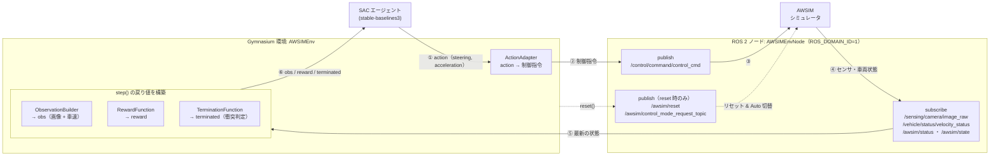

# Soft Actor-Critic (Reinforcement Learning)

このドキュメントでは、AI Challenge 環境で Soft Actor-Critic (SAC) による強化学習と推論走行を行う手順を説明します。

TinyLiDARNet や PilotNet が rosbag を使った模倣学習であるのに対し、ここで扱う SAC は模倣学習ではありません。教師データ (rosbag) を事前に集める必要はなく、AWSIM と直接やり取りしながら方策 (policy) を学習します。学習中は AWSIM を GPU 描画付きで起動し続け、エージェントが行動を送るたびにシミュレータが応答する、という相互作用を繰り返してモデルを更新します。

- アルゴリズムの位置付け: [ml_sample/algorithms.md](algorithms.md)
- 実装: [reinforcement_learning](https://github.com/AutomotiveAIChallenge/aichallenge-racingkart/tree/main/aichallenge/ml_workspace/reinforcement_learning)

## Setup

[環境構築](../setup/introduction.ja.md)を実施してください。GPU を積んだマシンでの実行を前提とします。

学習には AWSIM がカメラ画像を描画し続ける必要があるため、通常の模倣学習用セットアップに加えて以下の変更が必要です。

### 1. GPU 描画を有効にする (`.env`)

`aichallenge-racingkart/.env` の `COMPOSE_FILE` が GPU overlay (`docker-compose.gpu.yml`) を含むようにしてください。コメントアウトされている場合は先頭の `#` を外してください。

```text
COMPOSE_FILE=docker-compose.yml:docker-compose.gpu.yml
```

### 2. AWSIM のカメラとカウントダウンの設定変更 (`dev.sh`)

`aichallenge/simulator_scripts/dev.sh` を以下のように変更してください。

```diff
-    --camera off \
+    --camera cpu \
```

```diff
-    --start-count-seconds 5 \
+    --start-count-seconds 0 \
```

`--camera off` のままだと `/sensing/camera/image_raw` が配信されず、観測に使う画像が得られません。また `--start-count-seconds` はカウントダウン秒数で、学習中に毎エピソード待たされないよう `0` にしておくと便利です。

### 3. `control_method` を `rl_train` に変更する

`aichallenge/workspace/src/aichallenge_submit/aichallenge_submit_launch/launch/reference.launch.xml` の `control_method` を `rl_train` に書き換えてください。

```xml
<arg name="control_method" default="rl_train"
```

## SAC の学習手順

### Step 1. 学習用ディレクトリの作成

コンフィグ・ログ・学習済みモデルを保存するディレクトリを作成します。名前は分かりやすければ何でも構いません。ここでは `202605122237` とします。

```sh
cd ~/aichallenge-racingkart/aichallenge/ml_workspace/reinforcement_learning/
mkdir -p workspace/202605122237/
```

### Step 2. コンフィグのコピー

デフォルトのコンフィグを作成したディレクトリにコピーします。

```sh
cd ~/aichallenge-racingkart/aichallenge/ml_workspace/reinforcement_learning/
cp ./src/config/config_store/default_config.yaml ./workspace/202605122237/default_config.yaml
```

### Step 3. Autoware のビルドと起動

```sh
cd ~/aichallenge-racingkart/
make autoware-build
make dev
```

AWSIM に `Race Result` というウィンドウが表示されますが、これは正常な動作です。

### Step 4. コンテナに入って学習を実行

```sh
cd ~/aichallenge-racingkart/
./docker_exec.sh
```

`autoware` が名前に含まれる docker コンテナを選択してください。以降はこのコンテナ内のシェルで操作します。

```sh
cd /aichallenge/ml_workspace/reinforcement_learning/
ROS_DOMAIN_ID=1 python3 ./src/main.py --train --config ./workspace/202605122237/default_config.yaml
```

`--config` で渡した YAML と同じディレクトリに `model/` (学習済みモデル) と `log/` (TensorBoard ログ) が保存されます。指定したステップ数 (`default_config.yaml` では `total_timesteps: 300000`) の学習が終わると、`/aichallenge/ml_workspace/reinforcement_learning/workspace/202605122237/model.zip` が生成されます。

## 推論走行の手順

学習済みモデル (`model.zip`) の名前を `awsim_sac_model.zip` にリネームします。`--infer` はデフォルトで `awsim_sac_model` というモデルパスを読みに行くためです。

```sh
cd /aichallenge/ml_workspace/reinforcement_learning/workspace/202605122237/
mv model.zip awsim_sac_model.zip
```

推論走行を実行します。

```sh
cd /aichallenge/ml_workspace/reinforcement_learning/workspace/202605122237/
ROS_DOMAIN_ID=1 python3 ../../src/main.py --infer --config ./default_config.yaml
```

`--episodes` (デフォルト 5) でエピソード数を、`--model-path` でモデルファイルのパスを変更できます。

## 仕組みの解説

### 観測空間・行動空間

| | 内容 |
|---|---|
| 観測 (Dict) | `image`: フロントカメラ画像を 64x64x3 にリサイズしたもの (uint8)。`speed`: 車速 [m/s] (0 未満はクリップ) |
| 行動 (Box, 2次元) | `[steering, acceleration]` の連続値。デフォルト範囲は `steering: [-1.0, 1.0]`、`acceleration: [0.0, 1.0]` |
| 報酬 | `speed_reward_scale × max(0, speed) - collision_penalty (衝突時のみ) - step_time_penalty (毎ステップ)` の3項のみ |
| 終了条件 (terminated) | 衝突判定のみ。急減速 (前ステップから `collision_speed_drop_threshold` 以上速度が落ちた) か、低速状態 (`collision_speed_threshold` 未満) が `collision_count_threshold` 回連続した場合に終了 |

エピソード開始直後 (`step_count <= 20`) は衝突判定を抑制し、リセット直後の不安定な挙動で誤終了しないようにしています。

なお `default_config.yaml` には最大ステップ数で打ち切る `TimeLimit` wrapper の設定 (`algorithm.wrapper_order`, `algorithm.timelimit`) がありますが、これは `terminated` とは別に `truncated` を発生させるものです。コースアウト専用の判定はなく、コースアウトは速度低下という間接的な指標でしか検出されません。

### ROS トピック ⇔ Gym 環境のブリッジ構造

学習・推論はいずれも `ROS_DOMAIN_ID=1` (Autoware 側のドメイン) で動作します。Gymnasium の `AWSIMEnv` と ROS 2 ノード `AWSIMEnvNode` が橋渡しし、`step()` のたびに行動の publish → 観測の取得 → 報酬・終了判定という 1 サイクルを回します。



`AWSIMEnvNode` は他にも GNSS/IMU/LiDAR/Trajectory など多数のトピックを購読できるよう用意していますが、現在の `AWSIMEnv` が実際に使うのは `/awsim/state`、`/awsim/status`、`/sensing/camera/image_raw`、`/vehicle/status/velocity_status` の4つのみです。`reset()` は `/awsim/reset` を publish し、0.5秒待ってから `/awsim/control_mode_request_topic` に Auto (true) を publish してシミュレータを再開させます。

### 拡張ポイント

`select_parts.py` が、コンフィグの `name` フィールドの文字列に応じて実装クラスを切り替えるプラガブルな構成になっています。観測・行動・報酬・終了条件はそれぞれ独立した interface (`observation/interfaces.py`, `action/interfaces.py`, `reward/interfaces.py`, `termination/interfaces.py`) を実装したクラスとして追加でき、`select_*` 関数に分岐を足すだけで `default_config.yaml` の `name` を書き換えて選択できるようになります。

- **報酬を変える**: `reward/default_reward.py` の `DefaultAWSIMReward` は速度・衝突・時間の3項のみを見ています。セクション通過やラップ完走に応じたボーナスを加えたい場合はここに実装を追加してください。
- **観測を変える**: `observation/default_observation.py` の `ImageSpeedObservationBuilder` は画像とスピードのみを返します。LiDAR やステアリング角など他のセンサ値を使いたい場合は、`context/extract_map/context_extract_map.yaml` の抽出マップに項目を追加した上で `ObservationBuilder` を拡張してください。
- **終了条件を変える**: `termination/default_termination.py` の `CollisionTermination` は速度ベースの衝突判定のみです。コースアウト専用の判定を追加したい場合はここに実装してください。

## Notes

- `ROS_DOMAIN_ID` は必ず `1` (Autoware 側のドメイン) を指定してください。学習・推論コマンドの例はすべて `ROS_DOMAIN_ID=1` を前提にしています。
- 学習中は AWSIM がカメラ画像を描画し続けるため、GPU 描画が必須です。`--camera off` のままだと画像が配信されず観測がゼロ埋めのままになります。
- AWSIM に表示される `Race Result` ウィンドウは学習時にも出てきますが、正常な動作です。
- `--config` を指定しない場合、コンフィグは Python 側の `DEFAULT_CONFIG` (デフォルト値) にフォールバックします。このとき `gamma` や `reward` 系の値が `default_config.yaml` の値とは異なる (例: `gamma` は YAML では `0.99`、Python 既定値は `0.98`) ので、意図したハイパーパラメータで学習したい場合は必ず `--config` を指定してください。
- 学習後に生成されるファイルは `model.zip` という固定名です。推論 (`--infer`) はデフォルトで `awsim_sac_model.zip` を読みに行くため、手動でのリネームが必要です。
