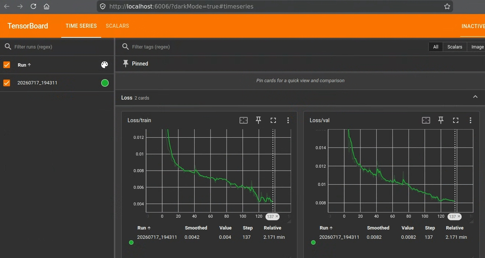

# TinyLidarNet

TinyLidarNetでは、LiDARから出力されたスキャンデータを用いて、機械学習モデルによる推論を実行し、制御信号（steering, acceleration）を出力します。

このドキュメントでは、TinyLidarNetの学習方法と実行方法について説明します。

- アルゴリズムの説明: [ml_sample/algorithms.md](algorithms.md#tinylidarnet)
- ROS 推論ノード: [tiny_lidar_net_controller](https://github.com/AutomotiveAIChallenge/aichallenge-racingkart/tree/main/aichallenge/workspace/src/aichallenge_submit/tiny_lidar_net_controller)
- 入力: 2D LiDAR スキャン
- 学習: PyTorch
- 推論: NumPy
- 入力前処理: 距離正規化

## 事前準備

[環境構築](../setup/introduction.ja.md)を実施して、`make dev` コマンドによってAutowareとAWSIMが使用できることを確認してください。また、[.envの記載](../setup/gpu-simulation.ja.md#env-check)を参考にGPUが使用できていることを確認してください。

## 全体の流れ

以下の手順でTinyLidarNetを使います。提供する重みファイルをそのまま使い、まずは動かしてみたい方はStep1後に直接Step4にお進みください。

- Step1. AWSIMの設定をE2E用にする
- Step2. 学習用データの取得
- Step3. 学習
- Step4. TinyLidarNetを使いAutowareを動かす

## Step1. AWSIMの設定をE2E用にする { #step1 }

`aichallenge/simulator_scripts/dev.sh` を開き、LiDARを有効にします。 `gpu` でうまく動かなかったら `cpu` を試してください。

TinyLidarNetではLiDAR情報しか使いませんが、Cameraも有効にすることでPilotNetなどカメラベースのAI用学習データも同時に取得できます。
また、大会と同じ条件で走行する場合は、IMU、GNSS、V2Xを無効にします。

```diff
-    --camera off \
+    --camera gpu \

-    --lidar off \
+    --lidar gpu \

+    --imu off \
+    --gnss off \
+    --v2x off \
```

## Step2. 学習用データの取得 { #step2 }

学習用データとして、LiDAR (及びカメラ) を有効にした状態で走行したrosbagを保存します。走行は手動走行が望ましいですが、MPCなどの制御アルゴリズムで走行させたデータを使用することもできます。

なお、データ取得ではターミナルを2つ使います。1つは車両を走らせる走行用（`make dev`）、もう1つは走行データを記録する記録用（`make autoware-bash` から `record_data.bash` を実行）です。

### `control_method` を変更する

`aichallenge/workspace/src/aichallenge_submit/aichallenge_submit_launch/launch/reference.launch.xml` の `control_method` を書き換えます。どのような方法で学習データを収集するかでお選びください。

- `mpc` : MPC制御アルゴリズムによる走行データを取得する場合。とりあえずのデータ取得を行う場合に便利です (mpcを使用してデータ取得する場合は、AWSIMのIMUとGNSSは有効にしてください)
- `joycon` : ジョイコンあるいはキーボードによって、自分で手動操作した走行データを取得する場合（キーボード操作の場合も `joycon` を選びます）

`joycon` の場合には、さらに `aichallenge/workspace/src/aichallenge_submit/aichallenge_submit_launch/launch/control/joycon.launch.xml` の `input_source` を使用する入力デバイスに応じて書き換えます。

- `joy` : ジョイコンを使用する場合
- `keyboard` : キーボードを使用する場合
- `keyboard_x11` : キーボードを使用する場合（`keyboard` でうまく行かない場合お試しください）

!!! tip "手動操作（ジョイコン／キーボード）"
    | 操作 | ジョイコン | キーボード |
    |---|---|---|
    | ステアリング | axes[0] (左スティック横) | a / d |
    | アクセル | axes[1] (左スティック縦) | w / s |
    | DRIVE(前進)ギア | button[5] (R1ボタン) | 1 |
    | REVERSE(後進)ギア | button[4] (L1ボタン) | 2 |
    | turbo boost | button[8] | b |

    注意：ジョイコンの場合は、button[3] (□ボタン)を押しながら、上記操作を行ってください

### rosbagを保存する

- 新規ターミナルを開き、 `make autoware-bash` コマンドを実行してAutoware環境が有効なコンテナに入ります
- `./record_data.bash` コマンドでrosbag記録を行います
    - ROS_DOMAIN_IDの設定を忘れるとデータ取得に失敗するため注意してください
    - 実際にrosbagの保存を行うのは次の手順で走行を始めてからの方が良いデータが取れます
- ある程度走行データが取得できたら、ctrl-cで終了します
    - 最低1周分は取得することをお勧めします。
    - rosbagは `aichallenge/ml_workspace/rawdata/yyyymmdd-hhmmss` に保存されます

```bash
make autoware-bash

# 以後、コンテナ内部でのコマンド
cd /aichallenge/ml_workspace
export ROS_DOMAIN_ID=1
./record_data.bash
# ある程度走行データが取得できたら、ctrl-c
```

### Autowareを起動して走行する

上記作業と並行して、新規ターミナルを開き、 `make dev` コマンドによってAutowareとAWSIMを起動して走行開始します。必要に応じてキーボード操作などで車両を走らせます。

```bash
make dev
```

## Step3. 学習 { #step3 }

rosbag保存するときに使用したターミナルか、新規ターミナルで再度 `make autoware-bash` コマンドを実行してAutoware環境が有効なコンテナに入ります。

以下の1〜5の手順で学習を進めます。各手順の詳細は折りたたみの説明（クリックで展開）にまとめています。実際に実行するコマンドは、説明の後にある一括コマンドを上から順にコピーして進めてください。

??? note "1. rosbagを訓練データと検証データに割り振る"
    ここでは、流れを掴むために訓練データと検証データに取得したデータをそのままコピーしています。実際には、訓練データと検証データを別のものにしたり、データを選定するなどの工夫を行ってください。

??? note "2. rosbagを学習用datasetに変換"
    訓練用と検証用の両方を変換します

    以下のような出力が得られたら成功です。

    ```sh
    [INFO] [PID:99328] Found 1 bags. Starting processing with 1 workers.
    [INFO] [PID:99356] Saved rosbag2_autoware: 413 samples (Total: 0.13s)
    [INFO] [PID:99328] All processing finished in 0.34 seconds.
    ```

    このコマンドは内部で以下を実行します:

    1. rosbag から `/sensing/lidar/scan` と `/control/command/control_cmd` を時刻同期して取得
    2. 前処理を行い `scans.npy` として保存
    3. ステアリングと加速度を `steers.npy` / `accelerations.npy` に保存

??? note "3. 学習"
    各種パラメータは `aichallenge/ml_workspace/tiny_lidar_net/config/train.yaml` で調整できます。

    デフォルトの`config/train.yaml`では`train.loss.steer_weight`・`train.loss.accel_weight`がともに1.0に設定されており、ステアリングとアクセルの両方を学習します。ただしアクセルの学習はうまく収束しないことが分かっているため、必要に応じて以下のようにHydra（設定管理ツール）のオーバーライド（上書き）機能で`train.loss.accel_weight`を0にし、ステアリングのみを学習することもできます。

    ```sh
    python3 ./train.py train.loss.accel_weight=0.0
    ```

    なお、CPUで学習を回したい場合や、RTX 50 seriesなどを用いていてCUDAがこの環境に対応していない場合は、以下のようにGPUを無効化して実行してください。

    ```sh
    CUDA_VISIBLE_DEVICES="" python3 ./train.py
    ```

??? note "4. 重みファイルの変換"
    .pthファイルを.npyに変換します。

    以下のような出力が得られれば成功です。

    ```sh
    Loaded checkpoint: checkpoints/best_model.pth
    Saved NumPy weights to: weights/converted_weights.npy
    ```

??? note "5. 重みファイルのデプロイ"
    作成した`converted_weights.npy`を、ROS 2 package内のckptディレクトリにコピーします。

```bash
make autoware-bash

# 以後、コンテナ内部でのコマンド

# 1-a. 訓練データの準備
mkdir -p /aichallenge/ml_workspace/train
cp -r /aichallenge/ml_workspace/rawdata/* /aichallenge/ml_workspace/train

# 1-b. 検証データの準備（本来は訓練データとは分けるべき）
mkdir -p /aichallenge/ml_workspace/val
cp -r /aichallenge/ml_workspace/rawdata/* /aichallenge/ml_workspace/val

cd /aichallenge/ml_workspace/tiny_lidar_net

# 2. rosbagを学習用datasetに変換
python3 ./extract_data_from_bag.py \
    --bags-dir /aichallenge/ml_workspace/train/ \
    --outdir ./dataset/train/
python3 ./extract_data_from_bag.py \
    --bags-dir /aichallenge/ml_workspace/val/ \
    --outdir ./dataset/val/

# 3. 学習の実行
python3 ./train.py
# ステアリングのみを学習する場合（アクセルは収束しにくいため）
# python3 ./train.py train.loss.accel_weight=0.0

# 全Epochが完了するまで待つか、ある程度収束したらctrl-cで終了します

# 4. 重みファイルの変換(.pthから.npyに変換)
python3 ./convert_weight.py \
    --ckpt ./checkpoints/best_model.pth \
    --output ./weights/converted_weights.npy

# 5. 重みファイルのデプロイ
cp ./weights/converted_weights.npy \
    /aichallenge/workspace/src/aichallenge_submit/tiny_lidar_net_controller/ckpt/tinylidarnet_weights.npy
```

## Step4. TinyLidarNetを使いAutowareを動かす { #step4 }

- `aichallenge/workspace/src/aichallenge_submit/aichallenge_submit_launch/launch/reference.launch.xml` の `control_method` を`tiny_lidar_net`に変更します。
- その後、いつも通り `make dev` コマンドによって起動すると、 TinyLidarNetによって車両が動き出します。

## TinyLidarNetのTips

### アクセル制御の追加

現在のdefault設定では、TinyLidarNetはステアリング制御のみを行い、[アクセルは固定値](https://github.com/AutomotiveAIChallenge/aichallenge-racingkart/blob/6706f4cb1bd3b1e50dc56e092ebd51ca174a3530/aichallenge/workspace/src/aichallenge_submit/tiny_lidar_net_controller/config/tiny_lidar_net_node.param.yaml#L12-L13)で制御しています。`control_mode: "ai"`に変更することで、アクセル制御もTinyLidarNetに実施させることができます。この場合、アクセル制御も学習しておく必要があります。

## TinyLidarNetとPilotNetで共通のTips { #tips }

### 他車両・障害物が存在するシナリオの学習

- 単独走行であれば、ML Plannerを用いる必要性は低いですが、複数台走行の場合は、overtakeといった高度な意思決定が必要となり、機械学習の活躍場面が増えます。AWSIMの複数台走行やシナリオエディタを使用すれば、そのようなシーンの学習データを取得することができます
- `make dev` コマンドで実行後、画面上部の 「top」 ボタンをクリックし、「Scenario Editor」をクリックします
    - 注意：自車両と他車両を合わせて4台配置する場合は、事前にVehiclesを4にしてください
- 任意の場所に任意の車両や障害物を配置できます。シナリオエディタの操作方法は[こちら](../specifications/simulator.ja.md)をご参照ください。
- お好みの配置ができたら、 「Save & Start」で走行開始できます。保存したシナリオは後からLoadすることができます。また、事前に用意されているSafety Gate用のシナリオをLoadすることもできます。


### Rockerから操作する場合

AutowareやAWSIMの起動を繰り返す場合は、Rockerを使用するほうが便利な場合もあります。

- AWSIMの起動
    - 新規ターミナルで下記コマンドでAWSIMを起動し、任意の設定を行いStartします

    ```bash
    ./docker_run.sh dev
    ./run_simulator.bash
    ```

- Autowareの起動
    - 新規ターミナルで下記コマンドでAutowareを起動します
    - もしも走行しない場合は、RViz上で「InitialPose Set」と「Auto Mode Stat」をクリックしてください

    ```bash
    ./docker_exec.sh
    ./run_autoware.bash awsim 1
    ```

- rosbag記録
    - 新規ターミナルで下記コマンドでrosbag記録します

    ```bash
    ./docker_exec.sh
    cd /aichallenge/ml_workspace
    export ROS_DOMAIN_ID=1
    ./record_data.bash
    ```

### AutowareとAWSIMだけを終了する方法

- モデルを学習させながら、同時に `make dev` で走行テストを行うことがあります。このとき、 `make down` でAutowareとAWSIMを終了させると、`make autoware-bash` で起動したモデル学習用のコンテナも終了してしまいます。
- `docker compose down simulator autoware` によってAutowareとAWSIMだけを終了することができます。

### 学習用パラメータの変更例

`aichallenge/ml_workspace/tiny_lidar_net/config/train.yaml` で学習用パラメータを調整できます。

例えば、`epochs` の数値を増やすことで学習回数を変更することができます。収束が足りない場合は回数を増やしてみてください。ただし、単に回数を増やすだけだと過学習してしまうリスクもあります。使用する学習データ数などを考慮して調整が必要なパラメータです。

### TensorBoardで学習の過程を確認する

TensorBoardを使うことで学習の過程を可視化できます。下記コマンド実行後、表示されるURLをブラウザで開いてください。なお、ホスト環境でインストール、実行することをお勧めします。

```bash
pip install tensorboard
cd /aichallenge/ml_workspace/tiny_lidar_net
tensorboard --logdir logs
# この後、表示されるURLを開く
```


