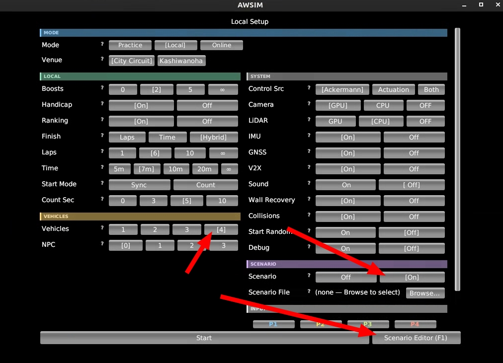
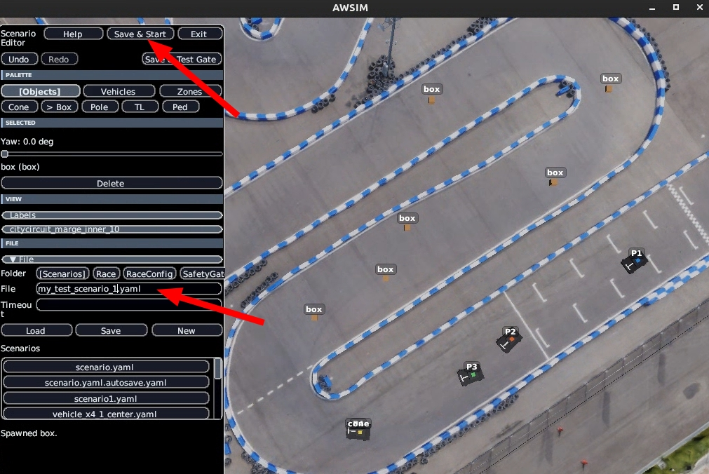
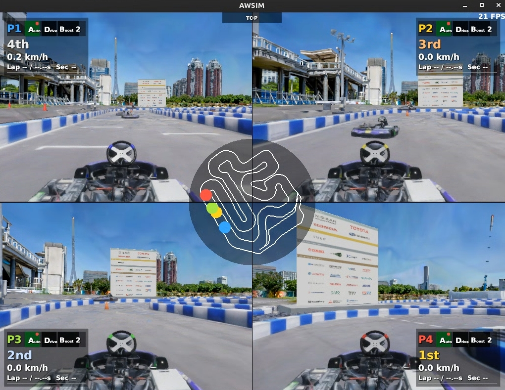

# TinyLidarNet

TinyLidarNetでは、LiDARから出力された点群データを用いて、機械学習モデルによる推論を実行し、制御信号（steering, acceleration）を出力します。

このドキュメントでは、TinyLidarNetの学習・デプロイ方法と実行方法について説明します。

## 事前準備

[環境構築](../setup/introduction.ja.md)を実施して、`make dev` コマンドによってAutowareとAWSIMが使用できることを確認してください。また、[.envの記載](../setup/gpu-simulation.ja.md#env-check)を参考にGPUが使用できていることを確認してください。

## 全体の流れ

以下の手順でTinyLidarNetを使います。提供する重みファイルをそのまま使い、まずは動かしてみたい方は直接Step3にお進みください。

- Step1. 学習用データの取得
- Step2. 学習
- Step3. TinyLidarNetを使いAutowareを動かす

## Step1. 学習用データの取得

### AWSIMのLiDARを有効にする

`aichallenge/simulator_scripts/dev.sh` を開き、LiDARを有効にします。 `gpu` でうまく動かなかったら `cpu` を試してください。

```diff
-    --lidar off \
+    --lidar gpu \
```

### `control_method` を変更する

`aichallenge/workspace/src/aichallenge_submit/aichallenge_submit_launch/launch/reference.launch.xml` の `control_method` を書き換えます。どのような方法で学習データを収集するかでお選びください。

- `mpc` : MPC制御アルゴリズムによる走行データを取得する場合。とりあえずのデータ取得を行う場合に便利です
- `joycon` : 自分で手動操作した走行データを取得する場合

`joycon` の場合には、さらに `aichallenge/workspace/src/aichallenge_submit/aichallenge_submit_launch/launch/control/joycon.launch.xml` の `input_source` を使用する入力デバイスに応じて書き換えます。


- `joy` : ジョイコンを使用する場合
- `keyboard` : キーボードを使用する場合
- `keyboard_x11` : キーボードを使用する場合（`keyboard` でうまく行かない場合お試しください）

!!! tip "ジョイコン操作"
    - axes[0] (左スティック横) : ステアリング
    - axes[1] (左スティック縦) : アクセル
    - button[3] (□ボタン) : 操作中押してください
    - button[4] (L1ボタン) : REVERSE(後進)ギア
    - button[5] (R1ボタン) : DRIVE(前進)ギア
    - button[8] : turbo boost

!!! tip "キーボード操作"
    - a / d : ステアリング
    - w / s : アクセル
    - 1 : DRIVE(前進)ギア
    - 2 : REVERSE(後進)ギア
    - b : turbo boost

### rosbag記録する

- 新規ターミナルを開き、 `make autoware-bash` コマンドを実行してAutoware環境が有効なコンテナに入ります
- `./record_data.bash` コマンドでrosbag記録を行います
    - ROS_DOMAIN_IDの設定を忘れるとデータ取得に失敗するため注意してください
    - 実際にrosbag記録を行うのは次の手順で走行を初めてからの方が良いデータが取れます
- ある程度走行データが取得できたら、ctrl-cで終了します
    - 最低1周分は取得することをお勧めします。
    - rosbagは `aichallenge/ml_workspace/rawdata/yyyymmdd-hhmmss` に保存されます

```bash
make autoware-bash

# 以後、コンテナ内部でのコマンド
cd /aichallenge/ml_workspace
export ROS_DOMAIN_ID=1
./record_data.bash
# ある程度走行データが取得できたら、ctrl-c
```

### Autowareを起動して走行する

上記作業と並行して、新規ターミナルを開き、 `make dev` コマンドによってAutowareとAWSIMを起動して走行開始します。必要に応じてキーボード操作などで車両を走らせます。

```bash
make dev
```

## Step2. 学習

rosbag記録するときに使用したターミナルか、新規ターミナルで再度 `make autoware-bash` コマンドを実行してAutoware環境が有効なコンテナに入ります。

以下の作業を行います

??? note "1. rosbagを訓練データと検証データに割り振る"
    本当は訓練データと検証データを別のものにする、データを選定するなどの工夫をすべきですが、一旦流れを掴むために訓練データと検証データに取得したデータをそのままいれてしまいます

??? note "2. rosbagを学習用datasetに変換"
    訓練用と検証用の両方を変換します

    以下のような出力が得られたら成功です。

    ```sh
    [INFO] [PID:99328] Found 1 bags. Starting processing with 1 workers.
    [INFO] [PID:99356] Saved rosbag2_autoware: 413 samples (Total: 0.13s)
    [INFO] [PID:99328] All processing finished in 0.34 seconds.
    ```


??? note "3. 学習"
    CPUで学習を回したい場合や、RTX 50 seriesなどを用いていて、CUDAがこの環境に対応していない場合は、以下を実行してください。

    ```sh
    CUDA_VISIBLE_DEVICES="" python3 /aichallenge/ml_workspace/tiny_lidar_net/train.py
    ```

    デフォルトの`config/train.yaml`では`train.loss.steer_weight`・`train.loss.accel_weight`がともに1.0に設定されており、ステアリングとアクセルの両方を学習します。しかしアクセルの学習はうまく収束しないことが分かっているため、まずは以下のようにHydraのオーバーライドで`train.loss.accel_weight`を0にし、ステアリングのみを学習することを推奨します。

    ```sh
    python3 /aichallenge/ml_workspace/tiny_lidar_net/train.py train.loss.accel_weight=0.0
    ```

    設定は `aichallenge/ml_workspace/pilot_net/config/train.yaml` で調整できます

??? note "4. 重みファイルの変換"
    .pthファイルを.npyに変換します。
    
    以下のような出力が得られれば成功です。

    ```sh
    ✅ Loaded checkpoint: /aichallenge/ml_workspace/tiny_lidar_net/checkpoints/best_model.pth
    ✅ Saved NumPy weights to: weights/converted_weights.npy
    ```

??? note "5. 重みファイルのデプロイ"
    作成した`converted_weights.npy`を、ROS 2 package内のckptディレクトリにコピーします。

```bash
make autoware-bash

# 以後、コンテナ内部でのコマンド

# 訓練データの準備
mkdir -p /aichallenge/ml_workspace/train
cp -r /aichallenge/ml_workspace/rawdata/* /aichallenge/ml_workspace/train

# 検証データの準備（本来は訓練データとは分けるべき）
mkdir -p /aichallenge/ml_workspace/val
cp -r /aichallenge/ml_workspace/rawdata/* /aichallenge/ml_workspace/val

# rosbagを学習用datasetに変換
python3 /aichallenge/ml_workspace/tiny_lidar_net/extract_data_from_bag.py \
    --bags-dir /aichallenge/ml_workspace/train/ \
    --outdir /aichallenge/ml_workspace/tiny_lidar_net/dataset/train/
python3 /aichallenge/ml_workspace/tiny_lidar_net/extract_data_from_bag.py \
    --bags-dir /aichallenge/ml_workspace/val/ \
    --outdir /aichallenge/ml_workspace/tiny_lidar_net/dataset/val/

# 学習の実行
python3 /aichallenge/ml_workspace/tiny_lidar_net/train.py

# 重みファイルの変換(.pthから.npyに変換)
python3 /aichallenge/ml_workspace/tiny_lidar_net/convert_weight.py \
    --ckpt /aichallenge/ml_workspace/tiny_lidar_net/checkpoints/best_model.pth \
    --output /aichallenge/ml_workspace/tiny_lidar_net/weights/converted_weights.npy

# 重みファイルのデプロイ
cp /aichallenge/ml_workspace/tiny_lidar_net/weights/converted_weights.npy \
    /aichallenge/workspace/src/aichallenge_submit/tiny_lidar_net_controller/ckpt/tinylidarnet_weights.npy
```

## Step3. TinyLidarNetを使いAutowareを動かす

- `aichallenge/workspace/src/aichallenge_submit/aichallenge_submit_launch/launch/reference.launch.xml` の `control_method` を`tiny_lidar_net`に変更しまます。
- その後、いつも通り `make dev` コマンドによって起動すると、 TinyLidarNetによって車両が動き出します。

## その他Tips

### アクセル制御の追加

現在のdefault設定では、TinyLidarNetはステアリング制御のみを行い、[アクセルは固定値](https://github.com/AutomotiveAIChallenge/aichallenge-racingkart/blob/6706f4cb1bd3b1e50dc56e092ebd51ca174a3530/aichallenge/workspace/src/aichallenge_submit/tiny_lidar_net_controller/config/tiny_lidar_net_node.param.yaml#L12-L13)で制御しています。`control_mode: "ai"`に変更し、アクセル制御もTinyLiDARNetに実施させてみましょう。

### 他車両・障害物が存在するシナリオの学習

- 単独走行であれば、ML Plannerを用いる必要性は低いですが、複数台走行の場合は、overtakeといった高度な意思決定が必要となり、機械学習の活躍場面が増えます。AWSIMの複数台走行やシナリオエディタを使用すれば、そのようなシーンの学習データを取得することができます
- `make dev` コマンドで実行後、画面上部の 「top」 ボタンをクリックし、「Scenario Editor」をクリックします
    - 注意：自車両と他車両を合わせて4台配置する場合は、事前にVehiclesを4にしてください
- 任意の場所に任意の車両や障害物を配置できます。シナリオエディタの操作方法は[こちら](../specifications/simulator.ja.md)をご参照ください。
- お好みの配置ができたら、 「Save & Start」で走行開始できます





### Rockerから操作する場合

AutowareやAWSIMの起動を繰り返す場合は、Rockerを使用するほうが便利な場合もあります。

- AWSIMの起動
    - 新規ターミナルで下記コマンドでAWSIMを起動し、任意の設定を行いStartします

    ```bash
    ./docker_run.sh dev
    ./run_simulator.bash
    ```

- Autowareの起動
    - 新規ターミナルで下記コマンドでAutowareを起動します
    - もしも走行しない場合は、RViz上で「InitialPose Set」と「Auto Mode Stat」をクリックしてください

    ```bash
    ./docker_exec.sh
    ./run_autoware.bash awsim 1
    ```

- rosbag記録
    - 新規ターミナルで下記コマンドでrosbag記録します

    ```bash
    ./docker_exec.sh
    cd /aichallenge/ml_workspace
    export ROS_DOMAIN_ID=1
    ./record_data.bash
    ```
