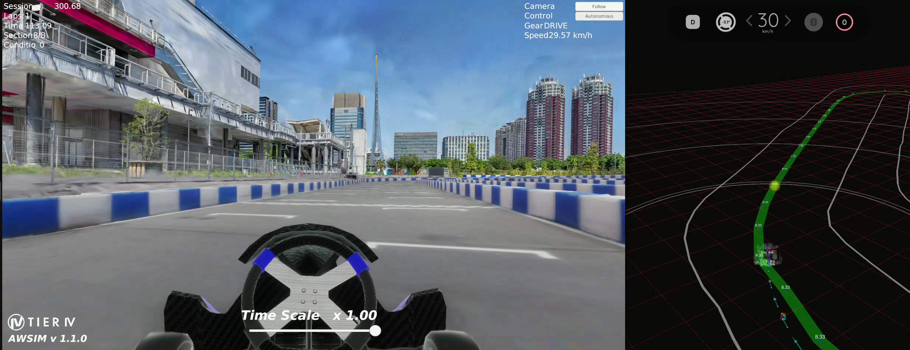

# ルール

## 概要

指定されたコースを走行し、規定の周回数に到達するまで走行時間を競います。

!!! warning "シミュレータのアップデート"
    使用するシミュレータ「AWSIM」は、大会期間中に複数回の更新を予定しています。

    アップデートの実施については告知いたしますが、アップデート内容については課題の難易度に関わるため告知いたしません。参加者の皆様には、ご自身でアップデート内容を調査していただくことを想定しています。

    なお、同じコードを提出した場合でも、アップデート前後でスコアに差が生じる可能性があります。いずれの段階においても提出いただいた結果の最高スコアによってランキングが決まります。

    アップデートに関するアナウンスは運営からの連絡をお待ちください。

## 環境

車両はスタートエリアから走行を開始し、コントロールラインに触れたタイミングで走行時間の計測が行われます。
各チームは６周周回したときの最速タイムを競います。

| 項目           | 決勝大会 | 予選大会 |
| -------------- | -------- | -------- |
| 準備セッション | 未定     | なし     |
| 記録セッション | 未定     | 7:00     |
| 周回数         | 未定     | 6        |

## 予選課題

!!! bug "予選課題"
    予選大会では、参加者の技術力を総合的に評価するため、システムの最適化や改善が必要な要素が含まれています。

    これらの課題を発見し、解決することも競技の重要な要素となります。

### 走行開始

車両はスタートエリアから走行を開始し、初めてコントロールラインを触れた時点から走行時間の計測が開始されます。予選大会では事前に定められた姿勢で車両が配置されています。決勝大会ではスタートエリア内に任意の姿勢で車両を配置できますが、車両に対する操作はスタートエリアの中でのみ認められています。

### 走行終了

以下のいずれかの条件を満たした時点で走行終了となり、走行結果として記録されます。

- 規定の周回数に到達した。
- 記録セッションの割り当て時間が経過した。
- 車両に触れて操作を行った。
- その他、​何らかの理由で走行終了に相当すると運営が判断した場合。

### 走行中止

以下のいずれかの条件を満たした時点で走行終了となり、当該の走行は無効となります。

- (予選のみ)記録セッション開始から2分以内にコントロールラインを通過していない。
- (予選のみ)コースから大きく逸脱した。
- コースの壁を動かした。
- その他、​何らかの理由で走行中止に相当すると運営が判断した場合。

### 順位

順位は以下の基準に従って決定します。

- 規定の周回数に到達している場合、走行時間の短いチーム。
- 規定の周回数に到達していない場合、
    - 周回数が多いチーム。
    - 周回数が同じ場合、最終周までの走行時間が短いチーム。

## 　追記事項

予選大会では、速度上限を無理に引き上げることによる不確実性の高い競技を回避するため、速度上限を35km/hに設定いたします。
35km/hを超過した場合、一時的に速度が5km/hまで制限されます。

この設定の目的は以下の通りです

1. 経路への追従誤差を小さくする等の技術的工夫が順位に反映される競技設計とするため
2. 運要素に左右される競技展開を防ぐため

※以前提出いただいたスコアには均一で一定の補正がかかります。

!!! info "アイテムシステム"
    本大会のシミュレータには、ニトロブースト（一時的な加速）や修理アイテム（車両コンディションの回復）などのアイテムシステムが実装されています。詳細は[シミュレータ仕様](../specifications/simulator.ja.md)を参照してください。

!!! note "マルチ車両・NPC"
    本大会のシミュレータはマルチ車両およびNPC車両に対応しています。これらが競技ルールにどのように反映されるかは、正式なルール決定後に更新されます。
