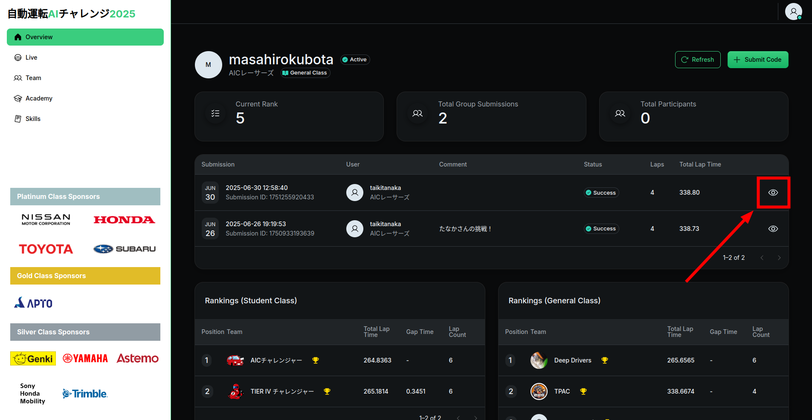
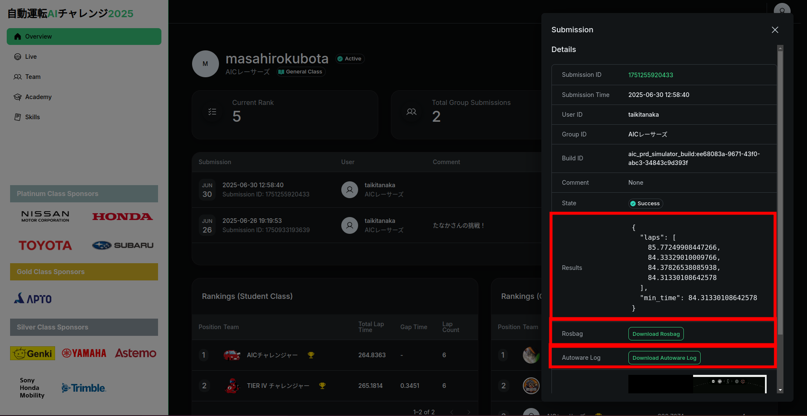

# 提出

## オンライン環境

本大会では、シミュレーターと自動採点機能を備えたオンライン環境を使用して採点が行われます。以下の手順に従って、作成したパッケージ群をオンライン環境にアップロードしてください。アップロード後、シミュレーションが自動で開始され、結果が表示されます。

提出は以下の手順で行います。

1. ソースコードの圧縮
2. ローカル評価環境での動作確認
3. オンライン採点環境への提出

### オンライン環境へのアップロード手順

1. 動作確認

    1.1. 事前準備

    - `aichallenge_submit`を圧縮し、結果出力用のフォルダを生成します。
    - `./create_submit_file.bash`

    1.2. Dockerイメージのビルド

    - `./docker_build.sh eval`

    1.3. Dockerコンテナの起動

    - 起動後、自動でAutowareが立ち上がり、自動運転が開始されます。
    - GPU版AWSIMを使用している場合: `./docker_run.sh eval gpu`
    - CPU版AWSIMを使用している場合: `./docker_run.sh eval cpu`

    1.4. `result.json`の確認

    - 評価完了後、`output/latest`フォルダに以下のファイルが格納されます。
        - `autoware.log`
        - `rosbag2_autoware`
        - `capture`
        - `result-summary.json`
        - `result-details.json`

2. オンライン環境にアップロード

    [オンライン環境](https://aichallenge-board.jsae.or.jp)にアクセスします。
    

    右上の「Login」 ボタンからログインします。
    

    ログインが完了したら緑色の「Submit Code」ボタンから`aichallenge_submit.tar.gz`をアップロードしてください。アップロード後、ソースコードのビルドとシミュレーションが順に実施されます。
    

    正常に終了した場合、「Success」と表示されます。
    ビルドに失敗したり、launchに失敗した等でスコアが出力されていない場合は「Failed」と表示されます。この場合、サーバーサイドでの内部エラーの可能性があるため、再アップロードをお願いします。問題が続く場合はslackでお問い合わせください。

    

    ランキングはこれまでの採点での最高点が適用されます。
    アップロードは1日に20回まで可能で、日本時間0時に回数がリセットされます。

3. 結果の確認

    オンライン環境で評価が終わると、提出履歴の右端のボタンで結果を確認することができます。

    

    result.jsonとrosbagとautoware.logを確認することができます。

    

4. Failedの場合

    4.1. packageの依存関係に問題がないか確認

    - 使用言語に応じて、`package.xml`、`setup.py`、または`CMakeLists.txt`に依存関係の漏れがないか確認してください。

    4.2. dockerの確認

    - 以下のコマンドでDocker内を確認し、必要なディレクトリに正しくインストール・ビルドされているか確認してください。

        - `docker run -it aichallenge-2025-eval:latest /bin/bash`

    - 確認するディレクトリ:

        - `/aichallenge/workspace/*`
        - `/autoware/install/*`

    4.3. ファイル容量の確認

    ファイルが重すぎると提出ができません。不要はファイルはなるべく削除するようにしてください。
    また、現在の提出可能なファイル容量の上限は1.043MBと設定されておりますが、今後は20MB程度に拡張を予定しております。詳細のアップデートはアナウンスをお待ちください。
