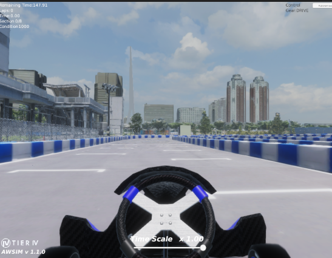

# GPU Settings and Runtime Settings

First, complete the setup by following [Setting Up the Environment](./introduction.en.md). If you run into problems with AWSIM rendering or GPU settings, refer to this page.
Camera/LiDAR are disabled by default. If you are taking part in the AI division, configure them by following [Switching Camera/LiDAR Settings](#camera-lidar).

## Checking .env { #env-check }

Check `~/aichallenge-racingkart/.env` and confirm that it has the settings below. This is configured automatically by `setup.bash`. When `setup.bash` detects `/dev/nvidia0`, `COMPOSE_FILE` in `.env` is set automatically.

If you are using an NVIDIA GPU but the setting is different, complete the NVIDIA GPU setup described below and then update `.env`.

```bash
# ご自身の環境に合う行を有効にして、他の行はコメントアウトしてください

# Intel 内蔵 GPU のみの場合・GPU未搭載の場合
COMPOSE_FILE=docker-compose.yml

# NVIDIA GPU 利用時
# COMPOSE_FILE=docker-compose.yml:docker-compose.gpu.yml:docker-compose.sound.yml
```

(Translation of the comments above: "Enable the line that matches your environment and comment out the others" / "Intel integrated GPU only, or no GPU" / "When using an NVIDIA GPU".)

## Installing GPU Drivers and Toolkits

**Common to all environments (NVIDIA GPU and Intel integrated GPU):**

- Install Vulkan

**NVIDIA GPU only:**

- Install the NVIDIA driver (a reboot is generally recommended)
- Install the NVIDIA Container Toolkit

??? note "Vulkan installation steps"
    Run the following commands.

    ```bash
    sudo apt update
    sudo apt install -y libvulkan1
    ```

??? note "NVIDIA driver installation steps"
    ```bash
    # リポジトリの追加
    sudo add-apt-repository ppa:graphics-drivers/ppa

    # パッケージリストの更新
    sudo apt update

    # インストール
    sudo ubuntu-drivers install

    # パッケージリストの更新
    sudo apt update

    # 下記のコマンドでインストールできていることを確認
    # 99%反映されないので、下記のrebootコマンドで再起動することを推奨します。
    nvidia-smi
    ```

    (Comments above, in order: add the repository / update the package list / install / update the package list / check the installation with the command below, it is almost never reflected yet, so rebooting with the reboot command below is recommended.)

    The following command reboots your PC, so be careful if you do not want to power off at this point!
    ```bash
    # 再起動
    reboot
    ```

    ```bash
    # 再起動の後、インストールできていることを確認
    nvidia-smi
    ```

    

??? note "NVIDIA Container Toolkit installation steps"
    Install by following the official NVIDIA Container Toolkit instructions
    (`https://docs.nvidia.com/datacenter/cloud-native/container-toolkit/install-guide.html`).

    ```bash
    # インストールの下準備
    distribution=$(. /etc/os-release;echo $ID$VERSION_ID) \
          && curl -fsSL https://nvidia.github.io/libnvidia-container/gpgkey | sudo gpg --dearmor -o /usr/share/keyrings/nvidia-container-toolkit-keyring.gpg \
          && curl -s -L https://nvidia.github.io/libnvidia-container/$distribution/libnvidia-container.list | \
                sed 's#deb https://#deb [signed-by=/usr/share/keyrings/nvidia-container-toolkit-keyring.gpg] https://#g' | \
                sudo tee /etc/apt/sources.list.d/nvidia-container-toolkit.list

    # インストール
    sudo apt-get update
    sudo apt-get install -y nvidia-container-toolkit
    sudo nvidia-ctk runtime configure --runtime=docker
    sudo systemctl restart docker

    # インストールできているかをテスト
    sudo docker run --rm --runtime=nvidia --gpus all nvidia/cuda:11.6.2-base-ubuntu20.04 nvidia-smi

    # 最後のコマンドで以下のように出力されれば成功です。
    # （下記はNVIDIAウェブサイトからの引用です）
    #
    # +-----------------------------------------------------------------------------+
    # | NVIDIA-SMI 450.51.06    Driver Version: 450.51.06    CUDA Version: 11.0     |
    # |-------------------------------+----------------------+----------------------+
    # | GPU  Name        Persistence-M| Bus-Id        Disp.A | Volatile Uncorr. ECC |
    # | Fan  Temp  Perf  Pwr:Usage/Cap|         Memory-Usage | GPU-Util  Compute M. |
    # |                               |                      |               MIG M. |
    # |===============================+======================+======================|
    # |   0  Tesla T4            On   | 00000000:00:1E.0 Off |                    0 |
    # | N/A   34C    P8     9W /  70W |      0MiB / 15109MiB |      0%      Default |
    # |                               |                      |                  N/A |
    # +-------------------------------+----------------------+----------------------+
    # +-----------------------------------------------------------------------------+
    # | Processes:                                                                  |
    # |  GPU   GI   CI        PID   Type   Process name                  GPU Memory |
    # |        ID   ID                                                   Usage      |
    # |=============================================================================|
    # |  No running processes found                                                 |
    # +-----------------------------------------------------------------------------+
    ```

    (Comments above, in order: preparation / install / test the installation / if the last command prints something like the following, it succeeded, quoted from the NVIDIA website.)

!!! warning
    You do not need to repeat steps you have already completed. The NVIDIA setup steps here are for reference only; see NVIDIA's official instructions for details.

## Verifying AWSIM Launch

Build and launch with the following commands.

```bash
cd aichallenge-racingkart
make simulator
```

If the simulator appears as shown below, it succeeded.


Now try launching Autoware as well.

```bash
cd aichallenge-racingkart
make autoware-build # 一度もbuildしてない方のみでOK
make autoware-simulator
```

(`# 一度もbuildしてない方のみでOK` = "only needed if you have never built".)

If a screen like the following appears, it succeeded.


When you have finished checking, run the following command.

```bash
make down
```

## Headless Execution on PCs Without a GPU

If your PC has no GPU, you must run AWSIM in headless mode with the steps below. The AWSIM window is not displayed in this case, but you can monitor the situation in RViz.

1. In `aichallenge-racingkart/aichallenge/simulator_scripts/dev.sh`, add `-headless` to the launch options of `AWSIM.x86_64`.
    - Note: if you add it at the end, do not forget to put a `\` at the end of the line of the preceding existing option.
2. Remove the line `- /dev/dri:/dev/dri` from `aichallenge-racingkart/docker-compose.yml`.

## Switching Camera/LiDAR Settings { #camera-lidar }

- By default, Camera and LiDAR are disabled. Participants in the End to End AI division must enable Camera and LiDAR.
  - AI division participants are assumed to have a PC with an NVIDIA GPU, so we recommend setting them to `gpu`.
- Edit the launch options of `AWSIM.x86_64` in `aichallenge-racingkart/aichallenge/simulator_scripts/dev.sh`.
    - For local evaluation runs, edit `eval.sh` in the same way.
    - For safety gate scenario runs, edit `gate.sh` in the same way.

```bash
# Cameraの設定
## 無効 (デフォルト)
--camera off

## 有効 (CPU処理)
--camera cpu

## 有効 (GPU処理)
--camera gpu
```

```bash
# LiDARの設定
## 無効 (デフォルト)
--lidar off

## 有効 (CPU処理)
--lidar cpu

## 有効 (GPU処理)
--lidar gpu
```

(Comments above: Camera / LiDAR setting, disabled (default), enabled (CPU processing), enabled (GPU processing).)
