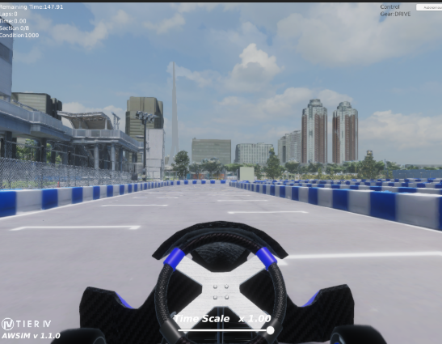

# GPUの設定

??? info "導線の案内"
    標準のセットアップ導線は [環境構築の流れ](./introduction.ja.md) を参照してください。
    このページは、GPU利用時に必要な追加手順（ドライバ/Toolkit/検証）をまとめた詳細参照用です。

## GPU環境の対応状況

| 環境 | 対応状況 | AWSIM起動 | センサー |
| ---- | -------- | --------- | -------- |
| **NVIDIA GPU あり** | 対応 | 有り | 有り |
| **Intel 内蔵 GPU あり（NVIDIA なし）** | 対応 | 有り | 無し |
| **GPU なし** | 未対応 | 無し | 無し |

- **NVIDIA GPU あり**：GPUアクセラレーションを利用してAWSIMとAutowareを実行できます。`setup.bash` が `/dev/nvidia0` を検出した場合、`.env` の `COMPOSE_FILE` に `docker-compose.gpu.yml` が自動で追加されます。
- **Intel 内蔵 GPU あり**：AWSIMは起動しますが、センサーシミュレーションは動作しません。最低限AWSIMが起動できることを確認したい場合に利用できます。
- **GPU なし**：サポート外です。AWSIMを起動することができません。

## .envの確認

`~/aichallenge-racingkart/.env` を確認して、以下の設定になっていることを確認します。本設定は `setup.bash` で自動的に行われます。もし NVIDIA GPU を使用しているにも関わらず設定が異なる場合は、後述のNVIDIA GPU 用の設定をしてから `.env` を更新してください。

```bash
# NVIDIA GPU 利用時（docker-compose.gpu.yml を有効にする）
COMPOSE_FILE=docker-compose.yml:docker-compose.gpu.yml

# Intel 内蔵 GPU のみの場合（上記行はコメントアウトのまま）
# COMPOSE_FILE=docker-compose.yml:docker-compose.gpu.yml
```

## GPUドライバなどのインストール

**全環境共通（NVIDIA GPU・Intel 内蔵 GPU）：**

- Vulkan導入

**NVIDIA GPU のみ：**

- NVIDIAドライバ導入（原則再起動推奨）
- NVIDIA Container Toolkit導入

??? note "Vulkanのインストール手順"
    ```bash
    sudo apt update
    sudo apt install -y libvulkan1
    ```

??? note "NVIDIAドライバのインストール手順"
    ```bash
    # リポジトリの追加
    sudo add-apt-repository ppa:graphics-drivers/ppa

    # パッケージリストの更新
    sudo apt update

    # インストール
    sudo ubuntu-drivers install

    # パッケージリストの更新
    sudo apt update

    # 下記のコマンドでインストールできていることを確認
    # 99%反映されないので、下記のrebootコマンドで再起動することを推奨します。
    nvidia-smi
    ```

    下記のコマンドでPCを再起動しますので、このタイミングで電源を落としたくない方は注意！
    ```bash
    # 再起動
    reboot
    ```

    ```bash
    # 再起動の後、インストールできていることを確認
    nvidia-smi
    ```

    

??? note "NVIDIA Container Toolkit のインストール手順"
    NVIDIA Container Toolkit の公式手順
    （`https://docs.nvidia.com/datacenter/cloud-native/container-toolkit/install-guide.html`）
    を参考にインストールを行います。

    ```bash
    # インストールの下準備
    distribution=$(. /etc/os-release;echo $ID$VERSION_ID) \
          && curl -fsSL https://nvidia.github.io/libnvidia-container/gpgkey | sudo gpg --dearmor -o /usr/share/keyrings/nvidia-container-toolkit-keyring.gpg \
          && curl -s -L https://nvidia.github.io/libnvidia-container/$distribution/libnvidia-container.list | \
                sed 's#deb https://#deb [signed-by=/usr/share/keyrings/nvidia-container-toolkit-keyring.gpg] https://#g' | \
                sudo tee /etc/apt/sources.list.d/nvidia-container-toolkit.list

    # インストール
    sudo apt-get update
    sudo apt-get install -y nvidia-container-toolkit
    sudo nvidia-ctk runtime configure --runtime=docker
    sudo systemctl restart docker

    # インストールできているかをテスト
    sudo docker run --rm --runtime=nvidia --gpus all nvidia/cuda:11.6.2-base-ubuntu20.04 nvidia-smi

    # 最後のコマンドで以下のように出力されれば成功です。
    # （下記はNVIDIAウェブサイトからの引用です）
    #
    # +-----------------------------------------------------------------------------+
    # | NVIDIA-SMI 450.51.06    Driver Version: 450.51.06    CUDA Version: 11.0     |
    # |-------------------------------+----------------------+----------------------+
    # | GPU  Name        Persistence-M| Bus-Id        Disp.A | Volatile Uncorr. ECC |
    # | Fan  Temp  Perf  Pwr:Usage/Cap|         Memory-Usage | GPU-Util  Compute M. |
    # |                               |                      |               MIG M. |
    # |===============================+======================+======================|
    # |   0  Tesla T4            On   | 00000000:00:1E.0 Off |                    0 |
    # | N/A   34C    P8     9W /  70W |      0MiB / 15109MiB |      0%      Default |
    # |                               |                      |                  N/A |
    # +-------------------------------+----------------------+----------------------+
    # +-----------------------------------------------------------------------------+
    # | Processes:                                                                  |
    # |  GPU   GI   CI        PID   Type   Process name                  GPU Memory |
    # |        ID   ID                                                   Usage      |
    # |=============================================================================|
    # |  No running processes found                                                 |
    # +-----------------------------------------------------------------------------+
    ```

!!! warning
    既に導入済みの手順は実施不要です。また、NVIDIA関係のセットアップ手順はあくまで参考程度としてください。詳細はNVIDIA公式の手順をご確認ください。

## AWSIMの起動確認

以下のコマンドでBuildして起動してください。

```bash
cd aichallenge-racingkart
make simulator
```

下記のようにシミュレータが現れたら成功です。


Autowareも起動してみましょう。

```bash
cd aichallenge-racingkart
make autoware-build # 一度もbuildしてない方のみでOK
make autoware-simulator
```

以下のような画面が現れたら成功です。


確認が終わったら、以下のコマンドを実行します。

```bash
make down
```

## FAQ

??? question "AWSIMがピンク画面になります。"
    GPUの認識に失敗している可能性があります。例えば、NVIDIA GPUのみが存在するPCで、`.env` に `docker-compose.gpu.yml` が追加されていないとピンク画面になります。[.envの確認](#envの確認)を参照してください。

??? question "AWSIMが重いです。（Intel 内蔵 GPU 使用時）"
    ご使用のGPUのスペックをご確認ください。特にPC全体が重くなってしまう場合はスペックが足りていない可能性があります。例えば第10世代 Intel Coreの内蔵GPUだと、3FPS程度しか出ませんでした。

??? question "AWSIMが重い・たまに固まります。（NVIDIA GPU 使用時）"
    NVIDIA GPU と Intel 内蔵 GPU の両方が搭載されたPCを使用している場合は、NVIDIAを優先して使用するように設定してください。

    ```bash
    sudo prime-select nvidia
    ```

??? question "AWSIMの起動・終了に時間がかかります。"
    現状、数秒〜10秒程度かかります。

??? question "NVIDIA GPU も Intel 内蔵 GPU もないが、ヘッドレスモードで動かしたいです。"
    公式としては非サポートですが、以下の手順で実行できます。この場合AWSIM画面は非表示ですが、rviz上で状況を確認できます。

    1. `aichallenge/run_simulator.bash` 内で、`AWSIM.x86_64` の起動オプションに `--headless` を追加する。
    2. `docker-compose.yml` から `- /dev/dri:/dev/dri` を削除する。
