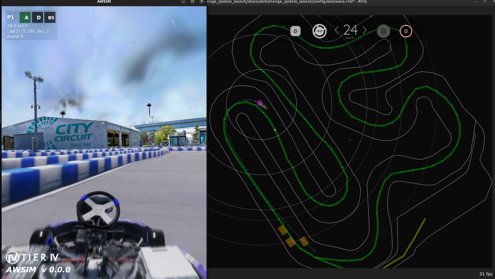

# 環境構築の流れ

この章では、自動運転 AI チャレンジ 2026（Racing Kart）の開発・実行環境を構築する手順を説明します。パッケージのインストール、仮想環境の構築、ワークスペース準備、Docker と AWSIMの起動までを、セットアップスクリプト一つで行います。

??? info "2025年度参加者向けの変更点"
      - `rocker` は GUI 転送用途に限定し、プロセス管理は docker compose を活用しています。
      - 個別セットアップ手順を廃止し、一括インストール手順に統一しました。

## 環境構築

curlのパッケージをinstallしましょう。

```bash
sudo apt update
sudo apt install curl
```

次に環境からシミュレーターの実行テストまでを一気通貫で行うコマンドを叩きます。

```bash
curl -fsSL "https://raw.githubusercontent.com/AutomotiveAIChallenge/aichallenge-racingkart/main/setup.bash" | bash
```

下記は `setup.bash` が対話形式で順に実施する内容です。必要な項目だけ開いて確認してください。

??? note "1. :material-package: 必要パッケージを install"
    必要な基本パッケージを導入します。

    ```bash
    sudo apt update
    sudo apt install -y python3-pip ca-certificates curl gnupg
    ```

??? note "2. :material-docker: Docker を install"
    Docker公式リポジトリを追加して、Docker本体をインストールします。

    ```bash
    sudo install -m 0755 -d /etc/apt/keyrings
    curl -fsSL https://download.docker.com/linux/ubuntu/gpg | sudo gpg --dearmor -o /etc/apt/keyrings/docker.gpg
    sudo chmod a+r /etc/apt/keyrings/docker.gpg
    echo \
      "deb [arch=$(dpkg --print-architecture) signed-by=/etc/apt/keyrings/docker.gpg] https://download.docker.com/linux/ubuntu \
      $(. /etc/os-release && echo "$VERSION_CODENAME") stable" | \
      sudo tee /etc/apt/sources.list.d/docker.list > /dev/null
    sudo apt-get update
    sudo apt-get install -y docker-ce docker-ce-cli containerd.io docker-buildx-plugin docker-compose-plugin
    ```
    Dockerが正常に動作するか確認します。

    ```bash
    sudo docker run hello-world
    ```
    Hello from Docker!と表示されれば正常にインストール出来ています。

??? note "3. :material-language-python: rocker を install"
    GUI転送に使う rocker をインストールし、PATH を通します。

    ```bash
    pip install rocker
    ```

    `~/.local/bin` が PATH に含まれていない場合は追加します。

    ```bash
    echo 'export PATH="$HOME/.local/bin:$PATH"' >> ~/.bashrc
    source ~/.bashrc
    ```

??? note "4. :material-account-group: Docker グループ登録"
    `sudo` なしでDockerを使えるようにユーザーをグループへ追加します。

    ```bash
    sudo usermod -aG docker $USER
    newgrp docker
    ```

??? note "5. :material-folder-open: リポジトリ準備"
    大会用リポジトリを取得し、事前チェックを実行します。

    ```bash
    cd ~
    git clone https://github.com/AutomotiveAIChallenge/aichallenge-racingkart.git
    cd ~/aichallenge-racingkart
    ```

??? note "6. :material-security: repositoryの確認"
    ちゃんとレポジトリが存在しているかチェック

    ```bash
    ./setup.bash doctor
    ```

??? note "7. :material-cloud-download: Autoware イメージ取得"
    実行に必要なAutowareベースイメージを取得します。

    ```bash
    docker pull ghcr.io/automotiveaichallenge/autoware-universe:humble-latest
    docker images
    ```

    Dockerイメージがダウンロードできていれば以下のような出力が得られます。

    ```txt
    REPOSITORY                                        TAG                       IMAGE ID       CREATED         SIZE
    ghcr.io/automotiveaichallenge/autoware-universe   humble-latest             30c59f3fb415   13 days ago     8.84GB
    ```

??? note "8. :material-download: AWSIM データ取得/展開"
    SharePoint から AWSIM をダウンロードし、所定ディレクトリへ展開して実行権限を付与します。

    1. 以下から最新の `AWSIM.zip` をダウンロードします。

    [:material-launch: AWSIMのダウンロード](https://tier4inc-my.sharepoint.com/:f:/g/personal/taiki_tanaka_tier4_jp/EopMoY32mnNLhPVHWZkkow4B5M71TLlFpS6xrOE7Zfhuug){ .md-button .md-button--primary  target="_blank" }

    ```bash
    mkdir -p ~/aichallenge-racingkart/aichallenge/simulator
    unzip ~/Downloads/AWSIM.zip -d ~/aichallenge-racingkart/aichallenge/simulator
    chmod +x ~/aichallenge-racingkart/aichallenge/simulator/AWSIM/AWSIM.x86_64
    ```

    2. 実行ファイルが以下に存在することを確認します。

    ```bash
    ls ~/aichallenge-racingkart/aichallenge/simulator/AWSIM/AWSIM.x86_64
    ```

    3. パーミッションは以下の図の状態を参考にしてください。

    

    GPU 利用時は `AWSIM_GPU_**.zip` を展開してください。

??? note "9. :material-hammer: 開発用イメージ作成"
    開発用Dockerイメージをビルドします。

    ```bash
    cd ~/aichallenge-racingkart
    ./docker_build.sh dev
    ```

??? note "10. :material-book-education: ワークスペースビルド"
    Autowareワークスペースをビルドします。

    ```bash
    cd ~/aichallenge-racingkart
    make autoware-build
    ```

??? note "11. :material-power: AWSIM + Autoware 起動 → `make down` で停止確認"
    シミュレータとAutowareを起動し、確認後に停止します。

    ```bash
    cd ~/aichallenge-racingkart
    make dev
    make down
    ```

## Setup画面の見方

- `Select branch [default: main]:` が出たら `main` を選択（`Enter`でも可）
- `[y/N]` は「この処理を実行するか」の確認です（通常は `y`）
- `Starting execution...` が表示されたら、セットアップが自動実行中です
- `To stop: make down` が表示されたら、起動確認まで完了です

```.bash
[setup] ℹ️ Bootstrap mode (fresh host)
[setup] Available branches (remote):
[setup]   1) dev
[setup] Select branch [default: main]: main
[setup] ℹ️ Planned steps (answer y/N for each, then execution starts):
[setup]   1) Install base packages (apt)
[setup]   2) Install Docker (if missing)
[setup]   3) Install rocker (pip)
[setup]   4) Add user to docker group (recommended)
[setup]   5) Clone/update repository (branch=main) -> $USER/aichallenge-racingkart
[setup]   6) Repo preflight: ./setup.bash doctor (requires repo)
[setup]   7) Create .env (GPU/CPU auto-detect)
[setup]   8) Pull Autoware base image (requires repo)
[setup]   9) Download AWSIM.zip and extract (requires repo)
[setup]  10) Build dev image: ./docker_build.sh dev (requires repo)
[setup]  11) make autoware-build (requires repo)
[setup]  12) make dev DOMAIN_ID=1 (requires repo)
```

途中で `[y/N]` が表示されたら、問題なければ `y` を入力してください。

```.bash
[setup] Install base packages (apt) [y/N]: y
[setup] Install Docker (if missing) [y/N]: y
[setup] Add user to docker group (recommended) [y/N]: y
[setup] Clone/update repository (branch=main) -> $USER/aichallenge-racingkart/aichallenge-racingkart [y/N]: y
[setup] Run repo preflight: ./setup.bash doctor [y/N]: y
[setup] Pull Autoware base image [y/N]: y
[setup] Download AWSIM.zip and extract [y/N]: y
[setup] Build dev image: ./docker_build.sh dev [y/N]: y
[setup] Run make autoware-build (this can take a while) [y/N]: y
[setup] Run make dev DOMAIN_ID=1 [y/N]: y
[setup] ℹ️ Starting execution...
[setup] ℹ️ Running: Install base packages (apt)
```

ここから先は5分程度待つだけです。コーヒーでも入れながら待ちましょう。

:coffee:

セットアップが終わると下記のような表示でAWSIMとAutowareが起動します。

```bash
Start dev simulation (AWSIM + Autoware, DOMAIN_ID=1)
make[1]: ディレクトリ '$USER/aichallenge-racingkart' に入ります
Start AWSIM
SIM_MODE=dev docker compose -f docker-compose.yml -f docker-compose.gpu.yml up -d simulator
[+] up 1/1
make[1]: ディレクトリ '$USER/aichallenge-racingkart/aichallenge-racingkart' から出ます         0.5s
make[1]: ディレクトリ '$USER/aichallenge-racingkart/aichallenge-racingkart' に入ります
Start Autoware for AWSIM
RUN_MODE=awsim DOMAIN_ID=1 docker compose -f docker-compose.yml -f docker-compose.gpu.yml up -d autoware
[+] up 1/1
 ✔ Container aichallenge-2026-autoware-1 Created                           0.2s
make[1]: ディレクトリ '$USER/aichallenge-racingkart/aichallenge-racingkart' から出ます
To stop: make down  (docker compose down --remove-orphans)
```

AWSIMとAutowareが起動しました。

停止する場合は以下コマンドで停止してください。

```bash
cd ~/aichallenge-racingkart
make down
```

以上で環境構築と動作確認が終了しました。

- AWSIMが起動しなかったり描画に問題がある場合は、GPUの設定を確認してください。
    - [GPUの設定](./gpu-simulation.ja.md)
- 早速開発に取り掛かりたい方は、開発の進め方を確認してください。
    - [開発の進め方](../development/development-guide.ja.md)
