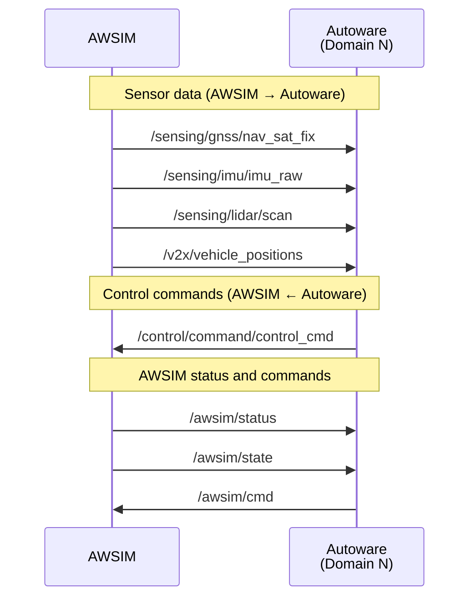

# Interface

## Domain ID Namespaces

To support multiple vehicles, this competition uses the ROS 2 domain ID feature to separate topic namespaces.

| Domain ID | Purpose |
| ---------- | ---- |
| 0          | AWSIM (simulator) |
| 1–4        | Each vehicle |

AWSIM connects directly to each vehicle's domain (1–4), publishes sensor data and vehicle status in each domain, and subscribes to control commands. This is how communication between the simulator and each vehicle is realized. In normal (single-vehicle) development you do not need to be aware of domain IDs.

## Main Topic Communication between AWSIM and Autoware

The sequence diagram below shows the flow of topic communication between AWSIM and Autoware. AWSIM connects directly to each vehicle's domain (Domain N), publishes sensor data and status under the Autoware-side topic names, and subscribes to control commands.

## Topic List

### Vehicle Interface

| Interface    | Name                                 | Type                                                     |
| ------------ | ------------------------------------ | -------------------------------------------------------- |
| Publisher    | `/vehicle/status/control_mode`       | `autoware_auto_vehicle_msgs/msg/ControlModeReport`       |
| Subscription | `/control/command/control_cmd`       | `autoware_auto_control_msgs/msg/AckermannControlCommand` |
| Subscription | `/control/command/actuation_cmd`     | `tier4_vehicle_msgs/msg/ActuationCommandStamped`         |
| Publisher    | `/vehicle/status/actuation_status`   | `tier4_vehicle_msgs/msg/ActuationStatusStamped`          |
| Publisher    | `/vehicle/status/velocity_status`    | `autoware_auto_vehicle_msgs/msg/VelocityReport`          |
| Publisher    | `/vehicle/status/steering_status`    | `autoware_auto_vehicle_msgs/msg/SteeringReport`          |
| Subscription | `/control/command/gear_cmd`          | `autoware_auto_vehicle_msgs/msg/GearCommand`             |
| Publisher    | `/vehicle/status/gear_status`        | `autoware_auto_vehicle_msgs/msg/GearReport`              |

### Sensors

| Interface | Name                                 | Type                                          |
| --------- | ------------------------------------ | ---------------------------------------------- |
| Publisher | `/sensing/gnss/nav_sat_fix`          | `sensor_msgs/msg/NavSatFix`                   |
| Publisher | `/sensing/imu/imu_raw`               | `sensor_msgs/msg/Imu`                         |
| Publisher | `/sensing/lidar/scan`                | `sensor_msgs/msg/LaserScan`                   |
| Publisher | `/sensing/camera/image_raw`          | `sensor_msgs/msg/Image`                       |
| Publisher | `/sensing/camera/camera_info`        | `sensor_msgs/msg/CameraInfo`                  |

### V2X

| Interface | Name                                 | Type                                          |
| --------- | ------------------------------------ | ---------------------------------------------- |
| Publisher | `/v2x/vehicle_positions`             | `v2x_msgs/msg/V2XVehiclePositionArray`        |

### Simulation Management

Topics that AWSIM exchanges directly in each vehicle's domain (N=1–4).

| Interface    | Name                                | Type                             |
| ------------ | ----------------------------------- | --------------------------------- |
| Publisher    | `/awsim/status`                     | `std_msgs/msg/Float32MultiArray` |
| Publisher    | `/awsim/state`                      | `std_msgs/msg/String`            |
| Subscription | `/awsim/control_mode_request_topic` | `std_msgs/msg/Bool`              |
| Subscription | `/awsim/cmd`                        | `std_msgs/msg/Float32MultiArray` |

### Admin Topics (Domain 0)

Topics used for the overall management of AWSIM. You do not need to be aware of them in normal development.

| Interface    | Name                       | Type                             |
| ------------ | -------------------------- | --------------------------------- |
| Publisher    | `/admin/awsim/state`       | `std_msgs/msg/String`            |
| Subscription | `/admin/awsim/start`       | `std_msgs/msg/Bool`              |
| Subscription | `/admin/awsim/reset`       | `std_msgs/msg/Empty`             |

## Topic Details

Details of the message fields of each topic.

- **Control commands**: [`control_cmd`](#controlcommandcontrol_cmd) / [`actuation_cmd`](#controlcommandactuation_cmd)
- **Vehicle status**: [`actuation_status`](#vehiclestatusactuation_status) / [`velocity_status`](#vehiclestatusvelocity_status) / [`steering_status`](#vehiclestatussteering_status) / [`gear_status`](#vehiclestatusgear_status)
- **Sensors**: [`gnss`](#sensinggnssnav_sat_fix) / [`imu`](#sensingimuimu_raw) / [`lidar`](#sensinglidarscan) / [`camera`](#sensingcameraimage_raw)
- **V2X**: [`v2x/vehicle_positions`](#v2xvehicle_positions)
- **Simulation**: [`awsim/status`](#awsimstatus) / [`awsim/state`](#awsimstate) / [`awsim/cmd`](#awsimcmd) / [`admin/awsim/state`](#adminawsimstate)

### `/control/command/control_cmd`

| Name                                | Description               |
| ----------------------------------- | ------------------------- |
| stamp                               | Message send time         |
| lateral.stamp                       | Unused                    |
| lateral.steering_tire_angle         | Target steering angle (rad) |
| lateral.steering_tire_rotation_rate | Unused                    |
| longitudinal.stamp                  | Unused                    |
| longitudinal.speed                  | Unused                    |
| longitudinal.acceleration           | Target acceleration (m/s²) |
| longitudinal.jerk                   | Unused                    |

### `/control/command/actuation_cmd`

Unused in the AWSIM environment, because AWSIM receives `/control/command/control_cmd` directly. On the real vehicle, the `raw_vehicle_cmd_converter` node automatically converts `/control/command/control_cmd` into `/control/command/actuation_cmd`.

| Name                  | Description                      |
| --------------------- | --------------------------------- |
| header.stamp          | Message send time                |
| header.frame_id       | Unused                           |
| actuation.accel_cmd   | Accelerator command (0.0 to 1.0) |
| actuation.brake_cmd   | Brake command (0.0 to 1.0)       |
| actuation.steer_cmd   | Tire angle command (rad)         |

### `/vehicle/status/actuation_status`

A status used only on the real vehicle; it is not published in the AWSIM environment. On the real vehicle, the `raw_vehicle_cmd_converter` node uses it as input for the current actuator values.

| Name                  | Description                      |
| --------------------- | --------------------------------- |
| header.stamp          | Data acquisition time            |
| header.frame_id       | Unused                           |
| status.accel_status   | Current accelerator value (0.0 to 1.0) |
| status.brake_status   | Current brake value (0.0 to 1.0) |
| status.steer_status   | Current tire angle (rad)         |

### `/vehicle/status/velocity_status`

| Name                  | Description              |
| --------------------- | ------------------------ |
| header.stamp          | Data acquisition time    |
| header.frame_id       | Frame ID (`base_link`)   |
| longitudinal_velocity | Longitudinal velocity    |
| lateral_velocity      | Lateral velocity         |
| heading_rate          | Angular velocity         |

### `/vehicle/status/steering_status`

| Name                | Description           |
| ------------------- | ---------------------- |
| stamp               | Data acquisition time |
| steering_tire_angle | Steering angle        |

### `/control/command/gear_cmd`

| Name    | Description          |
| ------- | --------------------- |
| stamp   | Message send time    |
| command | Gear type (1: NEUTRAL, 2: DRIVE, 20: REVERSE) |

### `/vehicle/status/gear_status`

| Name   | Description           |
| ------ | ---------------------- |
| stamp  | Data acquisition time |
| report | Gear type             |

### `/sensing/gnss/nav_sat_fix`

Positioning information from the GNSS sensor. The `racing_kart_gnss_poser` node converts the NavSatFix message into a pose in the vehicle coordinate system.

| Name                  | Description                       |
| --------------------- | ---------------------------------- |
| header.stamp          | Data acquisition time             |
| header.frame_id       | Frame ID                          |
| latitude              | Latitude (deg)                    |
| longitude             | Longitude (deg)                   |
| altitude              | Altitude (m)                      |
| position_covariance   | Position covariance               |

### `/sensing/imu/imu_raw`

| Name                | Description             |
| ------------------- | ------------------------ |
| header.stamp        | Data acquisition time   |
| header.frame_id     | Frame ID (`imu_link`)   |
| orientation         | Orientation             |
| angular_velocity    | Angular velocity        |
| linear_acceleration | Linear acceleration     |

### `/sensing/lidar/scan`

Scan data from the 2D LiDAR sensor.

| Name                | Description                    |
| ------------------- | -------------------------------- |
| header.stamp        | Data acquisition time          |
| header.frame_id     | Frame ID                       |
| angle_min           | Scan start angle (rad)         |
| angle_max           | Scan end angle (rad)           |
| angle_increment     | Angular resolution (rad)       |
| range_min           | Minimum range (m)              |
| range_max           | Maximum range (m) (max 30 m)   |
| ranges              | Range data array (1080 points) |

### `/sensing/camera/image_raw`

RGB image data from the camera.

| Name                | Description            |
| ------------------- | ------------------------ |
| header.stamp        | Data acquisition time  |
| header.frame_id     | Frame ID               |
| height              | Image height (px)      |
| width               | Image width (px)       |
| encoding            | Encoding format        |
| data                | Image data             |

### `/sensing/camera/camera_info`

Intrinsic parameters of the camera.

| Name                | Description            |
| ------------------- | ------------------------ |
| header.stamp        | Data acquisition time  |
| header.frame_id     | Frame ID               |
| height              | Image height (px)      |
| width               | Image width (px)       |
| k                   | Camera intrinsic matrix (3x3) |
| d                   | Distortion coefficients |

### `/v2x/vehicle_positions`

Positions of the vehicles shared via V2X. AWSIM publishes it directly in each vehicle's domain. It is enabled/disabled with the `--v2x` launch option, and a vehicle whose GNSS is disabled with `--gnss off` also disappears from this array ([Simulator](./simulator.en.md)).

`v2x_msgs/msg/V2XVehiclePositionArray`

| Name       | Description                                 |
| ---------- | --------------------------------------------- |
| header     | Header of the whole array                   |
| vehicles[] | Array of `v2x_msgs/msg/V2XVehiclePosition`  |

`v2x_msgs/msg/V2XVehiclePosition`

| Name         | Description                                                   |
| ------------ | ----------------------------------------------------------------- |
| header.stamp | Observation time                                              |
| header.frame_id | Coordinate frame (e.g. `map`)                              |
| vehicle_id   | ID identifying the vehicle (e.g. `d1`-`d4`)                   |
| position     | Position of the vehicle (`geometry_msgs/Point`, in the `header.frame_id` frame) |
| covariance   | Position uncertainty (`geometry_msgs/Vector3`, standard deviation [m] along x/y/z) |

- The message contains position only. It has no orientation or velocity fields, so the heading and speed of other vehicles must be estimated from a sequence of positions.
- A transmission delay that imitates the real vehicle is added (100-200 ms per vehicle, mean 150 ms, standard deviation 25 ms). See [Simulator](./simulator.en.md) for details.

### `/aichallenge/objects`

Obstacle information on the course. `std_msgs/msg/Float64MultiArray`, with 4 values per object.

| Name            | Description                   |
| --------------- | -------------------------------- |
| data[N * 4 + 0] | X coordinate of the Nth object |
| data[N * 4 + 1] | Y coordinate of the Nth object |
| data[N * 4 + 2] | Z coordinate of the Nth object |
| data[N * 4 + 3] | Radius of the Nth object       |

### `/awsim/status`

A topic for obtaining various simulation states. It is of type `Float32MultiArray` and has the following 7 fields.

| Index | Value           | Description                                    |
| ----- | ---------------- | ------------------------------------------------ |
| 0     | sessionTime     | Remaining session time (seconds, counting down) |
| 1     | lapCount        | Current lap count                              |
| 2     | thisLapTime     | Current lap time (seconds)                     |
| 3     | section         | Current section number                         |
| 4     | timeScale       | Simulation time scale                          |
| 5     | boostRemaining  | Remaining number of boosts                     |
| 6     | isBoosting      | Boosting flag (1.0 = boosting / 0.0)           |

### `/awsim/state`

A string topic that indicates the simulation state of each vehicle. The following state values are published.

| State value | Description                              |
| ----------- | ------------------------------------------ |
| Spawned     | The vehicle has been spawned             |
| Grounded    | The vehicle has touched the ground       |
| Ready       | The vehicle is ready                     |
| Start       | Driving has started                      |
| Finish      | Driving has finished (reached the specified number of laps) |

### `/awsim/cmd`

A topic for sending commands to AWSIM. It is of type `Float32MultiArray` and has the following field.

| Index | Value        | Description                                          |
| ----- | ------------- | ------------------------------------------------------ |
| 0     | boostCommand | Raising it to `1.0` or higher activates the turbo boost. To activate it again, set it back to `0.0` once and then raise it to `1.0` again. |

### `/admin/awsim/state`

An admin topic that indicates the state of the whole simulation (domain 0).

| State value | Description                        |
| ----------- | ------------------------------------ |
| SelectMode  | Mode selection screen              |
| PlayStart   | Play started                       |
| Ready       | Ready                              |
| WaitStart   | Waiting for start                  |
| Start       | Simulation started                 |
| Finish      | Simulation finished                |
| LapComplete | Lap completed                      |
| FinishAll   | All vehicles finished              |
| Terminate   | Termination processing             |
