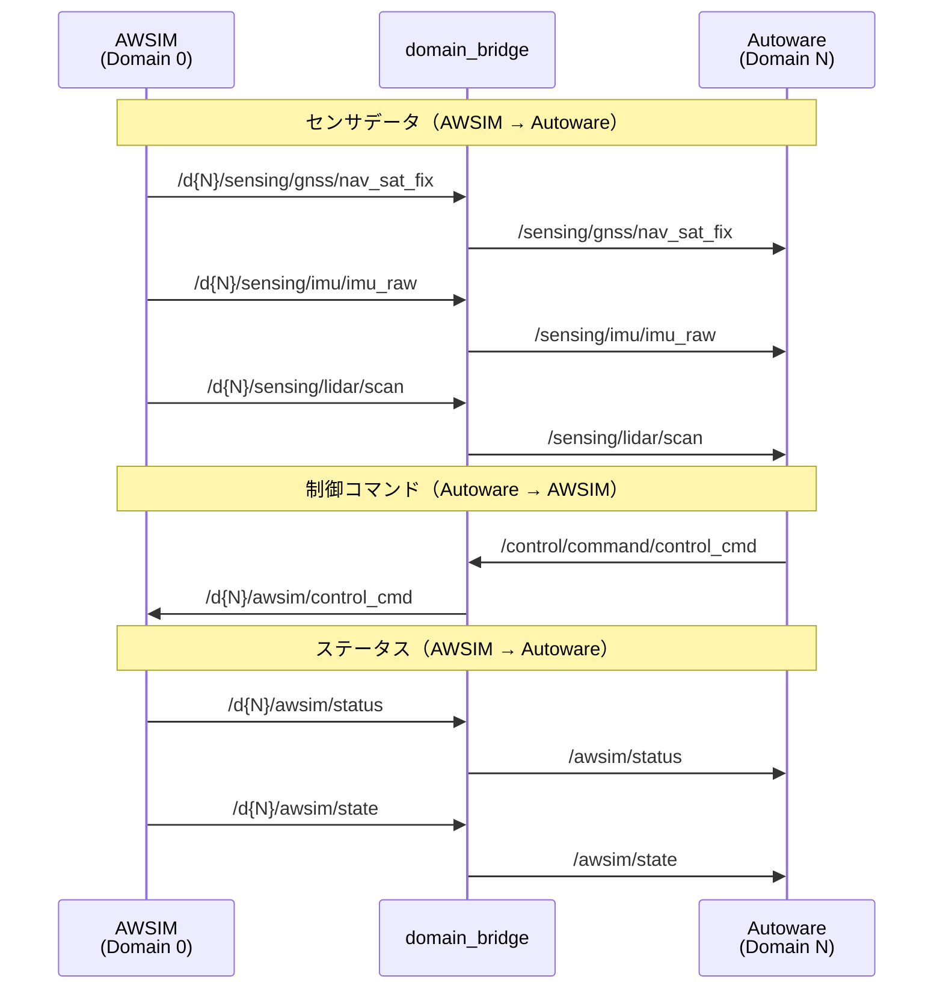

# インターフェース

## ドメインID名前空間

本大会ではマルチ車両対応のため、ROS 2のドメインID機能を使用してトピックの名前空間を分離しています。

| ドメインID | 用途 |
| ---------- | ---- |
| 0          | AWSIM（シミュレータ） |
| 1〜4       | 各車両 |

`domain_bridge`ノードがドメイン間のトピックを橋渡しし、シミュレータと各車両間の通信を実現しています。通常の開発（単一車両）では、ドメインIDを意識する必要はありません。

## トピック一覧

### 車両インターフェース

| Interface    | Name                                 | Type                                                     |
| ------------ | ------------------------------------ | -------------------------------------------------------- |
| Service      | `/control/control_mode_request`      | `autoware_auto_vehicle_msgs/srv/ControlModeCommand`      |
| Publisher    | `/vehicle/status/control_mode`       | `autoware_auto_vehicle_msgs/msg/ControlModeReport`       |
| Subscription | `/control/command/control_cmd`       | `autoware_auto_control_msgs/msg/AckermannControlCommand` |
| Subscription | `/control/command/actuation_cmd`     | `tier4_vehicle_msgs/msg/ActuationCommandStamped`         |
| Publisher    | `/vehicle/status/actuation_status`   | `tier4_vehicle_msgs/msg/ActuationStatusStamped`          |
| Publisher    | `/vehicle/status/velocity_status`    | `autoware_auto_vehicle_msgs/msg/VelocityReport`          |
| Publisher    | `/vehicle/status/steering_status`    | `autoware_auto_vehicle_msgs/msg/SteeringReport`          |
| Subscription | `/control/command/gear_cmd`          | `autoware_auto_vehicle_msgs/msg/GearCommand`             |
| Publisher    | `/vehicle/status/gear_status`        | `autoware_auto_vehicle_msgs/msg/GearReport`              |

### センサ

| Interface | Name                                 | Type                                          |
| --------- | ------------------------------------ | --------------------------------------------- |
| Publisher | `/sensing/gnss/nav_sat_fix`          | `sensor_msgs/msg/NavSatFix`                   |
| Publisher | `/sensing/imu/imu_raw`               | `sensor_msgs/msg/Imu`                         |
| Publisher | `/sensing/lidar/scan`                | `sensor_msgs/msg/LaserScan`                   |
| Publisher | `/sensing/camera/image_raw`          | `sensor_msgs/msg/Image`                       |
| Publisher | `/sensing/camera/camera_info`        | `sensor_msgs/msg/CameraInfo`                  |

### シミュレーション管理

各車両ドメイン（N=1〜4）で `/d{N}/awsim/status` 等としてPublishされ、`domain_bridge`によりAutoware側のトピック名に橋渡しされます。

| Interface    | Name                       | Type                             |
| ------------ | -------------------------- | -------------------------------- |
| Publisher    | `/awsim/status`            | `std_msgs/msg/Float32MultiArray` |
| Publisher    | `/awsim/state`             | `std_msgs/msg/String`            |

### 管理トピック（ドメイン0）

AWSIMの全体管理に使用されるトピックです。通常の開発では意識する必要はありません。

| Interface    | Name                       | Type                             |
| ------------ | -------------------------- | -------------------------------- |
| Publisher    | `/admin/awsim/state`       | `std_msgs/msg/String`            |
| Subscription | `/admin/awsim/start`       | `std_msgs/msg/Bool`              |
| Subscription | `/admin/awsim/reset`       | `std_msgs/msg/Empty`             |

### グラウンドトゥルース

デバッグ用の真値データです。提出コードでは使用できません。

| Interface | Name                                              | Type                                          |
| --------- | ------------------------------------------------- | --------------------------------------------- |
| Publisher | `/awsim/ground_truth/localization/kinematic_state` | `nav_msgs/msg/Odometry`                       |
| Publisher | `/awsim/ground_truth/vehicle/pose`                 | `geometry_msgs/msg/PoseStamped`               |
| Publisher | `/awsim/ground_truth/on_collision`                 | `std_msgs/msg/Bool`                           |

## トピックのドメイン橋渡し

以下のシーケンス図は、AWSIMとAutoware間のトピック通信の流れを示しています。

## トピック詳細

各トピックのメッセージフィールドの詳細です。

- **制御コマンド**: [`control_cmd`](#controlcommandcontrol_cmd) / [`actuation_cmd`](#controlcommandactuation_cmd)
- **車両ステータス**: [`actuation_status`](#vehiclestatusactuation_status) / [`velocity_status`](#vehiclestatusvelocity_status) / [`steering_status`](#vehiclestatussteering_status) / [`gear_status`](#vehiclestatusgear_status)
- **センサ**: [`gnss`](#sensinggnssnav_sat_fix) / [`imu`](#sensingimuimu_raw) / [`lidar`](#sensinglidarscan) / [`camera`](#sensingcameraimage_raw)
- **シミュレーション**: [`awsim/status`](#awsimstatus) / [`awsim/state`](#awsimstate) / [`admin/awsim/state`](#adminawsimstate)

### `/control/command/control_cmd`

| Name                                | Description          |
| ----------------------------------- | -------------------- |
| stamp                               | メッセージの送信時刻 |
| lateral.stamp                       | 未使用               |
| lateral.steering_tire_angle         | 目標操舵角           |
| lateral.steering_tire_rotation_rate | 未使用               |
| longitudinal.stamp                  | 未使用               |
| longitudinal.speed                  | 未使用               |
| longitudinal.acceleration           | 目標加速度           |
| longitudinal.jerk                   | 未使用               |

### `/control/command/actuation_cmd`

| Name                  | Description                 |
| --------------------- | --------------------------- |
| header.stamp          | メッセージの送信時刻        |
| header.frame_id       | 未使用                      |
| actuation.accel_cmd   | アクセル指示値 (0.0 〜 1.0) |
| actuation.brake_cmd   | ブレーキ指示値 (0.0 〜 1.0) |
| actuation.steer_cmd   | タイヤ角指示値 (rad)        |

### `/vehicle/status/actuation_status`

| Name                  | Description                 |
| --------------------- | --------------------------- |
| header.stamp          | データの取得時刻            |
| header.frame_id       | 未使用                      |
| status.accel_status   | アクセル現在値 (0.0 〜 1.0) |
| status.brake_status   | ブレーキ現在値 (0.0 〜 1.0) |
| status.steer_status   | タイヤ角現在値 (rad)        |

### `/vehicle/status/velocity_status`

| Name                  | Description              |
| --------------------- | ------------------------ |
| header.stamp          | データの取得時刻         |
| header.frame_id       | フレームID (`base_link`) |
| longitudinal_velocity | 縦速度                   |
| lateral_velocity      | 横速度                   |
| heading_rate          | 角速度                   |

### `/vehicle/status/steering_status`

| Name                | Description      |
| ------------------- | ---------------- |
| stamp               | データの取得時刻 |
| steering_tire_angle | 操舵角           |

### `/control/command/gear_cmd`

| Name    | Description          |
| ------- | -------------------- |
| stamp   | メッセージの送信時刻 |
| command | ギアの種類           |

### `/vehicle/status/gear_status`

| Name   | Description      |
| ------ | ---------------- |
| stamp  | データの取得時刻 |
| report | ギアの種類       |

### `/sensing/gnss/nav_sat_fix`

GNSSセンサからの測位情報です。`racing_kart_gnss_poser`ノードがNavSatFixメッセージを車両座標系の姿勢に変換します。

| Name                  | Description                       |
| --------------------- | --------------------------------- |
| header.stamp          | データの取得時刻                  |
| header.frame_id       | フレームID                        |
| latitude              | 緯度（度）                        |
| longitude             | 経度（度）                        |
| altitude              | 高度（m）                         |
| position_covariance   | 位置の共分散                      |

### `/sensing/imu/imu_raw`

| Name                | Description             |
| ------------------- | ----------------------- |
| header.stamp        | データの取得時刻        |
| header.frame_id     | フレームID (`imu_link`) |
| orientation         | 方位                    |
| angular_velocity    | 角速度                  |
| linear_acceleration | 加速度                  |

### `/sensing/lidar/scan`

2D LiDARセンサからのスキャンデータです。

| Name                | Description                    |
| ------------------- | ------------------------------ |
| header.stamp        | データの取得時刻               |
| header.frame_id     | フレームID                     |
| angle_min           | スキャン開始角度（rad）        |
| angle_max           | スキャン終了角度（rad）        |
| angle_increment     | 角度分解能（rad）              |
| range_min           | 最小検出距離（m）              |
| range_max           | 最大検出距離（m）（最大30m）   |
| ranges              | 距離データ配列（1080点）       |

### `/sensing/camera/image_raw`

カメラからのRGB画像データです。

| Name                | Description            |
| ------------------- | ---------------------- |
| header.stamp        | データの取得時刻       |
| header.frame_id     | フレームID             |
| height              | 画像の高さ（px）       |
| width               | 画像の幅（px）         |
| encoding            | エンコーディング形式   |
| data                | 画像データ             |

### `/sensing/camera/camera_info`

カメラの内部パラメータ情報です。

| Name                | Description            |
| ------------------- | ---------------------- |
| header.stamp        | データの取得時刻       |
| header.frame_id     | フレームID             |
| height              | 画像の高さ（px）       |
| width               | 画像の幅（px）         |
| k                   | カメラ内部行列（3x3）  |
| d                   | 歪み係数               |

### `/awsim/status`

シミュレーションの各種状態を取得するトピックです。`Float32MultiArray`型で、以下の7つのフィールドを持ちます。

| インデックス | 値              | 説明                                       |
| ------------ | --------------- | ------------------------------------------ |
| 0            | sessionTime     | 残りセッション時間（秒、カウントダウン）   |
| 1            | lapCount        | 現在のラップ数                             |
| 2            | thisLapTime     | 現在のラップタイム（秒）                   |
| 3            | section         | 現在のセクション番号                       |
| 4            | timeScale       | シミュレーションのタイムスケール           |
| 5            | boostRemaining  | 残りブースト使用回数                       |
| 6            | isBoosting      | ブースト中フラグ (1.0=ブースト中 / 0.0)    |

### `/awsim/state`

車両ごとのシミュレーション状態を示す文字列トピックです。以下の状態値が配信されます。

| 状態値     | 説明                                 |
| ---------- | ------------------------------------ |
| Spawned    | 車両がスポーンされた                 |
| Grounded   | 車両が地面に接地した                 |
| Ready      | 車両の準備が完了した                 |
| Start      | 走行開始                             |
| Finish     | 走行終了（規定周回数に到達）         |

### `/admin/awsim/state`

シミュレーション全体の状態を示す管理用トピックです（ドメイン0）。

| 状態値      | 説明                               |
| ----------- | ---------------------------------- |
| SelectMode  | モード選択画面                     |
| PlayStart   | プレイ開始                         |
| Ready       | 準備完了                           |
| WaitStart   | 開始待ち                           |
| Start       | シミュレーション開始               |
| Finish      | シミュレーション終了               |
| LapComplete | ラップ完了                         |
| FinishAll   | 全車両完了                         |
| Terminate   | 終了処理                           |
