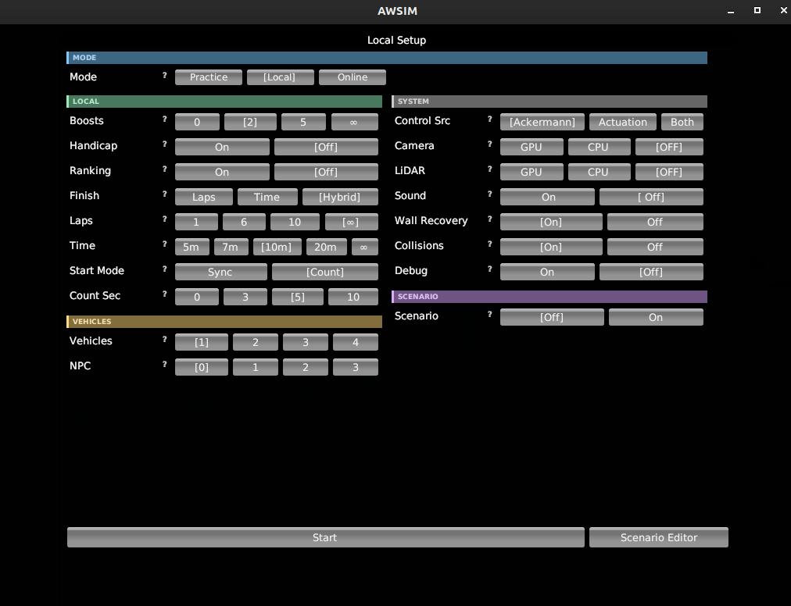
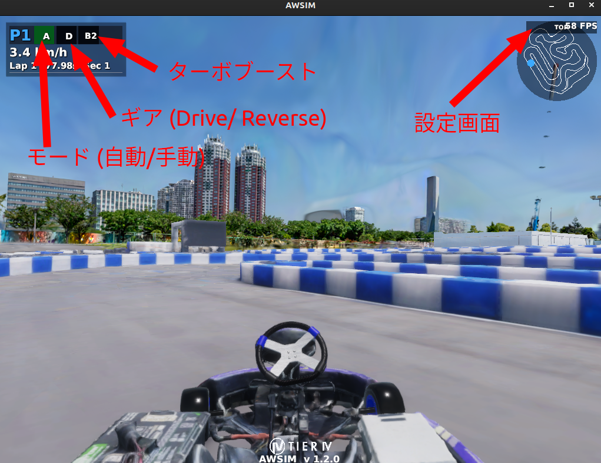
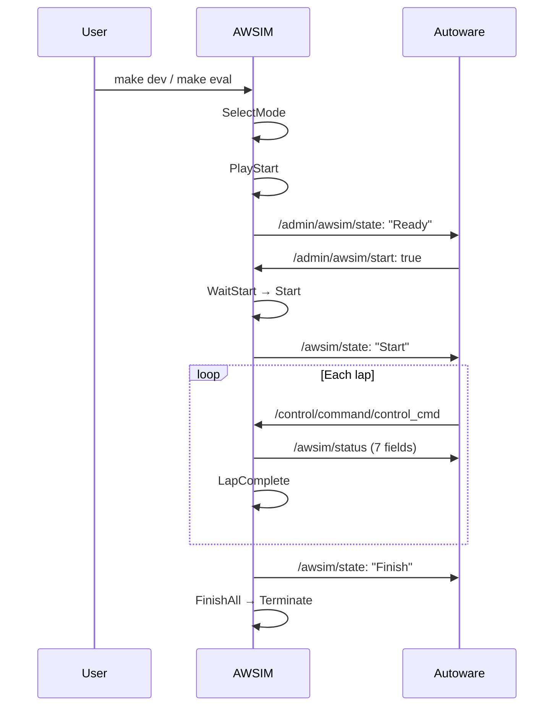
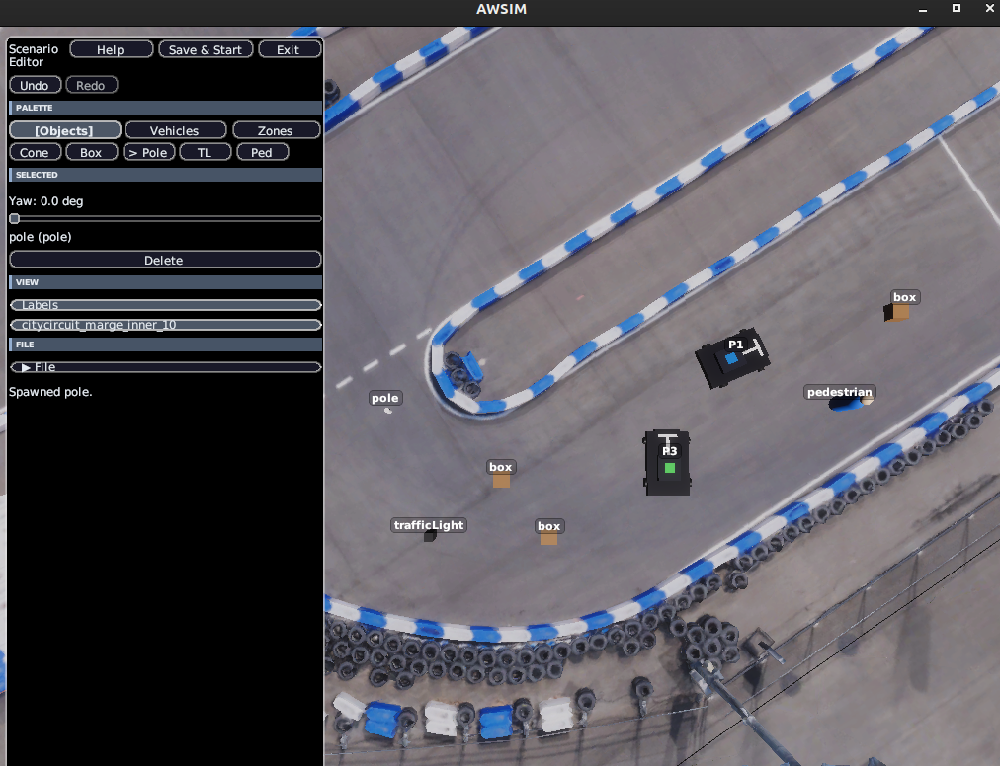

# Simulator

## Overview

This page describes the specifications of the simulator used in the AI Challenge.

The simulator is based on "[AWSIM](https://github.com/tier4/AWSIM)", an open-source autonomous driving simulator for Autoware.

## How to Launch

The simulator starts automatically together with Autoware when you run `make dev` or similar commands. To launch the simulator on its own, use `make simulator`.

## Launch Modes { #launch-modes }

A launch mode is provided for each use case. Each mode is implemented as `aichallenge/simulator_scripts/<mode name>.sh`. **The scripts are the single source of truth for launch arguments**, so edit the file directly if you want to change a setting.

- `make simulator-<mode name>` … launches AWSIM only (e.g. `make simulator-e2e-final`)
- `make dev` / `make e2e` / `make eval` / `make gate1`–`gate3` … launch AWSIM and Autoware together

| Mode | Launch command | Purpose | Main settings |
| --- | --- | --- | --- |
| `dev` | `make dev` (`dev2`–`dev4` for multiple vehicles) | Development / S2R practice | 1 vehicle (N vehicles via argument), unlimited laps/time, camera/LiDAR off |
| `e2e` | `make e2e` | E2E practice (also used for pre-submission checks) | 1 vehicle + 2 NPCs, 6 laps, effectively no timeout, camera/LiDAR cpu |
| `e2e-final` | `make simulator-e2e-final` | E2E finals | 4 vehicles, 6 laps, 420 s, sync start, handicap/ranking on, engine sound on |
| `s2r-final` | `make simulator-s2r-final` | S2R finals | 4 vehicles, 6 laps, 420 s, sync start, handicap/ranking on, engine sound on, overtaking lane on |
| `eval` | `make eval` | Evaluation (same conditions as the online submission) | 1 vehicle, 6 laps, 600 s, sync start |
| `parallel` | `make simulator-parallel` | Multi-vehicle race | 3 vehicles, 6 laps, 600 s, sync start |
| `gate` | `make gate1`–`make gate3` | Safety gate tests | 1 vehicle, per scenario |
| `multiplay-host` / `multiplay-client` | `make simulator-multiplay-host` etc. | Networked racing ([Multiplay](../development/multiplay.en.md)) | - |
| `simulator` (default) | `make simulator` | Plain launch without arguments | Settings are selected in the UI at startup |

### Modes per Class (E2E / S2R) { #class-modes }

Each class has two modes, **practice → finals**. The only differences between them are the sensor configuration, the number of vehicles, handicap, and ranking.

| | E2E class | S2R class |
| --- | --- | --- |
| Task | End-to-End (control directly from camera and LiDAR) | Sim-to-Real (assumes transfer to the real vehicle) |
| Camera / LiDAR | `cpu` (enabled) | `off` |
| IMU / GNSS / V2X | `off` (explicitly disabled) | enabled |
| Practice | `e2e` | `dev` |
| Finals | `e2e-final` | `s2r-final` |

- The sensor on/off configuration is exactly what distinguishes the classes. Because the E2E class uses no information other than the camera and LiDAR, `e2e.sh` / `e2e-final.sh` explicitly specify `--imu off --gnss off --v2x off`.
- **Use `dev` as-is for S2R practice.** `dev` already satisfies the practice conditions (camera/LiDAR off, handicap/ranking off, unlimited running), so there is no dedicated S2R practice mode.
- **E2E practice and pre-submission checks are combined into the single `e2e` mode.** The submission itself is evaluated under the same conditions as `make eval` (`eval` mode).
- Practice modes do not stop on a time limit, so you can keep driving: `e2e` runs its 6 laps with an effectively unlimited timeout (`--timeout 10000000.0`), and `dev` additionally sets `--laps unlimited`. To check with a time limit, use a finals mode or `make eval`.
- Practice uses a `count` start (the countdown starts automatically once all vehicles are grounded; `e2e` uses a 0-second count and starts immediately), and the finals use a `sync` start (all vehicles start together after `/admin/awsim/start` is received).
- `e2e` uses `--start-random on`, so the start position changes every time; this lets you check that your behavior does not depend on a particular start position. The finals use a fixed position for fairness.
- Engine sound (`--sound`) is on only in the two finals modes. It is off in the practice modes and in evaluation (`make eval`).
- **The overtaking lane (`--overtaking-lane`) is on only in `s2r-final`.** To practice under the same conditions as the [rules](../competition/sw-class.en.md#overtake-lane), launch AWSIM with `make simulator-s2r-final` and run `make autoware-simulator` in a separate terminal. If you want to try the judgement with `make dev`, change `--overtaking-lane off` to `on` in `dev.sh`.

!!! warning "`--overtaking-lane` is currently only on the aichallenge-racingkart `dev` branch (as of 2026-09-12)"
    The `--overtaking-lane` flag was added on the `dev` branch by aichallenge-racingkart [#295](https://github.com/AutomotiveAIChallenge/aichallenge-racingkart/pull/295). It is not yet in the `s2r-final.sh` / `dev.sh` scripts on the `main` branch (`0c249d5`, 2026-08-24), which is what `setup.bash` fetches by default. If your checkout is on `main`, running `make simulator-s2r-final` will not enable the overtaking lane. Check your branch with `git -C ~/aichallenge-racingkart branch --show-current`, and check whether the flag is present with `grep -- --overtaking-lane ~/aichallenge-racingkart/aichallenge/simulator_scripts/s2r-final.sh`.

## Screen Description

When launched with `make simulator`, the settings screen is displayed. The settings equivalent to the launch options described below can be configured in the GUI. Click "Start" when you are done.

When launched with `make dev`, AWSIM starts together with Autoware and the simulation screen is shown directly.

- Click the A/M button at the top left of the screen to switch mode (autonomous/manual)
    - In manual mode, you can drive with the keyboard controls described below
- Click the D/R button at the top left of the screen to switch gear (forward/reverse)
- Click the B button at the top left of the screen to activate the turbo boost. The number after B is the number of remaining turbo boosts
- Click the TOP button at the top right of the screen to show the settings screen

## Launch Options

AWSIM can be controlled with command-line arguments, which are specified in the launch scripts (`simulator_scripts/dev.sh`, etc.). AWSIM settings can also be changed from the GUI in addition to the launch options.

This section lists the launch options of the simulator itself. For the values actually used in the competition and development environments, refer to the launch scripts and the rules announced by the organizers. Note that this section also includes options that are not used in the actual competition and development environments.

### Race Settings

| Option        | Type   | Default    | Description                                        |
| ------------- | ------ | ---------- | -------------------------------------------------- |
| --timeout     | float  | 600.0      | Sets the session timeout (seconds).                |
| --laps        | int/string | 6       | Sets the number of laps. `unlimited`/`inf`/`0` means unlimited. |
| --vehicles    | int    | 4          | Sets the number of active vehicles (1, 2, 4).      |
| --npcs        | int    | 0          | Sets the number of NPC vehicles (0–3).             |
| --boosts      | int    | 5          | Sets the number of available boost items (0 to unlimited). |
| --collisions  | bool   | false      | Enables/disables collision detection between vehicles. |
| --wall-recovery | bool | true       | Enables/disables the wall recovery feature.        |
| --ranking     | bool   | false      | Enables/disables the ranking display.              |
| --handicap    | bool   | false      | Enables/disables the position-based handicap.      |
| --start-random | bool  | false      | Enables/disables randomization of the start position. |
| --overtaking-lane | bool | false    | Enables/disables the BLOCK penalty judgement of the overtaking lane ([rules](../competition/sw-class.en.md#overtake-lane)). |

### Control and Input Settings

| Option          | Type   | Default    | Description                                        |
| --------------- | ------ | ---------- | -------------------------------------------------- |
| --steer-source  | string | ackermann  | Steering input method. `ackermann`/`actuation`/`actuation-longitudinal-only`. |
| --control-mode  | string | ackermann  | Alias of `--steer-source`.                         |
| --start-mode    | string | off        | Start method. `off`/`sync`/`count`.                |
| --start-count-seconds | int | 10      | Countdown start time (seconds, 0–10).              |

### Sensor Settings

| Option | Type | Default | Description                              |
| ------ | ---- | ------- | ----------------------------------------- |
| --camera   | off/cpu/gpu | gpu | Camera sensor. `gpu`/`cpu` enables it, `off` disables it. |
| --lidar    | off/cpu/gpu | cpu | LiDAR sensor. `gpu`/`cpu` enables it, `off` disables it. |
| --imu      | bool | on | Enables/disables the IMU (`/sensing/imu/imu_raw`). |
| --gnss     | bool | on | Enables/disables GNSS (`/sensing/gnss/nav_sat_fix`). A vehicle with `off` also disappears from `/v2x/vehicle_positions`. |
| --v2x      | bool | on | Enables/disables V2X vehicle position sharing (`/v2x/vehicle_positions`). |
| -headless  | flag | (not specified) | Unity's standard headless launch flag (single dash). When specified, the camera and LiDAR sensors are disabled and the simulator runs lightweight without rendering. |

`/v2x/vehicle_positions` includes a transmission delay that imitates the real vehicle. The delay is assigned per vehicle in the range 100–200 ms (mean 150 ms, standard deviation 25 ms) and is updated on every publish. If you compute the speed of other vehicles directly from the array's `header.stamp`, the values will be noisy, so implement your code with the delay in mind (extrapolating received positions, discarding stale data, keeping a safety margin).

### Scenario and Replay

| Option          | Type   | Default    | Description                                        |
| --------------- | ------ | ---------- | -------------------------------------------------- |
| --scenario      | string |            | Specifies a scenario file (YAML).                  |
| --vehicle-poses | string |            | Specifies a YAML file of vehicle placements.       |
| --replay0       | string |            | Loads a previous driving log and replays it as another vehicle. |
| --json_path     | string |            | Specifies the path of a JSON settings file.        |

Use `result-details.json` as the replay log. Replay supports 10 vehicles, from `--replay0` to `--replay9`.

### Multiplay

| Option                  | Type   | Default    | Description                                 |
| ----------------------- | ------ | ---------- | -------------------------------------------- |
| --multiplay             | string |            | Multiplay mode. `server`/`client`/`host`.   |
| --multiplay-address     | string | localhost  | Address of the server to connect to.        |
| --multiplay-port        | int    | 50051      | Communication port number.                  |
| --multiplay-name        | string |            | Player name.                                |
| --multiplay-send-hz     | float  | 50.0       | Send update rate (Hz).                      |

### Audio

| Option | Type | Default | Description                                 |
| ------ | ---- | ------- | -------------------------------------------- |
| --sound    | bool | true       | Enables/disables the engine sound.      |

!!! tip "Boolean options"
    Boolean options accept `1`/`true`/`on`/`enable`/`enabled` or `0`/`false`/`off`/`disable`/`disabled`.

## Keyboard Operation

| Operation          | Key               |
| ------------------ | ----------------- |
| Accelerator        | Arrow Up          |
| Brake              | Arrow Down        |
| Steering           | Arrow Left, Right |
| Gear (D/R/N/P)     | D / R / N / P     |
| Turbo boost        | 1 / 2 / 3 / 4     |

The turbo boost is operated with the number key (1–4) that corresponds to the vehicle number.

## Topic Operation

Topics are used to communicate between the autonomous driving program and AWSIM. For the topic specifications, see [Interface](./interface.en.md).

## Vehicle (Racing Kart)

The vehicle conforms to the specifications of the [EGO Vehicle] in AWSIM and is built with specifications close to a real racing kart.

### Parameters

The following table summarizes the vehicle parameters.

| **Item**               | **Value** |
| ---------------------- | --------- |
| Vehicle weight         | 160 kg    |
| Overall length         | 200 cm    |
| Overall width          | 145 cm    |
| Wheelbase              | 108.7 cm  |
| Front tire diameter    | 24 cm     |
| Front tire width       | 13 cm     |
| Front wheel tread      | 93 cm     |
| Rear tire diameter     | 24 cm     |
| Rear tire width        | 18 cm     |
| Rear wheel tread       | 112 cm    |
| Maximum steering angle | 80 °      |
| Maximum acceleration when driving | 3.2 m/s^2 |

#### Vehicle Component

The following table summarizes the settings of the Vehicle component.

| **Item**                            | **Value** |
| ----------------------------------- | --------- |
| Use Inertia                         | Off       |
| **Physics Settings (experimental)** |           |
| Sleep Velocity Threshold            | 0.02      |
| Sleep Time Threshold                | 0         |
| Skidding Cancel Rate                | 0.236     |
| **Input Settings**                  |           |
| Max Steer Angle Input               | 30        |
| Max Acceleration Input              | 1.5       |

#### Rigidbody Component

The following table summarizes the settings of the Rigidbody component.

| **Item**     | **Value** |
| ------------ | --------- |
| Mass         | 160       |
| Drag         | 0         |
| Angular Drag | 0         |

### CoM Position

CoM (Center of Mass) is the center of mass of the vehicle Rigidbody. The CoM is set at the center of the vehicle, at the height of the wheel axles.

**Side view:**

**Top view:**

### Vehicle Collider

The vehicle collider is used to detect contact between the vehicle and other objects or checkpoints. The vehicle collider is created based on the mesh of the vehicle object.

### Wheel Colliders

The vehicle has one wheel collider per wheel, four in total, so the vehicle is simulated with a four-wheel model rather than an equivalent two-wheel (bicycle) model.

The wheel colliders are configured as follows.

| **Item**              | **Value** |
| --------------------- | --------- |
| Mass                  | 1         |
| Radius                | 0.12      |
| Wheel Damping Rate    | 0.25      |
| Suspension Distance   | 0.001     |
| **Suspension Spring** |           |
| Spring (N/m)          | 35000     |
| Damper (N\*s/m)       | 3500      |
| Target Position       | 0.01      |

### Sensor Configuration

#### GNSS

The GNSS is mounted at the following position relative to the vehicle base link.

| **Item** | **Value** |
| -------- | --------- |
| x        | 0.0 m     |
| y        | 0.0 m     |
| z        | 0.0 m     |
| roll     | 0.0 rad   |
| pitch    | 0.0 rad   |
| yaw      | 0.0 rad   |

#### IMU

The IMU is mounted at the following position relative to the vehicle base link.

| **Item** | **Value** |
| -------- | --------- |
| x        | 0.0 m     |
| y        | 0.0 m     |
| z        | 0.0 m     |
| roll     | 0.0 rad   |
| pitch    | 0.0 rad   |
| yaw      | 0.0 rad   |

#### LiDAR

A 2D LiDAR sensor is mounted on the vehicle. It publishes `sensor_msgs/msg/LaserScan` data on the `/sensing/lidar/scan` topic.

| **Item**         | **Value**    |
| ---------------- | ------------ |
| Number of points | 1080         |
| Maximum range    | 30 m         |
| Type             | 2D LaserScan |

#### Camera

An RGB camera is mounted on the vehicle. It publishes image data on the `/sensing/camera/image_raw` topic and the camera intrinsic parameters on the `/sensing/camera/camera_info` topic.

## Item System

The simulator implements an item system to make races more strategic.

### Boost

An item that temporarily improves acceleration performance can be used.
It is not expected to appear in the real-vehicle finals, but it has been introduced because we want you to experiment in a variety of environments in simulation.

| **Item**     | **Value** |
| ------------ | --------- |
| Acceleration | 0.5 m/s²  |
| Duration     | 10 s      |

Note that on the real vehicle, the voltage is lowered as a safety measure so that the kart does not go over the fence.
The boost is positioned as an item that lifts this voltage reduction.

### Repair Item

Picking up a repair item on the course restores the vehicle's Condition value by 40. Not implemented in 2026.

## Wall Recovery

When the vehicle hits a wall and its speed exceeds 0.5 m/s, its direction is corrected automatically.

| **Item**                 | **Value** |
| ------------------------ | --------- |
| Trigger condition        | On wall collision and speed > 0.5 m/s |
| Correction time          | 1 s       |
| Correction angular speed | 180 °/s   |

## Simulation Lifecycle

## Scenario Editor

- The scenario editor lets you place various obstacles on the course, so that you can reproduce a wide variety of scenes. To open the scenario editor, click "Scenario Editor" at the bottom right of the settings screen.
- When you have finished placing obstacles, click "Save & Start" to drive on the scenario you created.
- You can also save the scenario as a yaml file and load it later from the settings screen.
- Controls:
    - Move: keyboard (ASDW)
    - Change viewpoint: right-drag with the mouse, scroll
    - Manipulate objects: left-click with the mouse

