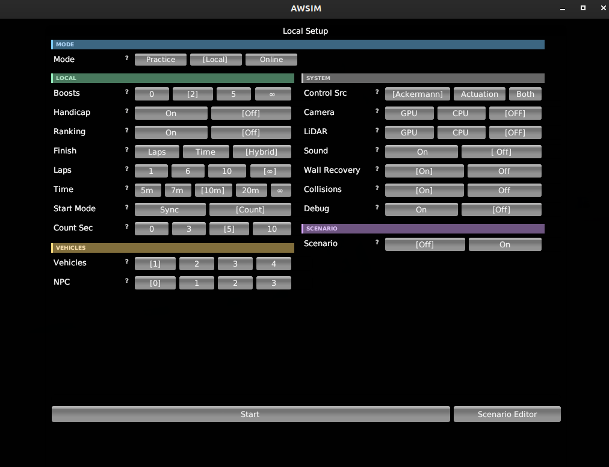
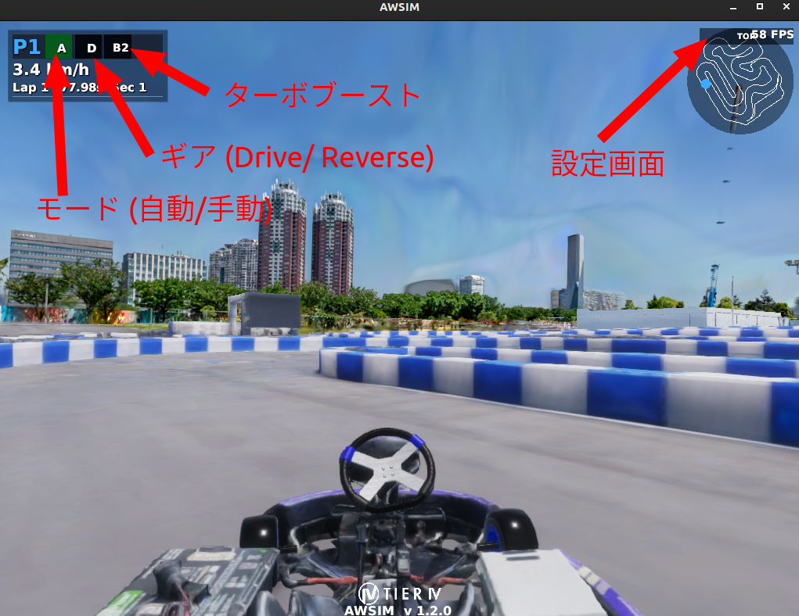
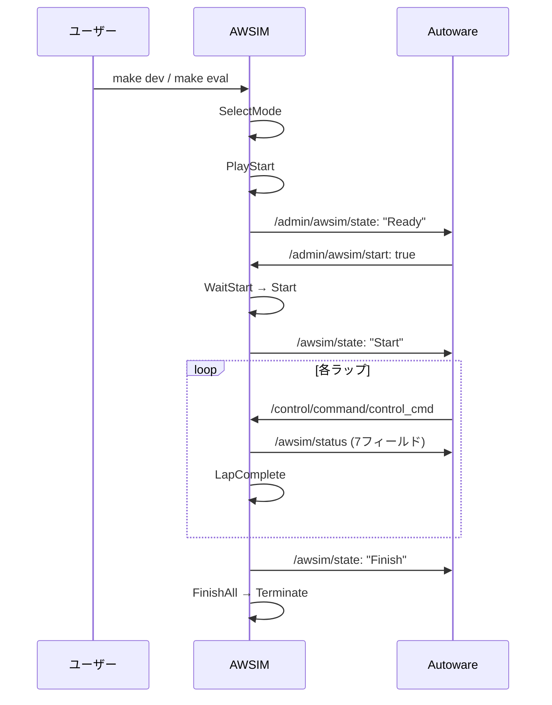
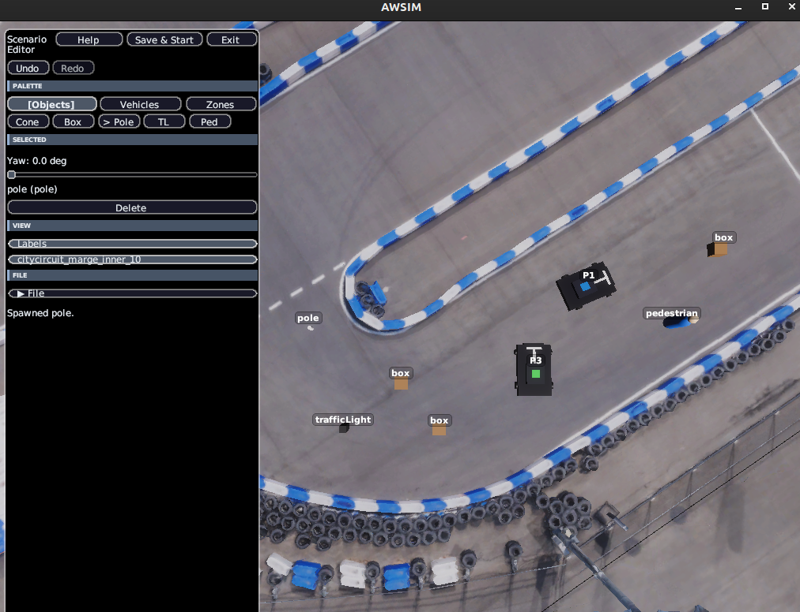

# シミュレーター

## 概要

このページではAIチャレンジで使用されるシミュレーターの仕様について説明します。

シミュレーターは、Autowareのためのオープンソース自動運転シミュレーター「[AWSIM](https://github.com/tier4/AWSIM)」をベースとして作成されています。

## 起動方法

`make dev` などでシミュレーターはAutowareと一緒に自動的に起動します。シミュレーターを単体で起動したい場合は `make simulator` を使用します。

## 画面説明

`make simulator` で起動した場合、設定画面が表示されます。後述の起動オプション相当の設定をGUIで行うことが可能です。設定が出来たら「Start」をクリックします。

`make dev` で起動した場合、AutowareとともにAWSIMが起動して直接シミュレーション画面が表示されます。

- 画面左上のA/Mボタンをクリックするとモード切替ができます（自動/手動）
    - 手動モード中は、後述のキーボード操作によって運転が可能です
- 画面左上のD/Rボタンをクリックするとギア切替ができます（前進/後進）
- 画面左上のBボタンをクリックするとターボブーストがかかります。Bの後ろの数値は残りのターボブースト数です
- 画面右上のTOPボタンをクリックすると設定画面が表示されます

## 起動オプション

AWSIMはコマンドライン引数で動作を制御でき、起動スクリプト（`simulator_scripts/dev.sh` など）内で指定しています。AWSIMの設定は起動オプションの他、GUI画面からも変更可能です。

ここではシミュレーター単体の起動オプションを記載しています。実際の大会・開発環境での設定値は、起動スクリプトや運営発表のルールを参照してください。なお、ここでは実際の大会・開発環境では未使用のオプションも含んでいます。

### レース設定

| オプション    | 型     | デフォルト | 説明                                              |
| ------------- | ------ | ---------- | ------------------------------------------------- |
| --timeout     | float  | 600.0      | セッションのタイムアウト（秒）を設定します。      |
| --laps        | int/string | 6       | 周回数を設定します。`unlimited`/`inf`/`0`で無制限。 |
| --vehicles    | int    | 4          | アクティブ車両数（1, 2, 4）を設定します。         |
| --npcs        | int    | 0          | NPC車両数（0〜3）を設定します。                   |
| --boosts      | int    | 5          | 加速アイテムの使用可能数（0〜無限）を設定します。      |
| --collisions  | bool   | false      | 車両同士の衝突判定の有効/無効を設定します。       |
| --wall-recovery | bool | true       | 壁リカバリー機能の有効/無効を設定します。         |
| --ranking     | bool   | false      | ランキング表示の有効/無効を設定します。           |

### 制御・入力設定

| オプション      | 型     | デフォルト | 説明                                              |
| --------------- | ------ | ---------- | ------------------------------------------------- |
| --steer-source  | string | ackermann  | 操舵入力方式。`ackermann`/`actuation`/`actuation-longitudinal-only`。 |
| --control-mode  | string | ackermann  | `--steer-source`のエイリアス。                     |
| --start-mode    | string | off        | 開始方式。`off`/`sync`/`count`。                  |
| --start-count-seconds | int | 10      | カウントダウン開始時間（秒、0〜10）。             |

### センサ設定

| オプション | 型   | デフォルト | 説明                                    |
| ---------- | ---- | ---------- | --------------------------------------- |
| --camera   | off/cpu/gpu | gpu | カメラセンサ。`gpu`/`cpu` で有効化、`off` で無効化します。 |
| --lidar    | off/cpu/gpu | cpu | LiDARセンサ。`gpu`/`cpu` で有効化、`off` で無効化します。 |
| -headless  | フラグ | （未指定） | Unity標準のヘッドレス起動フラグ（シングルダッシュ）。指定するとカメラ・LiDARセンサを無効化し、描画なしで軽量に実行します。 |

### シナリオ・リプレイ

| オプション      | 型     | デフォルト | 説明                                              |
| --------------- | ------ | ---------- | ------------------------------------------------- |
| --scenario      | string |            | シナリオファイル（YAML）を指定します。            |
| --vehicle-poses | string |            | 車両配置のYAMLファイルを指定します。              |
| --replay0       | string |            | 以前の走行ログを読み込み別車両として再生します。  |
| --json_path     | string |            | JSON設定ファイルのパスを指定します。              |

リプレイのログには `result-details.json` を使用します。また、リプレイは `--replay0` から `--replay9` まで10台の車両に対応しています。

### マルチプレイ

| オプション              | 型     | デフォルト | 説明                                        |
| ----------------------- | ------ | ---------- | ------------------------------------------- |
| --multiplay             | string |            | マルチプレイモード。`server`/`client`/`host`。 |
| --multiplay-address     | string | localhost  | 接続先サーバーアドレス。                    |
| --multiplay-port        | int    | 50051      | 通信ポート番号。                            |
| --multiplay-name        | string |            | プレイヤー名。                              |
| --multiplay-send-hz     | float  | 50.0       | 送信更新頻度（Hz）。                        |

### オーディオ

| オプション | 型   | デフォルト | 説明                                        |
| ---------- | ---- | ---------- | ------------------------------------------- |
| --sound    | bool | true       | エンジンサウンドの有効/無効を設定します。   |

!!! tip "真偽値オプション"
    真偽値オプションは `1`/`true`/`on`/`enable`/`enabled` または `0`/`false`/`off`/`disable`/`disabled` を受け付けます。

## キーボード操作

| 操作               | キー              |
| ------------------ | ----------------- |
| アクセル           | Arrow Up          |
| ブレーキ           | Arrow Down        |
| ステアリング       | Arrow Left, Right |
| ギア (D/R/N/P)     | D / R / N / P     |
| ターボブースト     | 1 / 2 / 3 / 4     |

ターボブーストは、車両番号に対応する数字キー（1〜4）で操作します。

## トピック操作

自動運転プログラムからAWSIMとやり取りするためにはトピックを使います。トピック仕様は[インターフェース](./interface.ja.md)をご参考ください。

## 車両（レーシングカート）

車両はAWSIMにおける[EGO Vehicle]の仕様に準拠しており、実際のレーシングカートに近いスペックで作成されています。

### パラメータ

車両のパラメータを以下の表にまとめています。

| **項目**               | **値**    |
| ---------------------- | --------- |
| 車両重量               | 160 kg    |
| 全長                   | 200 cm    |
| 全幅                   | 145 cm    |
| ホイールベース         | 108.7 cm  |
| 前輪タイヤ直径         | 24 cm     |
| 前輪タイヤ幅           | 13 cm     |
| 前輪ホイールトレッド   | 93 cm     |
| 後輪タイヤ直径         | 24 cm     |
| 後輪タイヤ幅           | 18 cm     |
| 後輪ホイールトレッド   | 112 cm    |
| 最大ステアリング転舵角 | 80 °      |
| 駆動時最大加速度       | 3.2 m/s^2 |

#### Vehicleコンポーネント

Vehicleコンポーネントの設定内容を以下の表にまとめています。

| **項目**                            | **値** |
| ----------------------------------- | ------ |
| Use Inertia                         | Off    |
| **Physics Settings (experimental)** |        |
| Sleep Velocity Threshold            | 0.02   |
| Sleep Time Threshold                | 0      |
| Skidding Cancel Rate                | 0.236  |
| **Input Settings**                  |        |
| Max Steer Angle Input               | 30     |
| Max Acceleration Input              | 1.5    |

#### Rigidbodyコンポーネント

Rigidbodyコンポーネントの設定内容を以下の表にまとめています。

| **項目**     | **値** |
| ------------ | ------ |
| Mass         | 160    |
| Drag         | 0      |
| Angular Drag | 0      |

### CoM位置

CoM(Center of Mass)は、車両Rigidbodyの質量中心です。CoM位置は、車両の中心かつ車輪軸の高さに設定されています。

**側面図:**

**上面図:**

### 車両コライダー

車両コライダーは、車両と他オブジェクトやチェックポイントとの接触判定に利用されます。車両コライダーは車両オブジェクトのメッシュをベースとして作成されています。

### ホイールコライダー

車両には各車輪に1つずつ、合計4つのホイールコライダーが設定されており、等価二輪モデルではなく四輪モデルでの車両シミュレーションが行われています。

ホイールコライダーは以下のように設定されています。

| **項目**              | **値** |
| --------------------- | ------ |
| Mass                  | 1      |
| Radius                | 0.12   |
| Wheel Damping Rate    | 0.25   |
| Suspension Distance   | 0.001  |
| **Suspension Spring** |        |
| Spring (N/m)          | 35000  |
| Damper (N\*s/m)       | 3500   |
| Target Position       | 0.01   |

### センサ構成

#### GNSS

GNSSは車両のベースリンクに対して以下の位置に取り付けられています。

| **項目** | **値**  |
| -------- | ------- |
| x        | 0.0 m   |
| y        | 0.0 m   |
| z        | 0.0 m   |
| roll     | 0.0 rad |
| pitch    | 0.0 rad |
| yaw      | 0.0 rad |

#### IMU

IMUは車両のベースリンクに対して以下の位置に取り付けられています。

| **項目** | **値**  |
| -------- | ------- |
| x        | 0.0 m   |
| y        | 0.0 m   |
| z        | 0.0 m   |
| roll     | 0.0 rad |
| pitch    | 0.0 rad |
| yaw      | 0.0 rad |

#### LiDAR

2D LiDARセンサが車両に搭載されています。`/sensing/lidar/scan`トピックで`sensor_msgs/msg/LaserScan`型のデータを配信します。

| **項目**     | **値**   |
| ------------ | -------- |
| スキャン点数 | 1080点   |
| 最大検出距離 | 30 m     |
| 型           | 2D LaserScan |

#### カメラ

RGBカメラが車両に搭載されています。`/sensing/camera/image_raw`トピックで画像データを、`/sensing/camera/camera_info`トピックでカメラ内部パラメータを配信します。

## アイテムシステム

シミュレータにはレースを戦略的にするためのアイテムシステムが実装されています。

### ブースト

一時的に加速性能が向上するアイテムを使用可能です。
実機決勝大会では出てこない想定ですが、シミュレーションでは様々な環境で試行錯誤していただきたいため、導入しております。

| **項目**     | **値**    |
| ------------ | --------- |
| 加速度       | 0.5 m/s²  |
| 持続時間     | 10 秒     |

なお、実機では柵を越えないよう安全対策として電圧を下げております。
電圧下げを解除するためのアイテムとしての位置づけです。

### 修理アイテム

コース上の修理アイテムを取得すると、車両のCondition値が40回復します。2026年は未実装です。

## 壁リカバリー

壁に衝突した際、車両の速度が0.5m/sを超えている場合に自動で方向修正が行われます。

| **項目**       | **値**    |
| -------------- | --------- |
| 発動条件       | 壁衝突時かつ速度 > 0.5 m/s |
| 修正時間       | 1 秒      |
| 修正角速度     | 180 °/s   |

## シミュレーションのライフサイクル

## シナリオエディタ

- シナリオエディタでは、コース上に様々な障害物を配置することが出来ます。これによって、多様なシーンを再現することが出来ます。シナリオエディタを開くためには、設定画面上で右下の「Scenario Editor」をクリックします。
- 障害物の配置が完了したら、「Save & Start」で作成したシナリオ上で走行が可能です。
- yamlファイルとして保存して、後ほど設定画面から読み込むことも可能です。
- 操作：
    - 移動：キーボード（ASDW）
    - 視点切り替え：マウス右ドラッグ、スクロール
    - オブジェクト操作：マウス左クリック

