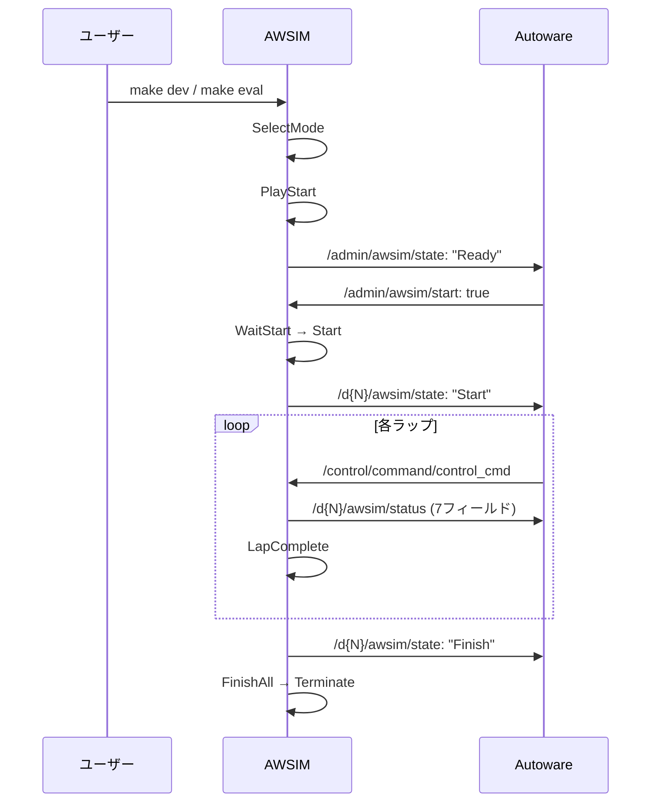

# シミュレーター

## 概要

このページではAIチャレンジで使用されるシミュレーターの仕様について説明します。

シミュレーターは、Autowareのためのオープンソース自動運転シミュレーター「[AWSIM](https://github.com/tier4/AWSIM)」をベースとして作成されています。

## 起動オプション

### レース設定

| オプション    | 型     | デフォルト | 説明                                              |
| ------------- | ------ | ---------- | ------------------------------------------------- |
| --timeout     | float  | 600.0      | セッションのタイムアウト（秒）を設定します。      |
| --endless     | bool   | false      | タイムアウトの有効/無効を設定します。             |
| --laps        | int/string | 6       | 周回数を設定します。`unlimited`/`inf`/`0`で無制限。 |
| --vehicles    | int    | 4          | アクティブ車両数（1, 2, 4）を設定します。         |
| --npcs        | int    | 0          | NPC車両数（0〜3）を設定します。                   |
| --boosts      | int    | 5          | ニトロアイテムの配置数（0〜5）を設定します。      |
| --collisions  | bool   | false      | 車両同士の衝突判定の有効/無効を設定します。       |
| --wall-recovery | bool | true       | 壁リカバリー機能の有効/無効を設定します。         |
| --ranking     | bool   | false      | ランキング表示の有効/無効を設定します。           |

### 制御・入力設定

| オプション      | 型     | デフォルト | 説明                                              |
| --------------- | ------ | ---------- | ------------------------------------------------- |
| --steer-source  | string | ackermann  | 操舵入力方式。`ackermann`/`actuation`/`actuation-longitudinal-only`。 |
| --control-mode  | string | ackermann  | `--steer-source`のエイリアス。                     |
| --manual-mode   | bool   | true       | `true`で手動操作、`false`でROS2自動制御。         |
| --start-mode    | string | off        | 開始方式。`off`/`sync`/`count`。                  |
| --start-count-seconds | int | 10      | カウントダウン開始時間（秒、0〜10）。             |

### センサ設定

| オプション | 型   | デフォルト | 説明                                    |
| ---------- | ---- | ---------- | --------------------------------------- |
| --camera   | bool | true       | カメラセンサの有効/無効を設定します。   |
| --lidar    | bool | true       | LiDARセンサの有効/無効を設定します。    |

### シナリオ・リプレイ

| オプション      | 型     | デフォルト | 説明                                              |
| --------------- | ------ | ---------- | ------------------------------------------------- |
| --scenario      | string |            | シナリオファイル（YAML）を指定します。            |
| --vehicle-poses | string |            | 車両配置のYAMLファイルを指定します。              |
| --replay0       | string |            | 以前の走行ログを読み込み別車両として再生します。  |
| --json_path     | string |            | JSON設定ファイルのパスを指定します。              |

リプレイのログには `result-details.json` を使用します。また、リプレイは `--replay0` から `--replay9` まで10台の車両に対応しています。

### マルチプレイ

| オプション              | 型     | デフォルト | 説明                                        |
| ----------------------- | ------ | ---------- | ------------------------------------------- |
| --multiplay             | string |            | マルチプレイモード。`server`/`client`/`host`。 |
| --multiplay-address     | string | localhost  | 接続先サーバーアドレス。                    |
| --multiplay-port        | int    | 50051      | 通信ポート番号。                            |
| --multiplay-name        | string |            | プレイヤー名。                              |
| --multiplay-send-hz     | float  | 50.0       | 送信更新頻度（Hz）。                        |

### オーディオ

| オプション | 型   | デフォルト | 説明                                        |
| ---------- | ---- | ---------- | ------------------------------------------- |
| --sound    | bool | true       | エンジンサウンドの有効/無効を設定します。   |

!!! tip "真偽値オプション"
    真偽値オプションは `1`/`true`/`on`/`enable`/`enabled` または `0`/`false`/`off`/`disable`/`disabled` を受け付けます。

## キーボード操作

| 操作               | キー              |
| ------------------ | ----------------- |
| 終了               | Esc               |
| リセット           | Space             |
| カメラ切り替え     | C                 |
| アクセル           | Arrow Up          |
| ブレーキ           | Arrow Down        |
| ステアリング       | Arrow Left, Right |
| ギア (D)           | D                 |
| ギア (R)           | R                 |
| ギア (N)           | N                 |
| ギア (P)           | P                 |
| 左ウインカー       | 1                 |
| 右ウインカー       | 2                 |
| ハザード           | 3                 |
| ウインカーOFF      | 4                 |
| シナリオエディタ   | F1                |
| 確定（起動画面）   | Enter             |

## トピック操作

### 車両ごとのトピック

各車両のドメインID（N=1〜4）に応じて、`/d{N}/`プレフィックス付きでPublishされます。`domain_bridge`により各車両ドメインに橋渡しされるため、Autoware側では通常のトピック名（プレフィックスなし）でアクセスできます。

| トピック          | 型                             | 説明                                           |
| ----------------- | ------------------------------ | ---------------------------------------------- |
| /awsim/status     | std_msgs.msg.Float32MultiArray | シミュレーションの各種状態を取得します。       |
| /awsim/state      | std_msgs.msg.String            | 車両ごとのシミュレーション状態を取得します。   |

### 管理用トピック

ドメイン0で動作する管理用トピックです。

| トピック            | 型                  | 方向        | 説明                                     |
| ------------------- | ------------------- | ----------- | ---------------------------------------- |
| /admin/awsim/state  | std_msgs.msg.String | Publisher   | シミュレーション全体の状態を配信します。 |
| /admin/awsim/start  | std_msgs.msg.Bool   | Subscriber  | シミュレーション開始を指示します。       |
| /admin/awsim/reset  | std_msgs.msg.Empty  | Subscriber  | シミュレーションをリセットします。       |

`/awsim/status` は以下の構造になっています。

| インデックス | 値              | 説明                                       |
| ------------ | --------------- | ------------------------------------------ |
| 0            | sessionTime     | 残りセッション時間（秒、カウントダウン）   |
| 1            | lapCount        | 現在のラップ数                             |
| 2            | thisLapTime     | 現在のラップタイム（秒）                   |
| 3            | section         | 現在のセクション番号                       |
| 4            | timeScale       | シミュレーションのタイムスケール           |
| 5            | boostRemaining  | 残りブースト使用回数                       |
| 6            | isBoosting      | ブースト中フラグ (1.0=ブースト中 / 0.0)    |

## 車両（レーシングカート）

車両はAWSIMにおける[EGO Vehicle]の仕様に準拠しており、実際のレーシングカートに近いスペックで作成されています。

### パラメータ

車両のパラメータを以下の表にまとめています。

| **項目**               | **値**    |
| ---------------------- | --------- |
| 車両重量               | 160 kg    |
| 全長                   | 200 cm    |
| 全幅                   | 145 cm    |
| ホイールベース         | 108.7 cm  |
| 前輪タイヤ直径         | 24 cm     |
| 前輪タイヤ幅           | 13 cm     |
| 前輪ホイールトレッド   | 93 cm     |
| 後輪タイヤ直径         | 24 cm     |
| 後輪タイヤ幅           | 18 cm     |
| 後輪ホイールトレッド   | 112 cm    |
| 最大ステアリング転舵角 | 80 °      |
| 駆動時最大加速度       | 3.2 m/s^2 |

#### Vehicleコンポーネント

Vehicleコンポーネントの設定内容を以下の表にまとめています。

| **項目**                            | **値** |
| ----------------------------------- | ------ |
| Use Inertia                         | Off    |
| **Physics Settings (experimental)** |        |
| Sleep Velocity Threshold            | 0.02   |
| Sleep Time Threshold                | 0      |
| Skidding Cancel Rate                | 0.236  |
| **Input Settings**                  |        |
| Max Steer Angle Input               | 30     |
| Max Acceleration Input              | 1.5    |

#### Rigidbodyコンポーネント

Rigidbodyコンポーネントの設定内容を以下の表にまとめています。

| **項目**     | **値** |
| ------------ | ------ |
| Mass         | 160    |
| Drag         | 0      |
| Angular Drag | 0      |

### CoM位置

CoM(Center of Mass)は、車両Rigidbodyの質量中心です。CoM位置は、車両の中心かつ車輪軸の高さに設定されています。

### 車両コライダー

車両コライダーは、車両と他オブジェクトやチェックポイントとの接触判定に利用されます。車両コライダーは車両オブジェクトのメッシュをベースとして作成されています。

### ホイールコライダー

車両には各車輪に1つずつ、合計4つのホイールコライダーが設定されており、等価二輪モデルではなく四輪モデルでの車両シミュレーションが行われています。

ホイールコライダーは以下のように設定されています。

| **項目**              | **値** |
| --------------------- | ------ |
| Mass                  | 1      |
| Radius                | 0.12   |
| Wheel Damping Rate    | 0.25   |
| Suspension Distance   | 0.001  |
| **Suspension Spring** |        |
| Spring (N/m)          | 35000  |
| Damper (N\*s/m)       | 3500   |
| Target Position       | 0.01   |

### センサ構成

#### GNSS

GNSSは車両のベースリンクに対して以下の位置に取り付けられています。

| **項目** | **値**  |
| -------- | ------- |
| x        | 0.0 m   |
| y        | 0.0 m   |
| z        | 0.0 m   |
| roll     | 0.0 rad |
| pitch    | 0.0 rad |
| yaw      | 0.0 rad |

#### IMU

IMUは車両のベースリンクに対して以下の位置に取り付けられています。

| **項目** | **値**  |
| -------- | ------- |
| x        | 0.0 m   |
| y        | 0.0 m   |
| z        | 0.0 m   |
| roll     | 0.0 rad |
| pitch    | 0.0 rad |
| yaw      | 0.0 rad |

#### LiDAR

2D LiDARセンサが車両に搭載されています。`/sensing/lidar/scan`トピックで`sensor_msgs/msg/LaserScan`型のデータを配信します。

| **項目**     | **値**   |
| ------------ | -------- |
| スキャン点数 | 1080点   |
| 最大検出距離 | 30 m     |
| 型           | 2D LaserScan |

#### カメラ

RGBカメラが車両に搭載されています。`/sensing/camera/image_raw`トピックで画像データを、`/sensing/camera/camera_info`トピックでカメラ内部パラメータを配信します。

## アイテムシステム

シミュレータにはレースを戦略的にするためのアイテムシステムが実装されています。

### ニトロブースト

コース上のニトロアイテムを取得すると、一時的に加速性能が向上します。

| **項目**     | **値**    |
| ------------ | --------- |
| 加速度       | 1.5 m/s²  |
| 持続時間     | 10 秒     |
| 最大速度     | 55 km/h   |
| 最大使用回数 | 5 回      |

`/awsim/status`のインデックス5（boostRemaining）で残り使用回数を、インデックス6（isBoosting）でブースト中かどうかを確認できます。

### 修理アイテム

コース上の修理アイテムを取得すると、車両のCondition値が40回復します。

## 壁リカバリー

壁に衝突した際、車両の速度が0.5m/sを超えている場合に自動で方向修正が行われます。

| **項目**       | **値**    |
| -------------- | --------- |
| 発動条件       | 壁衝突時かつ速度 > 0.5 m/s |
| 修正時間       | 1 秒      |
| 修正角速度     | 180 °/s   |

## シミュレーションのライフサイクル

## 制御モード

本大会では3つの制御モードが用意されています。`reference.launch.xml`の`control_mode`引数で切り替えます。

| モード | パッケージ | 説明 |
| ------ | ---------- | ---- |
| `rule_based`（デフォルト） | simple_pure_pursuit | Pure Pursuitアルゴリズムによるルールベース制御 |
| `e2e` | tiny_lidar_net_controller | LiDARスキャン（1080点）から加速度と操舵角を直接出力するEnd-to-End制御 |
| `joycon` | — | 手動テレオペ操作 |
