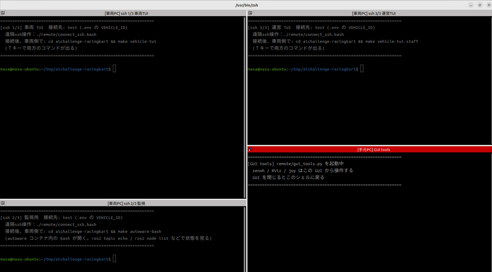
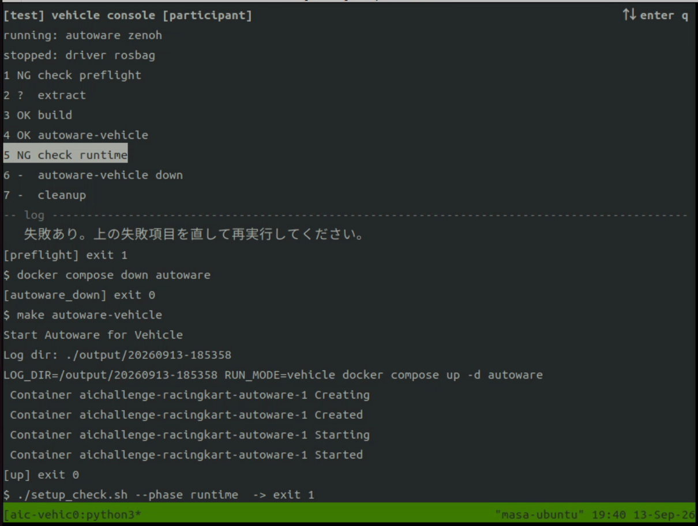

# 実機決勝での参加者操作

!!! warning "WIP"

    このページは作成中です。確定した情報は順次更新します。

Sim to Real SW 部門の実機決勝（9月20日・シティサーキット東京ベイ）で、参加チームが実車両をどう操作するかをまとめたページです。競技ルール・順位決定方式は[Sim to Real部門ルール](../competition/sw-class.ja.md#final-abst)、当日のスケジュールと走行枠中にできる操作は[実機決勝特設ページ](../competition/kart-finals.ja.md)を参照してください。

!!! warning "事前に提出したコードがそのまま車両上で動きます"
    走行枠のあいだ、車両 PC 上でのコード変更・再ビルドは一切できません。当日できるのはパラメータのチューニングと遠隔手動操作だけです。走行を見ながら調整したい値は、**すべて実行中に変更できる形（dynamic reconfigure）で実装しておく**必要があります。

## 第1部 事前準備

### 1-1. コードの提出

実機決勝で使用するコードを、指定期日までに運営へ提出します。

| 項目 | 内容 |
| --- | --- |
| 提出期限 | 9/14 |
| 提出物 | 実機決勝で走らせるコード一式（SIM 予選と同じ `aichallenge_submit.tar.gz` 形式） |

提出後、運営が車両上でビルド・起動して動作を確認し、問題が見つかった場合は個別に連絡します。**期限後のコード差し替えはできません**ので、提出前に手元で `make autoware-build` が通ること、起動して走行できることを必ず確認してください。

### 1-2. dynamic reconfigure への対応

当日チューニングしたいパラメータは、ノードを再起動せずに変更できるようにしておきます。ROS 2 のパラメータを宣言し、`rclcpp::Node::add_on_set_parameters_callback`（C++）または `Node.add_on_set_parameters_callback`（Python）で変更を受け取る実装にしてください。制御ゲイン、目標速度・加減速度の上限、障害物回避や追い越しの判断しきい値などが対象になります。

対応していないパラメータは、当日 launch ファイルや YAML を書き換えても、Autoware を再起動しないと反映されません。再起動は可能ですが、限られた走行枠を消費するため推奨しません。

### 1-3. チューニング用スクリプトの用意（推奨）

走行中のパラメータ確認・変更に使用する自作のシェルスクリプトを、提出物に含めることを推奨します。TUI形式でなくても構いません。

| 項目 | 要件 |
| --- | --- |
| 機能 | 1-2 で dynamic reconfigure 対応したパラメータを、走行中に確認・変更できること |
| 動作環境 | autoware コンテナ内（ROS 2 環境・`ROS_DOMAIN_ID` がスタックと揃った状態）で動作すること。参加者が操作するオペレーションブースの PC には GUI 画面を転送できないため、GUI アプリとして実装しないこと |

### 1-4. 安全ゲートのクリア（強く推奨）

[安全ゲート](../competition/sw-class.ja.md#safety-gate)（障害物停止・NPC 追い越し・車線維持）のクリアは必須ではありませんが、強く推奨します。実機決勝では反則回数が順位に直結し、衝突や停止はそのまま反則になるためです。実行方法は[安全ゲートシナリオの実行](../development/development-guide.ja.md#safety-gate)を参照してください。

### 1-5. 実車両特有の挙動への対処

V2X の通信遅延、ステアを切った状態での発進、スタート時の並び順など、シミュレータと実車両で異なる点があります。[実車両で走らせるときの注意点](../competition/kart-finals.ja.md#real-vehicle-notes)を確認し、必要な対処をコードに入れておいてください。特に、スタート待機中にスタック判定が働いて後退や切り返しを始めないようにする対処は、提出前に必ず入れてください。

## 第2部 当日の操作

### 2-1. オペレーションブース到着時の状態

参加チームがオペレーションブースに着いた時点で、運営側の準備は以下まで完了しています。

1. 提出されたコードが車両 PC 上でビルド済み
2. Autoware・driver・zenoh が起動済み（rosbag は運営が記録します。参加チームへの提供はありません）
    - 期日までにソースコードを提出したチームのみ
3. ブースの PC から車両 PC へ SSH 接続済み

参加チームはこの状態から操作を引き継ぎます。車両 PC 上の操作はすべてこの SSH 接続経由で行います。

#### 4 つのペインの見方

操作したいペインをマウスでクリックしてから、キー入力を行います。



| 番号・位置 | ペイン | 用途と操作する人 |
| --- | --- | --- |
| ① 左上 | `tui`（車両 TUI） | 参加者が Autoware の状態を確認し、必要な場合に停止・起動します |
| ② 左下 | `monitor`（監視） | 車両 PC 上の Autoware コンテナ内の端末です。参加者が ROS 2 コマンドなどを実行して車両に指示を出すことができます |
| ③ 右上 | `staff`（運営 TUI） | 運営が driver・zenoh・rosbag を管理します。参加者はこのペインを操作しません |
| ④ 右下 | `gui`（GUI tools） | 手元のブース PC で GUI ツールを起動する端末です。RViz やゲームコントローラの通信に使います。参加者はこのペインを操作しません |

### 2-2. 車両操作 TUI の見方と Autoware の再起動

①の車両操作 TUI では、上部の `running:` に稼働中のサービス、`stopped:` に停止中のサービスが表示されます。`autoware` の状態をここで確認できます。



| キー | 操作 |
| --- | --- |
| ↑ / ↓ | 実行する項目を選択します |
| Enter | 選択した項目を実行します |
| `q` | 車両操作 TUI を終了します。Autoware を停止する操作ではありません |

項目の状態は `OK`（完了）、`NG`（失敗）、`>>`（実行中）、`-`（未完了）、`?`（前提の項目が未完了）で表示されます。

| 番号・項目 | 用途 | 当日の扱い |
| --- | --- | --- |
| 1 `check preflight` | 起動前の環境確認 | 新しく TUI を起動した際にも自動実行されます。`NG` が出ている場合は運営に伝えます |
| 2 `extract` | 提出物の展開 | 運営が事前に済ませます。走行枠中に実行しません |
| 3 `build` | 提出物のビルド | 運営が事前に済ませます。走行枠中に実行しません |
| 4 `autoware-vehicle` | Autoware の起動 | 再起動時に使います |
| 5 `check runtime` | 起動後の環境確認 | Autowareを再起動した際には実行します |
| 6 `autoware-vehicle down` | Autoware の停止 | 再起動時に使います |
| 7 `cleanup` | 提出物とビルド成果物の片付け | コードとビルド成果物を消すため、参加者は実行しません |

Autoware を再起動する場合は、次の順で操作します。

1. 運営に再起動することを申告し、車両を安全に停止させます。
2. ↑ / ↓ で `6 autoware-vehicle down` を選んで Enter を押します。
3. 停止処理が終了し、`stopped:` に `autoware` が表示されることを確認します。
4. `4 autoware-vehicle` を選んで Enter を押します。
5. `running:` に `autoware` が表示されることを確認します。
6. `5 check runtime` を選んで Enter を押し、`OK` と表示されることを確認します。`NG` の場合は走行を再開せず、表示された失敗内容を運営に伝えます。
7. RViz で自己位置や車両の状態を確認してから走行を再開します。

!!! note "再起動後のパラメータ確認（推奨）"

    Autoware を再起動すると、走行中に変更したパラメータが起動時の初期値に戻る場合があります。走行を再開する前に、②の監視端末で `ros2 param get` を使い、変更したパラメータの現在値が意図した値になっていることを確認することを推奨します。異なる場合は変更値を再設定し、再度確認してください。

    ```bash
    ros2 param get /ノード名 パラメータ名
    ```

    `/ノード名` と `パラメータ名` は、確認する対象に置き換えてください。

### 2-3. パラメータのチューニング

走行の様子は RViz でも確認できます（[遠隔操作](remote.ja.md)）。

チューニングに使える時間は試合の進行によって異なります。準決勝には自由走行（10〜25分）があり、ここが主なチューニング時間です。決勝は待機時間が短く、パラメータをじっくり詰める余裕はありません（[試合スケジュール](../competition/kart-finals.ja.md#match-schedule)）。

!!! warning "操作前に運営へ申告してください"
    パラメータ変更を含め、車両への操作を行う前には運営に申告する必要があります。また、自チームの `ROS_DOMAIN_ID` 以外に影響を及ぼす操作は禁止です（[Sim to Real部門ルール](../competition/sw-class.ja.md#final-rule)）。

### 2-4. ゲームコントローラによる遠隔手動操作

- 参加チームにはゲームコントローラ（[ロジクール F310](https://gaming.logicool.co.jp/ja-jp/products/gamepads/f310-gamepad.940-000137.html)）が渡されます。これで車両を遠隔から手動操作できます。また、ステアのみ自動走行とするモードも許可されています。この場合にはアクセルのみを手動操作します。
- スタックした場合や、車両が予期せぬ挙動をした場合の復帰は参加チーム自身で行います。運営によるサポート（遠隔操作・物理的介入）はありません。ルールに則り手動走行で復帰してください。
- ゲームコントローラの各ボタンの機能は以下の図のとおりです。


| ボタン・軸 | 機能 | 備考 |
|---|---|---|
| Button A | モード選択（手動） | 選択する前に運営に申告が必要です |
| Button B | モード選択（アクセルのみ自動） | 使用禁止です |
| Button X | モード選択（ステアのみ自動） | 使用可能です。アクセルのみ右トリガーで手動操作します |
| Button Y | モード選択（自動） | 通常はこちらを選びます |
| Button 上 | ギア（Drive） | アクセル操作によって前進します |
| Button 左 | ギア（Neutral） | 未使用 |
| Button 下 | ギア（Reverse） | アクセル操作によって後進します |
| Button L, R | 緊急停止 |  |
| Button Start, Back | 緊急停止 |  |
| Button Mode | 未使用 | 消灯状態にします |
| 左スティック X軸 | ステアリング | 手動走行時に使用します |
| 左スティック Y軸 | 未使用 |  |
| 右スティック X軸 | 未使用 |  |
| 右スティック Y軸 | 未使用 |  |
| 左トリガー | ブレーキ | 手動走行・ステアのみ自動走行時に使用します |
| 右トリガー | アクセル | 手動走行・ステアのみ自動走行時に使用します |

!!! warning "コントローラの注意事項"
    - Modeは必ず消灯状態にしてください
    - 予期せず緊急停止状態になることを防ぐため、不要なボタンは押さないでください
    - 緊急停止してしまうと、解除する必要があります。解除は運営に申告してください
    - アクセル（右トリガー）は、なれるまではゆっくり押してください
    - 停止するためにはブレーキ（左トリガー）を押してください
    - 手動走行する際には、ギアの操作を忘れないよう気をつけてください
    - モード状態を確認する手段がないため、モード選択ボタンを何回か連打することをおすすめします。手動走行する場合の例：
        - Aボタンを連打（モード選択（手動））
        - 上ボタンを連打（ギア（Drive））
        - 右トリガーをゆっくりと押す（アクセル）

!!! warning "ストール回避"
    - カート側に組み込まれた機構によって、壁などに衝突状態でアクセルがかかり続けると「ストール」という状態になります（自動走行・手動走行問わず）
    - ストール状態になると復帰する手段はありません。試合終了までカートは停止状態になります
    - ストールを回避するためには、衝突直前にXボタン押しによって「ステアのみ自動」モードに入ってから、左トリガー押しによってブレーキをかけてください
        - 「ステアのみ自動」モードは許可されています
