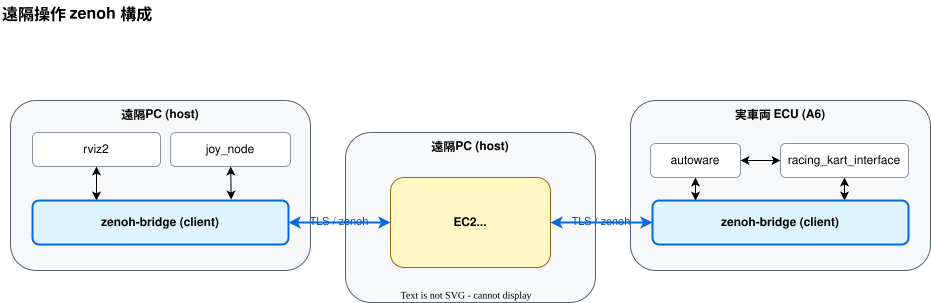
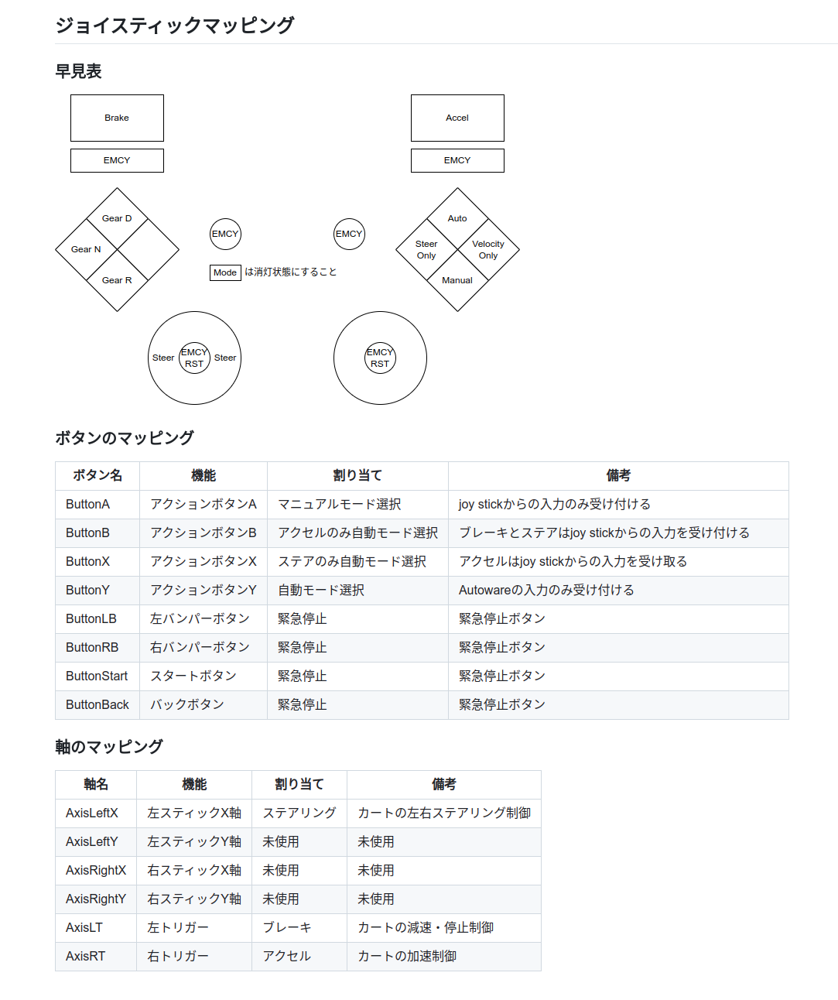

# 遠隔操作

走行中の緊急停止や手動走行は、遠隔 PC に接続したゲームコントローラを用いて遠隔操作で行います。

実車両側の起動手順は[実車両の起動](run.ja.md)、ECU 自体の初期構築は[ECU の初期構築](ecu-setup.ja.md)を参照してください。

遠隔 PC と自動運転車両の間の通信が途絶したとき、またはゲームコントローラが遠隔 PC から抜けたときには、自動運転車両が緊急停止する安全機能が入っています。ただし途絶判定のしきい値は5秒なので、ゲームコントローラが抜けた瞬間に車両が止まるわけではないことに注意してください。



## 第1部 共通セットアップ

### 1-1. ROS 2 Humble をインストール

遠隔 PC の OS は Ubuntu 22.04 (Jammy) を前提とします。内容は[公式手順](https://docs.ros.org/en/humble/Installation/Ubuntu-Install-Debs.html)と同じです。

遠隔 PC では `joy.bash`（`joy_node`）と `ros2` コマンドをホスト側で動かすため、ホストに ROS 2 が必要です。1-2 のセットアップスクリプトは ROS 2 を入れないので、この手順は別に実施します。

```bash
sudo apt update && sudo apt install -y locales
sudo locale-gen en_US en_US.UTF-8
sudo update-locale LC_ALL=en_US.UTF-8 LANG=en_US.UTF-8

sudo apt install -y software-properties-common curl
sudo add-apt-repository -y universe
export ROS_APT_SOURCE_VERSION=$(curl -s https://api.github.com/repos/ros-infrastructure/ros-apt-source/releases/latest | grep -F "tag_name" | awk -F'"' '{print $4}')
curl -L -o /tmp/ros2-apt-source.deb "https://github.com/ros-infrastructure/ros-apt-source/releases/download/${ROS_APT_SOURCE_VERSION}/ros2-apt-source_${ROS_APT_SOURCE_VERSION}.$(. /etc/os-release && echo ${UBUNTU_CODENAME:-${VERSION_CODENAME}})_all.deb"
sudo dpkg -i /tmp/ros2-apt-source.deb
```

`ros-humble-desktop` を入れます。

```bash
sudo apt update
sudo apt install -y ros-humble-desktop
```

シェル起動時に `ros2` コマンドが使えるよう `~/.bashrc` に追記します（1-7 で追記する環境変数と同じ場所です）。

```bash
echo 'source /opt/ros/humble/setup.bash' >> ~/.bashrc
source ~/.bashrc
printenv ROS_DISTRO     # humble と表示されること
```

### 1-2. リポジトリ取得と環境構築

`curl` を入れてから、セットアップスクリプトを実行します。リポジトリの clone から Docker のインストール、Autoware イメージの取得までを一括で行います。

```bash
sudo apt update
sudo apt install -y curl
curl -fsSL "https://raw.githubusercontent.com/AutomotiveAIChallenge/aichallenge-racingkart/main/setup.bash" | bash
```

`~/aichallenge-racingkart` に main ブランチが clone されます。

スクリプトは実行する項目を1つずつ確認してきます。次の2つは `n`、それ以外はすべて `y` と答えてください。

| プロンプト | 遠隔 PC での回答 | 理由 |
| --- | --- | --- |
| `Download AWSIM.zip and extract` | n | 遠隔 PC では AWSIM を起動しないため（約数 GB の節約） |
| `Run make dev (ROS_DOMAIN_ID from .env)` | n | AWSIM を使うシミュレータ起動なので不要 |

プロンプトは `[y/N]` 形式で、**何も入力せず Enter を押すと `n` 扱い**になります。実行したい項目では `y` を明示的に入力してください。

### 1-3. セットアップ後の再確認

```bash
cd ~/aichallenge-racingkart
./setup.bash doctor
```

`doctor` は OS・ツール・Docker・`.env`・イメージの有無を見るだけで、システムには何も変更を加えません。AWSIM に関する警告は 1-2 で n を選んだ結果なので、遠隔 PC では無視して構いません。

### 1-4. Zenoh bridge（ホストにインストール）

```bash
cd ~/aichallenge-racingkart
sudo dpkg -i vehicle/zenoh-bridge-ros2dds_1.5.0_amd64.deb
apt list --installed zenoh-bridge-ros2dds   # 1.5.0 であること
```

### 1-5. ゲームコントローラ用 joy パッケージ

```bash
sudo apt install -y ros-humble-joy
sudo usermod -aG input "$USER"
# 再ログインして反映する
```

### 1-6. TLS 証明書の配置

配布された tls.zip を `remote/tls/` に展開し、秘密鍵のパーミッションを 600 にします。

```bash
cd ~/aichallenge-racingkart
sudo apt install -y unzip
unzip -o ~/Downloads/tls.zip -d remote/    # tls.zip の保存先は環境に合わせてください
chmod 600 remote/tls/client/key.pem
```

展開後、次の構成になっていることを確認します。異なる場合は `remote/tls/` 以下がこの構成になるように置き直してください。

```bash
ls remote/tls          # client  server
ls remote/tls/client   # cert.pem  key.pem(600)
ls remote/tls/server   # minica.pem
```

### 1-7. CycloneDDS / RMW 設定

ホスト側の設定ファイルはリポジトリ同梱のものをコピーして使います（コンテナ側は `docker-compose.yml` が `vehicle/cyclonedds.xml` をマウントするので別物です）。

```bash
sudo apt install -y ros-humble-rmw-cyclonedds-cpp
sudo mkdir -p /opt/autoware
sudo cp ~/aichallenge-racingkart/vehicle/cyclonedds.xml /opt/autoware/cyclonedds.xml
grep -i NetworkInterface /opt/autoware/cyclonedds.xml    # name="lo" があること
```

`~/.bashrc` に追記します。

```bash
export RMW_IMPLEMENTATION=rmw_cyclonedds_cpp
export CYCLONEDDS_URI=file:///opt/autoware/cyclonedds.xml
```

### 1-8. `.env` に車両番号を設定

リポジトリ直下の `.env` を開き、`VEHICLE_ID` の行を対象車両に合わせて書き換えます（以降 Ax と記載の部分は、A3、A6 など対象車両に合わせて変更してください）。

```diff
- VEHICLE_ID=A0
+ VEHICLE_ID=Ax
```

## 第2部 ノート PC 1台で遠隔操作動作確認

**目的**：PC 1台の中に「車両側」「遠隔側」を両方立て、両者を実 EC2 に client 接続し、joy 操作が EC2 経由で車両側に届くことを確認します。

### 2-1. 手順

コマンドを端末A〜E に分けて実行します。端末A の `make zenoh` はコンテナをデタッチ起動するだけで端末を占有しないので、開いたままにしておく必要があるのは端末B〜E の4つです。各端末はカレントディレクトリを引き継がないので、端末ごとに `cd` から実行してください。

```bash
# 端末A: 車両側 zenoh bridge（domain1 → EC2）
cd ~/aichallenge-racingkart
make zenoh

# 端末B: 車両側の joy 受け手（domain1）。echo 自体が subscriber になり bridge が転送を開始
source /opt/ros/humble/setup.bash
ROS_DOMAIN_ID=1 ros2 topic echo /racing_kart/joy

# 端末C: 遠隔側 zenoh bridge（domain0 → EC2）
cd ~/aichallenge-racingkart/remote
ROS_DOMAIN_ID=0 ./connect_zenoh.bash Ax

# 端末D: 遠隔側で joy を流す（domain0）
source /opt/ros/humble/setup.bash
ROS_DOMAIN_ID=0 ros2 topic pub -r 10 /racing_kart/joy sensor_msgs/msg/Joy \
  '{header: {frame_id: "joy"}, axes: [0.1,0.5,0.0,0.0], buttons: [1,0,0,0]}'
```

### 2-2. 合否判定

```bash
# 端末E
source /opt/ros/humble/setup.bash
ROS_DOMAIN_ID=1 ros2 topic hz /racing_kart/joy     # ~10Hz であること
```

### 2-3. 終了手順

端末B・C・D・E はフォアグラウンドのホストプロセスなので、`make down` では止まりません。先に各端末で Ctrl+C します。

```bash
# 1) 端末B(echo) / 端末C(zenoh bridge) / 端末D(topic pub) / 端末E(hz) をそれぞれ Ctrl+C

# 2) 端末A で起動した zenoh コンテナを停止
cd ~/aichallenge-racingkart
make down

# 3) 残存していないことを確認
docker compose ps                  # 何も残っていないこと
pgrep -af zenoh-bridge-ros2dds     # 何も出ないこと
```

## 第3部 実車両と遠隔 PC の構成

実車両と遠隔 PC を EC2 経由でつなぐ本番の遠隔操作です。
遠隔 PC は EC2 経由で車両側と zenoh 接続するため、**遠隔 PC 側にインターネット接続が必須**です。

### 3-1. ゲームコントローラの接続

USB ケーブルでゲームコントローラ（ロジクール F310）を遠隔 PC に接続します。

### 3-2. 遠隔操作の流れ（遠隔 PC 側）

コマンドを端末A〜C に分けて実行します。端末C の `rviz.bash` はコンテナをデタッチ起動するだけで端末を占有しないので、開いたままにしておく必要があるのは端末A・B の2つです。

遠隔 PC では `.env` の `ROS_DOMAIN_ID` を `0` に設定しておきます。端末A と端末B はホストの既定ドメインで動きますが、RViz2 はコンテナなので `.env` の値を読むためです。

```diff
- ROS_DOMAIN_ID=1
+ ROS_DOMAIN_ID=0
```

なお第2部の1台構成では、車両側 zenoh を domain 1 で起動する必要があるため `.env` は `ROS_DOMAIN_ID=1` のままにします。

```bash
# 端末A: joy_node（コントローラ入力 → /racing_kart/joy）
cd ~/aichallenge-racingkart/remote
ROS_DOMAIN_ID=0 ./joy.bash

# 端末B: 車両と zenoh 接続（EC2 へ client 接続 / TLS）
cd ~/aichallenge-racingkart/remote
ROS_DOMAIN_ID=0 ./connect_zenoh.bash Ax

# 端末C: RViz（遠隔可視化スタック）
cd ~/aichallenge-racingkart/remote
./rviz.bash
```

`connect_zenoh.bash` は `zenoh-user.json5` の TLS 証明書パスを `remote/` 基準で相対解決するため、`remote/` をカレントディレクトリにして実行する必要があります。

`rviz.bash` は `make rviz2` のラッパで、rviz2 をコンテナとして起動します（`./rviz.bash restart` で開き直し、`./rviz.bash down` で停止します）。

### 3-3. 車両側 ECU の起動

車両側 ECU では別途 `make autoware-driver-zenoh-rosbag` で driver / autoware / rosbag / zenoh を起動します。`.env` の設定や IMU バイアスの調整を含む実車両側の手順は[実車両の起動](run.ja.md)、ECU 自体の初期構築は[ECU の初期構築](ecu-setup.ja.md)にまとまっています。

### 3-4. 終了手順

端末A の `joy.bash`（joy_node）と端末B の `connect_zenoh.bash`（zenoh bridge）はホスト上のフォアグラウンドプロセスであり、`make down` は Docker Compose のサービスしか停止しません。逆に rviz2 はデタッチ起動のコンテナなので、端末C を閉じても動き続けます。停止には `make down`（または `./rviz.bash down`）が必要です。

```bash
# 1) 端末A(joy.bash) と 端末B(connect_zenoh.bash) をそれぞれ Ctrl+C で停止

# 2) コンテナを停止（rviz2 はここで止まる）
cd ~/aichallenge-racingkart
make down

# 3) 何も残っていないことを確認
docker compose ps                  # 何も残っていないこと
pgrep -af zenoh-bridge-ros2dds     # 何も出ないこと
pgrep -af joy_node                 # 何も出ないこと
```

## 第4部 ゲームコントローラの使い方

### 4-1. ロジクール F310

ロジクール F310 を使用して遠隔操作します。製品ページは[こちら](https://gaming.logicool.co.jp/ja-jp/products/gamepads/f310-gamepad.940-000137.html)です。


### 4-2. ボタンと軸の割り当て

ゲームコントローラの各ボタンの機能は以下の図のとおりです。


